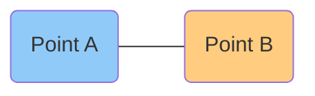
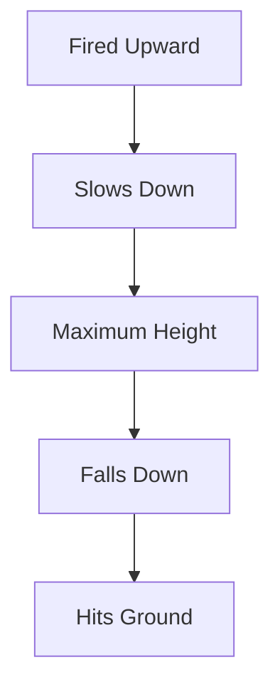
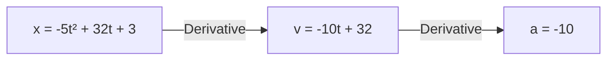
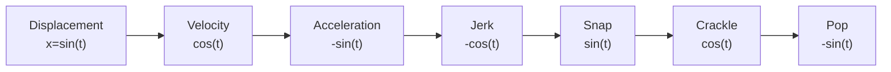

# Displacement, Velocity, and Acceleration

> **Core Idea:** Calculus studies how quantities **change**.  
> The **derivative** measures the **instantaneous rate of change** of a function.

---

# Learning Objectives

After studying this note, you should understand:

- What displacement, velocity, and acceleration represent.
- Difference between **average** and **instantaneous** velocity.
- How tangent lines relate to derivatives.
- Relationship between displacement → velocity → acceleration.
- Real-world projectile motion example.
- Higher-order derivatives (jerk, snap, crackle, pop).

---

# Motion as a Function of Time

For motion, we usually use:

- **Input:** Time → \(t\)
- **Output:** Position (Displacement) → \(x(t)\)

Unlike normal functions:

- Independent variable → **t**
- Dependent variable → **x**

```text
Time (t)
   │
   ▼
Displacement x(t)
```

---

# Relationship Between Motion Quantities


Every derivative measures the **rate of change** of the previous quantity.

---

# Displacement

## Definition

Displacement tells **where an object is** at a particular time.

\[
x=f(t)
\]

Example:

```text
t = 0 s → x = 3 m

t = 2 s → x = 47 m

t = 5 s → x = 38 m
```

It answers:

> "Where is the object now?"

---

# Average Velocity

Suppose an object moves from

\[
(t_1,x_1)
\]

to

\[
(t_2,x_2)
\]

Average velocity is

\[
\boxed{
v\_{avg}
=
\frac{x_2-x_1}{t_2-t_1}
}
\]

This is simply the **slope of the secant line**.

---

## Visualization



Between two points,

Slope = Average Velocity

---

# Instantaneous Velocity

Average velocity considers **two points**.

Instantaneous velocity considers **only one point**.

It is the speed shown on a **speedometer**.

Mathematically,

\[
v(t)=\frac{dx}{dt}
\]

---

## Geometric Meaning

It equals the **slope of the tangent line**.

```text
Displacement

|
|       •
|     /
|   /
|__/____________ Time
    ↑
 Tangent

Slope of tangent
=
Instantaneous velocity
```

---

# Projectile Motion Example

A cannonball is fired vertically upward.

Ignoring air resistance,

its displacement is

\[
\boxed{
x(t)= -5t^2+32t+3
}
\]

This is a **quadratic function**.

---

# Motion of the Cannonball



---

# Average Velocity Example

### First 3 seconds

Average velocity

\[
=17\text{ m/s}
\]

Positive because the object moves upward.

---

### Last 3 seconds

Average velocity

\[
=-13\text{ m/s}
\]

Negative because it moves downward.

---

# Why Velocity Can Be Negative

Velocity includes **direction**.

Positive

```text
↑ Upward
```

Negative

```text
↓ Downward
```

Speed is always positive.

Velocity can be positive or negative.

---

# Maximum Height

Given

\[
x=-5t^2+32t+3
\]

Complete the square:

\[
x
=
-5(t-3.2)^2

- 54.2
  \]

Therefore,

Maximum height

\[
\boxed{
54.2\text{ m}
}
\]

Occurs at

\[
\boxed{
t=3.2\text{ s}
}
\]

---

# Velocity Function

Differentiate displacement.

\[
x(t)
=
-5t^2+32t+3
\]

Derivative:

\[
\boxed{
v(t)
=
-10t+32
}
\]

Velocity is a **linear function**.

---

## Velocity Graph

```text
Velocity

32|
  |\
22| \
12|  \
  |   \
  |    \
  |_____\
     Time
```

Velocity decreases uniformly.

---

# Acceleration

Acceleration is the rate of change of velocity.

\[
\boxed{
a(t)=\frac{dv}{dt}
}
\]

Differentiate again:

\[
v=-10t+32
\]

Therefore,

\[
\boxed{
a=-10
}
\]

Acceleration is **constant**.

---

## Graph

```text
Acceleration

-10 ───────────────────

Time →
```

---

# Why is Acceleration Negative?

Negative acceleration means

- velocity decreases
- object slows while moving upward

This is called

**Deceleration**

---

# Function Complexity

Notice how derivatives simplify the functions.

| Quantity     | Function Type |
| ------------ | ------------- |
| Displacement | Quadratic     |
| Velocity     | Linear        |
| Acceleration | Constant      |

---

# Summary Flow



---

# Earth's Gravity

Real gravity

\[
g
=
9.8
\text{ m/s}^2
\]

Example uses

\[
10
\text{ m/s}^2
\]

because it simplifies calculations.

---

# Beyond Acceleration

Higher-order derivatives exist.

| Derivative Order | Name          |
| ---------------- | ------------- |
| 0                | Displacement  |
| 1                | Velocity      |
| 2                | Acceleration  |
| 3                | Jerk          |
| 4                | Snap (Jounce) |
| 5                | Crackle       |
| 6                | Pop           |

---

# Simple Harmonic Motion

Imagine a spring oscillating.

Displacement

```text
Sine Wave
```

Velocity

```text
Cosine Wave
```

Acceleration

```text
Negative Sine Wave
```

---

## Oscillation Cycle



The derivatives repeat in a cycle.

---

# Why Derivatives Matter

A derivative transforms

```text
Position
      ↓
Velocity
      ↓
Acceleration
      ↓
Higher derivatives
```

Every derivative tells

> **"How fast is this quantity changing?"**

---

# Key Takeaways

- Motion is represented as **position over time**.
- **Average velocity** is the slope between two points.
- **Instantaneous velocity** is the slope of the tangent line.
- Velocity is the **derivative of displacement**.
- Acceleration is the **derivative of velocity**.
- Projectile motion under gravity produces:
  - Quadratic displacement
  - Linear velocity
  - Constant acceleration
- Higher derivatives include **jerk, snap, crackle, and pop**.
- Derivatives are the mathematical foundation for understanding motion.

---

# Formula Sheet

### Average Velocity

\[
v\_{avg}
=
\frac{\Delta x}{\Delta t}
\]

---

### Instantaneous Velocity

\[
v=\frac{dx}{dt}
\]

---

### Acceleration

\[
a=\frac{dv}{dt}
=
\frac{d^2x}{dt^2}
\]

---

### Projectile Motion Example

Displacement

\[
x=-5t^2+32t+3
\]

Velocity

\[
v=-10t+32
\]

Acceleration

\[
a=-10
\]

Maximum height

\[
54.2\text{ m}
\]

Time at maximum height

\[
3.2\text{ s}
\]
