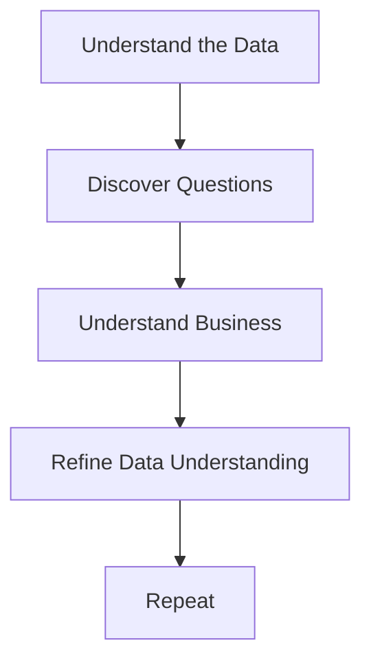
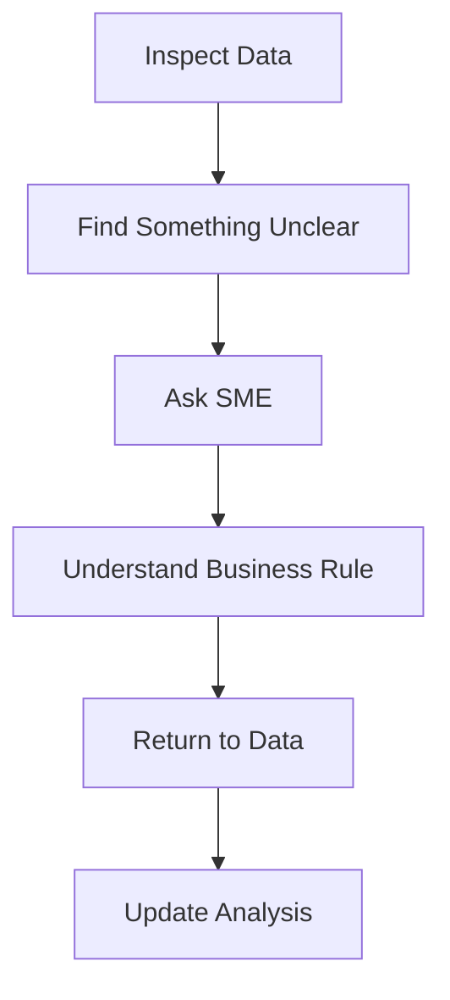
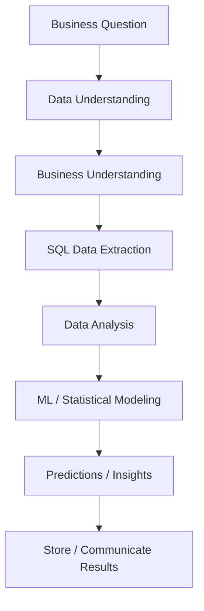

# Using SQL for Data Science: Understanding the Problem

## Overview

SQL provides a powerful set of tools for:

- Extracting data
- Joining multiple tables
- Creating views
- Using `CASE` statements
- Inserting data
- Updating data
- Preparing data for analysis

However, knowing SQL syntax is only part of the challenge. The harder and more important skill is **understanding how SQL fits into the complete data science problem-solving process**.

A successful SQL-based data science workflow starts with understanding:

1. The **data**
2. The **business or subject-area problem**
3. The relationship between the two

> **Core principle:** If you understand the data and the problem well, writing the SQL queries becomes much easier.

---

# SQL in the Data Science Workflow

A typical SQL-based data science workflow looks like:

```text
Business Question
       ↓
Understand the Data
       ↓
Understand the Business Problem
       ↓
Extract Data with SQL
       ↓
Analyze / Transform Data
       ↓
Build Analysis or Model
       ↓
Generate Predictions / Results
       ↓
Write Results Back to Database
```

SQL is therefore not just about writing queries. It is one component of an **end-to-end problem-solving process**.

For example:

> A company wants to predict whether a customer is likely to purchase a product.

The SQL work might involve:

- Extracting customer information
- Joining customer and transaction tables
- Filtering relevant customers
- Creating analytical features
- Preparing historical data
- Feeding the resulting dataset into a machine learning model
- Writing predictions back into a database

---

# 1. Data Understanding

## The Most Important Step

Before writing complex queries or performing analysis, **understand the data**.

Understanding the data allows you to write queries that correctly represent the underlying information.

Important questions include:

- What tables exist?
- What does each table represent?
- What does each column represent?
- What are the primary keys?
- What are the foreign keys?
- How are tables related?
- Are there `NULL` values?
- What are the possible values in each column?
- Are values stored as the correct data type?
- Are strings free-form or standardized?
- Are dates and times stored separately or together?
- Are there duplicate records?
- Are there missing values?
- What assumptions were made when the data was collected?

---

## Example: Data Type Understanding

Suppose a column appears to represent an integer:

```text
customer_id
-----------
1001
1002
1003
```

But the database stores it as:

```sql
VARCHAR
```

This matters because the data type can affect:

- Comparisons
- Sorting
- Joins
- Aggregations
- Filtering
- Data cleaning
- Machine learning preprocessing

Understanding the schema before analysis prevents incorrect assumptions.

---

# Understanding Relationships

Understanding relationships between tables is particularly important.

For example:

```text
customers
    |
    | customer_id
    ↓
orders
    |
    | order_id
    ↓
order_items
```

You need to understand:

- Which column connects the tables?
- Is the relationship one-to-one?
- One-to-many?
- Many-to-many?
- Can records exist without a corresponding record in another table?
- Will a join create duplicate rows?

For example:

```sql
SELECT
    c.customer_id,
    c.name,
    o.order_id
FROM customers c
JOIN orders o
    ON c.customer_id = o.customer_id;
```

This query is only meaningful if you understand what `customer_id` represents in both tables.

---

# Data Understanding Is Worth the Time

If you are unfamiliar with a dataset or subject area, query development may initially take longer.

You may need time to determine:

- How tables relate
- Which columns should be joined
- What values mean
- Which fields contain missing data
- Whether a column contains the type of information you expect
- Which records are relevant to the analysis

This initial investment is worthwhile.

> **Do not rush into query writing before understanding the data.**

---

# 2. Business / Subject-Area Understanding

Data understanding alone is not enough.

You also need to understand **why the analysis is being performed**.

This is known as:

- Business understanding
- Domain understanding
- Subject-area understanding

The goal is to understand the actual problem you are trying to solve.

---

## Example

Suppose the business requirement is:

> "Predict whether a customer is likely to buy our product."

This sounds straightforward.

But immediately, several questions arise:

- Which customers?
- Which products?
- What does "likely" mean?
- What time period should be considered?
- Should inactive customers be included?
- Should employees be excluded?
- Should customers with no purchase history be included?
- Should cancelled orders count?
- Should test transactions count?
- What qualifies as a purchase?

These details may not appear in the original business requirement.

---

# The Unspoken Need

One of the biggest challenges in real-world data science is identifying **unspoken requirements**.

A stakeholder may give you a simple requirement, while important business rules remain unstated.

For example:

> "Predict whether a customer will purchase our product."

Potential hidden requirements:

```text
Should inactive customers be included?
Should employees be excluded?
Should test accounts be excluded?
Should cancelled orders count?
Should refunded purchases count?
Should historical purchases be included?
Which products are relevant?
What prediction period should be used?
```

These decisions can significantly change the analysis.

---

# Logical Exclusions

Real-world analysis often requires certain records to be excluded.

Examples:

```text
Test accounts
Internal employees
Duplicate customers
Cancelled transactions
Fraudulent transactions
Refunded purchases
Inactive accounts
Invalid records
```

These exclusions should not be guessed.

They should be confirmed through **business understanding**.

---

# 3. Data Understanding ↔ Business Understanding

Data understanding and business understanding are closely connected.

They should not necessarily be treated as a strictly linear process.

Instead, think of them as an iterative loop:



As you inspect the data, you discover new questions.

You then go back to the business or subject-matter expert to clarify those questions.

The answers lead you back to the data.

This continues until the problem is sufficiently understood.

---

# Working With Subject-Matter Experts

A **Subject-Matter Expert (SME)** is someone who deeply understands the business or domain.

Examples:

- A finance analyst for financial data
- A doctor for healthcare data
- A marketing manager for marketing data
- A sales manager for sales data
- A fraud analyst for fraud detection

When working on an unfamiliar dataset, you may need to repeatedly communicate with SMEs.

Typical process:



This interaction is a normal and important part of professional data science.

---

# 4. Query Writing Comes After Understanding

A common beginner mistake is:

```text
Problem
  ↓
Immediately write SQL
```

A better approach is:

```text
Problem
  ↓
Understand Business Requirement
  ↓
Understand Data
  ↓
Identify Relationships
  ↓
Identify Business Rules
  ↓
Define Required Dataset
  ↓
Write SQL
```

Once the problem and data are clearly understood, SQL becomes much easier.

> **Good query writing is often the result of good problem understanding.**

---

# SQL as a Tool, Not the Entire Solution

SQL is a tool used to manipulate and retrieve data.

It can perform operations such as:

```sql
SELECT
JOIN
WHERE
GROUP BY
HAVING
ORDER BY
CASE
INSERT
UPDATE
DELETE
CREATE VIEW
```

But knowing these commands does not automatically mean you can solve a data science problem.

The real skill is knowing:

> **What data should I retrieve, why should I retrieve it, and how should it be interpreted?**

---

# 5. A Practical Problem-Solving Framework

When starting a new SQL/data science problem, use this framework.

## Step 1 — Understand the Problem

Ask:

- What problem are we solving?
- Why does it matter?
- What decision will the analysis support?
- What is the expected output?

---

## Step 2 — Understand the Data

Investigate:

- Tables
- Columns
- Data types
- Primary keys
- Foreign keys
- Relationships
- `NULL` values
- Duplicates
- Date/time fields
- Categorical values
- Data quality issues

---

## Step 3 — Understand Business Rules

Determine:

- Who should be included?
- Who should be excluded?
- Which transactions count?
- Which events matter?
- What definitions are being used?
- What edge cases exist?

---

## Step 4 — Define the Required Dataset

Before writing the final query, determine:

```text
Required entities
Required columns
Required joins
Required filters
Required transformations
Required aggregations
Required time period
```

---

## Step 5 — Write the SQL

Now construct the query using the appropriate SQL operations:

```sql
SELECT
FROM
JOIN
WHERE
GROUP BY
HAVING
CASE
ORDER BY
```

---

## Step 6 — Validate the Results

Do not assume the query is correct just because it executes successfully.

Check:

- Row counts
- Duplicate records
- Missing values
- Unexpected values
- Aggregations
- Join behavior
- Boundary conditions
- Business rules

A query can be **syntactically correct but logically wrong**.

---

# Key Principle: Correctness Over Speed

A useful mindset is:

> **Slowly wrap your head around the problem. Slowly understand the data. Then write the query.**

Trying to write SQL immediately can result in:

- Incorrect joins
- Incorrect filtering
- Double counting
- Missing records
- Incorrect aggregations
- Misinterpreted data
- Invalid machine learning features

Taking time to understand the problem reduces these risks.

---

# Data Science + SQL Mental Model

Think of SQL as part of a larger pipeline:



# Key Takeaways

1. **Understanding the data is the most important first step.**
2. Understand tables, columns, data types, relationships, and data quality.
3. **Understand the business problem before beginning analysis.**
4. Look for **unspoken business requirements**.
5. Identify logical exclusions and edge cases.
6. Data understanding and business understanding are **iterative processes**.
7. Work with subject-matter experts when business rules are unclear.
8. A query can execute successfully while still producing logically incorrect results.
9. SQL is a tool within a larger data science workflow.
10. **When the problem and data are understood, SQL query writing becomes much easier.**

> ### Core Idea
>
> **Understand the problem → Understand the business → Understand the data → Define the required dataset → Write SQL → Validate the results.**

```

```
