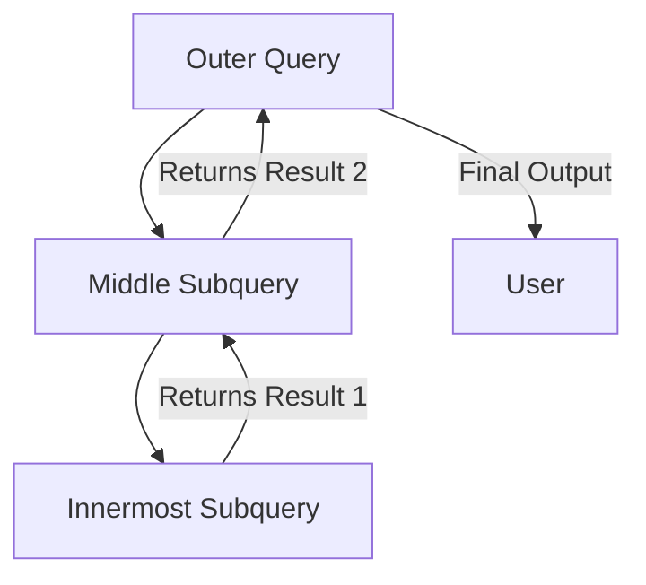

# SQL Subqueries – Best Practices, Nesting & Performance

## Learning Objectives

By the end of this note, you will be able to:

- Write and understand **nested subqueries** (subqueries inside subqueries)
- Explain how database engines **execute subqueries** step-by-step
- Use subqueries for **aggregations and calculations**
- Evaluate performance trade-offs between subqueries and `JOIN`s
- Apply industry-standard **best practices** when designing SQL queries

---

## What is a Subquery? (Intuition & Analogy)

A **subquery** is simply a `SELECT` statement written inside another SQL query. Think of it like a **Russian nesting doll**: you open the outer doll, find a smaller one inside, and that smaller one might contain an even tinier one. Each inner query answers a specific question, and its answer becomes the input for the next level up.

Subqueries are most commonly used in:

- `WHERE` clauses (filtering)
- `SELECT` lists (calculations)
- `FROM` clauses (temporary result sets)
- `HAVING` clauses (group-level filtering)

> **Key Rule**: When a subquery is used for filtering or scalar calculations, it can only return **one column**. This keeps the database engine from getting confused about how to compare multiple values at once.

---

## Execution Flow: How the Database Processes Subqueries

Databases do not read queries top-to-bottom like humans do. They follow a strict **inside-out execution order**:

1. **Innermost query runs first** → produces a result set
2. That result is passed to the **next outer level** as input
3. This repeats until the **outermost query** executes and returns your final output

# 📘 Study Note: SQL Subqueries – Best Practices, Nesting & Performance

## 🎯 Learning Objectives

By the end of this note, you will be able to:

- Write and understand **nested subqueries** (subqueries inside subqueries)
- Explain how database engines **execute subqueries** step-by-step
- Use subqueries for **aggregations and calculations**
- Evaluate performance trade-offs between subqueries and `JOIN`s
- Apply industry-standard **best practices** when designing SQL queries

---

## 💡 What is a Subquery? (Intuition & Analogy)

A **subquery** is simply a `SELECT` statement written inside another SQL query. Think of it like a **Russian nesting doll**: you open the outer doll, find a smaller one inside, and that smaller one might contain an even tinier one. Each inner query answers a specific question, and its answer becomes the input for the next level up.

Subqueries are most commonly used in:

- `WHERE` clauses (filtering)
- `SELECT` lists (calculations)
- `FROM` clauses (temporary result sets)
- `HAVING` clauses (group-level filtering)

> 🔑 **Key Rule**: When a subquery is used for filtering or scalar calculations, it can only return **one column**. This keeps the database engine from getting confused about how to compare multiple values at once.

---

## ⚙️ Execution Flow: How the Database Processes Subqueries

Databases do not read queries top-to-bottom like humans do. They follow a strict **inside-out execution order**:

1. **Innermost query runs first** → produces a result set
2. That result is passed to the **next outer level** as input
3. This repeats until the **outermost query** executes and returns your final output



> ⚠️ **Warning**: Deep nesting increases execution time because each level may trigger additional passes through the data. Modern database optimizers help, but they cannot magically fix poorly structured logic.

---

## 🔍 Practical Examples from the Lecture

### 1. Nested Subqueries: Finding Customers Who Ordered a Toothbrush

**Goal**: Get names and contact details of customers who ordered a specific product.

| Step | Query Level | What It Does                                            | Output                |
| ---- | ----------- | ------------------------------------------------------- | --------------------- |
| 1️⃣   | Innermost   | Finds all `order_id`s containing "toothbrush"           | List of order numbers |
| 2️⃣   | Middle      | Uses those `order_id`s to find matching `customer_id`s  | List of customer IDs  |
| 3️⃣   | Outermost   | Uses those `customer_id`s to fetch names & contact info | Final filtered list   |

This chain shows how subqueries **break complex filtering into digestible steps**.

### 2. Subqueries for Calculations: Counting Orders Per Customer

Instead of joining tables, we can use a **correlated subquery** in the `SELECT` clause:

```sql
SELECT
    c.customer_name,
    c.state,
    (SELECT COUNT(*)
     FROM orders o
     WHERE o.customer_id = c.customer_id) AS total_orders
FROM customers c
ORDER BY c.customer_name ASC;
```

**How it works**:

- The outer query loops through each customer row
- For **every single row**, the inner subquery runs and counts matching orders
- The `WHERE o.customer_id = c.customer_id` line is called a **correlation clause**. It ties the inner query to the current row of the outer query.

> 💡 **Analogy**: Imagine a librarian checking out each book on a shelf (outer query). For every book, they walk to the archive room (inner subquery), count how many copies exist, write it down, and return to the shelf. Repeat until done.

---

## ✅ Pros vs. ⚠️ Cons & Limitations

| Aspect          | Advantages                                                               | Limitations                                                                    |
| --------------- | ------------------------------------------------------------------------ | ------------------------------------------------------------------------------ |
| **Flexibility** | Can be placed in `SELECT`, `FROM`, `WHERE`, `HAVING`                     | Cannot execute `INSERT`, `UPDATE`, or `DELETE` inside a subquery               |
| **Readability** | Breaks complex logic into smaller, self-contained blocks                 | Deep nesting makes queries hard to debug and maintain                          |
| **Performance** | Modern optimizers often rewrite subqueries efficiently behind the scenes | Correlated subqueries can execute once per row → O(n²) behavior in worst cases |
| **Portability** | Supported across all major DBMS (PostgreSQL, MySQL, SQL Server, Oracle)  | Optimization depth and performance vary by vendor and version                  |

---

## 🛠️ Best Practices & Performance Guidelines

1. **Prefer `JOIN`s for large datasets** when possible. Joins typically scan tables once; correlated subqueries may scan repeatedly.
2. **Test both approaches**. Use `EXPLAIN` or query execution plans to see how your DBMS actually processes the statement.
3. **Avoid unnecessary nesting**. If you find yourself writing 3+ levels of subqueries, refactor into CTEs (`WITH` clauses) or temporary tables.
4. **Index correlated columns**. Ensure columns used in correlation conditions (e.g., `customer_id`) are indexed to speed up row-by-row lookups.
5. **Use scalar subqueries carefully**. They must return exactly one value per outer row. If they return zero or multiple rows, the query will fail or produce unexpected results.

---

## 🧠 Common Misconceptions & Warnings

| Misconception                                              | Reality                                                                                                                                                                    |
| ---------------------------------------------------------- | -------------------------------------------------------------------------------------------------------------------------------------------------------------------------- |
| "Subqueries are always slower than JOINs."                 | Not true. Modern optimizers often convert subqueries to joins automatically. Performance depends on data size, indexes, and query structure.                               |
| "You can SELECT multiple columns in a filtering subquery." | Only one column is allowed when using operators like `=`, `<`, `>`. Multiple columns require `IN` or `EXISTS` with row constructors, which are advanced and rarely needed. |
| "The database executes queries top-to-bottom."             | False. Execution follows logical order: `FROM → WHERE → GROUP BY → HAVING → SELECT → ORDER BY`. Subqueries break this flow by executing inside-out first.                  |

---

## 📝 Summary & Key Takeaways

- Subqueries let you embed questions inside questions, making complex filtering and calculations cleaner.
- Execution always starts from the **innermost query** and moves outward.
- Correlated subqueries link inner and outer queries via matching columns (e.g., `o.id = c.id`).
- They improve readability but can hurt performance if overused or poorly indexed.
- Always validate with execution plans; modern DBMS optimizers help, but they don't replace good query design.
- Subqueries cannot perform data modification (`INSERT`/`UPDATE`/`DELETE`) and are limited to read-only `SELECT` logic.

---

## ➡️ Next Steps

In upcoming lessons, you will explore:

- **`JOIN` operations** (INNER, LEFT, RIGHT, FULL) as alternatives or complements to subqueries
- **Common Table Expressions (CTEs)** for cleaner multi-step queries
- **Window functions** for advanced row-level calculations without self-joins
- Query optimization techniques using indexing and execution plan analysis

> 📌 **Study Tip**: Practice rewriting the toothbrush example using a `JOIN`. Compare execution time and readability. This hands-on comparison builds intuition faster than memorization alone.

> **Warning**: Deep nesting increases execution time because each level may trigger additional passes through the data. Modern database optimizers help, but they cannot magically fix poorly structured logic.

---

## Practical Examples from the Lecture

### 1. Nested Subqueries: Finding Customers Who Ordered a Toothbrush

**Goal**: Get names and contact details of customers who ordered a specific product.

| Step | Query Level | What It Does                                            | Output                |
| ---- | ----------- | ------------------------------------------------------- | --------------------- |
| 1️    | Innermost   | Finds all `order_id`s containing "toothbrush"           | List of order numbers |
| 2️    | Middle      | Uses those `order_id`s to find matching `customer_id`s  | List of customer IDs  |
| 3️    | Outermost   | Uses those `customer_id`s to fetch names & contact info | Final filtered list   |

This chain shows how subqueries **break complex filtering into digestible steps**.

### 2. Subqueries for Calculations: Counting Orders Per Customer

Instead of joining tables, we can use a **correlated subquery** in the `SELECT` clause:

```sql
SELECT
    c.customer_name,
    c.state,
    (SELECT COUNT(*)
     FROM orders o
     WHERE o.customer_id = c.customer_id) AS total_orders
FROM customers c
ORDER BY c.customer_name ASC;
```

**How it works**:

- The outer query loops through each customer row
- For **every single row**, the inner subquery runs and counts matching orders
- The `WHERE o.customer_id = c.customer_id` line is called a **correlation clause**. It ties the inner query to the current row of the outer query.

> **Analogy**: Imagine a librarian checking out each book on a shelf (outer query). For every book, they walk to the archive room (inner subquery), count how many copies exist, write it down, and return to the shelf. Repeat until done.

---

## Pros vs. Cons & Limitations

| Aspect          | Advantages                                                               | Limitations                                                                    |
| --------------- | ------------------------------------------------------------------------ | ------------------------------------------------------------------------------ |
| **Flexibility** | Can be placed in `SELECT`, `FROM`, `WHERE`, `HAVING`                     | Cannot execute `INSERT`, `UPDATE`, or `DELETE` inside a subquery               |
| **Readability** | Breaks complex logic into smaller, self-contained blocks                 | Deep nesting makes queries hard to debug and maintain                          |
| **Performance** | Modern optimizers often rewrite subqueries efficiently behind the scenes | Correlated subqueries can execute once per row → O(n²) behavior in worst cases |
| **Portability** | Supported across all major DBMS (PostgreSQL, MySQL, SQL Server, Oracle)  | Optimization depth and performance vary by vendor and version                  |

---

## Best Practices & Performance Guidelines

1. **Prefer `JOIN`s for large datasets** when possible. Joins typically scan tables once; correlated subqueries may scan repeatedly.
2. **Test both approaches**. Use `EXPLAIN` or query execution plans to see how your DBMS actually processes the statement.
3. **Avoid unnecessary nesting**. If you find yourself writing 3+ levels of subqueries, refactor into CTEs (`WITH` clauses) or temporary tables.
4. **Index correlated columns**. Ensure columns used in correlation conditions (e.g., `customer_id`) are indexed to speed up row-by-row lookups.
5. **Use scalar subqueries carefully**. They must return exactly one value per outer row. If they return zero or multiple rows, the query will fail or produce unexpected results.

---

## Common Misconceptions & Warnings

| Misconception                                              | Reality                                                                                                                                                                    |
| ---------------------------------------------------------- | -------------------------------------------------------------------------------------------------------------------------------------------------------------------------- |
| "Subqueries are always slower than JOINs."                 | Not true. Modern optimizers often convert subqueries to joins automatically. Performance depends on data size, indexes, and query structure.                               |
| "You can SELECT multiple columns in a filtering subquery." | Only one column is allowed when using operators like `=`, `<`, `>`. Multiple columns require `IN` or `EXISTS` with row constructors, which are advanced and rarely needed. |
| "The database executes queries top-to-bottom."             | False. Execution follows logical order: `FROM → WHERE → GROUP BY → HAVING → SELECT → ORDER BY`. Subqueries break this flow by executing inside-out first.                  |

---

## Summary & Key Takeaways

- Subqueries let you embed questions inside questions, making complex filtering and calculations cleaner.
- Execution always starts from the **innermost query** and moves outward.
- Correlated subqueries link inner and outer queries via matching columns (e.g., `o.id = c.id`).
- They improve readability but can hurt performance if overused or poorly indexed.
- Always validate with execution plans; modern DBMS optimizers help, but they don't replace good query design.
- Subqueries cannot perform data modification (`INSERT`/`UPDATE`/`DELETE`) and are limited to read-only `SELECT` logic.

---
