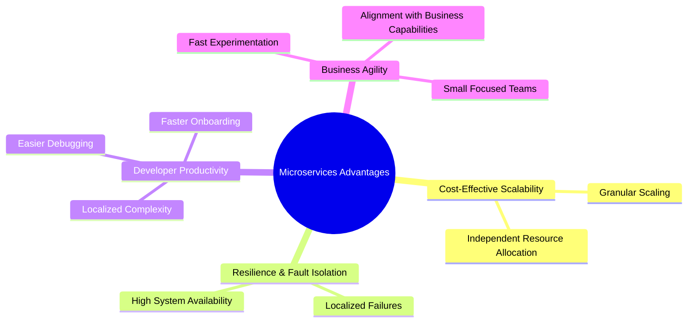

# Advantages of Microservices Architecture

### Core Technical & Operational Benefits

---

### 1. Cost-Effective & Granular Scalability

- **Independent Scaling:** Services can be scaled up or down independently based on actual demand rather than scaling the entire monolithic application stack.
- **Targeted Resource Allocation:** You can allocate expensive CPU/RAM resources precisely where scaling bottlenecks occur (e.g., scaling only the _Payment Service_ during peak traffic while keeping the _Notification Service_ baseline).

---

### 2. Fault Isolation & High Resilience

- **Localized Failure:** Because components are loosely coupled and execute independently, an unhandled error or crash in one microservice (e.g., _Recommendations_) does not bring down the rest of the application (e.g., _User Checkout_).
- **System Continuity:** Surrounding microservices continue to function normally, preserving core business workflows.

---

### 3. Reduced Complexity & High Developer Productivity

- **Localized Complexity:** Developers only need to understand the codebase and dependencies of their specific, self-contained microservice rather than navigating an entire enterprise monolith.
- **Fast Onboarding:** New engineers and architects can get up to speed quickly by focusing on a small, isolated piece of software.
- **Simplified Debugging:** With a smaller, scoped codebase per service, identifying bugs, testing, and troubleshooting logic becomes far faster and easier.

---

### 4. Business Agility & Market Alignment

- **Rapid Experimentation ("Fail Fast"):** Small, independent releases allow teams to deploy experimental features quickly with low risk to the core system.
- **Alignment with Business Use Cases:** Microservices are structured directly around specific business capabilities, making it easier to align software delivery with real customer value.
- **Seamless Updates & Removal:** Individual services can be refactored, upgraded, or removed without impacting the overarching system architecture.
- **Agile, Focused Teams:** Small, cross-functional teams take full ownership of individual services, maximizing execution speed and accountability.
