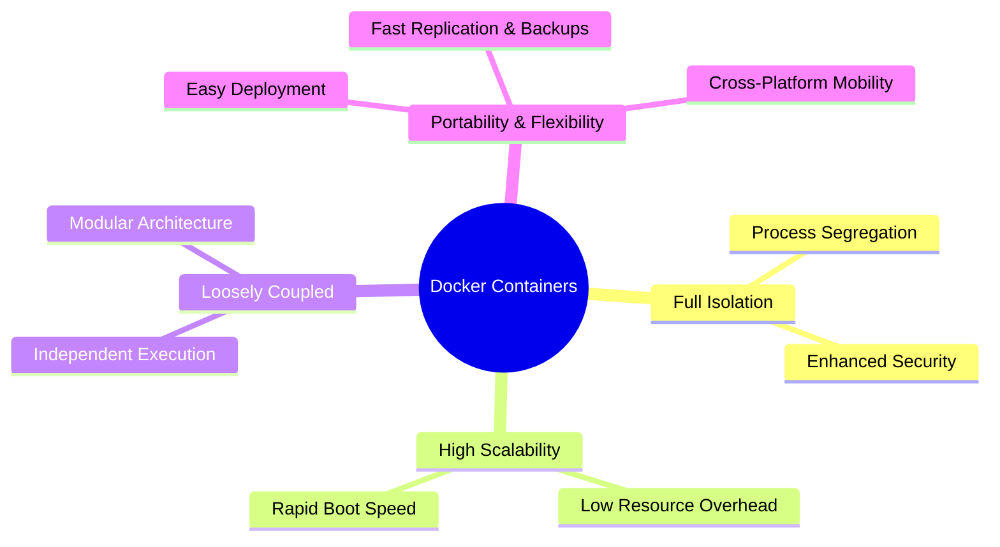

# Containerization & Core Advantages of Docker

### How Docker Achieves Containerization

Docker acts as a software containerization platform that allows developers to **build** an application and **package** it together with its complete execution environment (code, runtimes, libraries, environment variables, and config files) into a single standard container image.

This guarantees that the application runs **reliably and predictably** across any infrastructure—from a developer's local laptop to cloud environments.

---

### Core Advantages of Docker Containers

#### 1. Full Application Isolation & Security

- Each major application process or service runs inside its own isolated container.
- Process segregation prevents one compromised or faulty service from affecting other containers on the same host, creating a secure runtime environment.

#### 2. High Scalability & Rapid Boot Speed

- Because containers share the host kernel and carry low resource overhead, they boot in seconds.
- Workloads can scale in and out dynamically in response to traffic demand without heavy hardware provisioning.

#### 3. Loosely Coupled Architecture

- Containers operate independently of one another.
- Updating, upgrading, or restarting one containerized microservice does not interrupt the operations of surrounding containers.

#### 4. Lightweight, Portable & Flexible Operations

- **Move & Replicate:** Easily copy or transfer containerized workloads across local, staging, and multi-cloud environments.
- **Backup & Restore:** Container images and state configurations can be archived, versioned, and restored rapidly.
