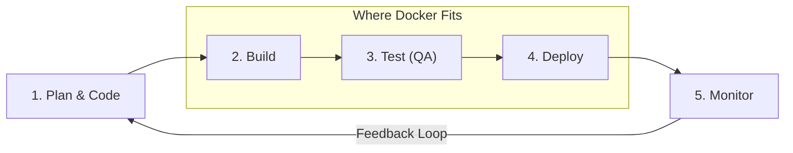

# The Role of Docker in DevOps

### Understanding DevOps Methodology

**DevOps** combines **Dev** (Development) and **Ops** (Operations). It is a cultural philosophy and software engineering practice designed to bridge the traditional gap between development, testing, and operations teams.

> **Key Definition:** DevOps ensures that the release, configuration, and monitoring of software are handled collaboratively by everyone who builds it. It emphasizes communication, continuous integration (CI), automated testing, continuous deployment (CD), and quality assurance.

---

### The DevOps Lifecycle & Continuous Pipeline

In a DevOps workflow, code progresses continuously through automated stages:

---

### How Docker Empowers DevOps

Executing the DevOps process continuously requires a robust set of automated tools working hand-in-hand. Docker acts as the **core enabler of continuous application deployment** across the pipeline:

- **Eliminates "It Works on My Machine":** Developers build features in containers that run identically across testing, staging, and production environments.
- **Accelerates CI/CD Pipelines:** Lightweight container images can be compiled, tested, and deployed in seconds, removing manual server configuration steps.
- **Standardizes Environment Configuration:** Infrastructure and runtime dependencies are version-controlled alongside code via `Dockerfile` and `docker-compose.yml`.
- **Simplifies Automated Scaling & Rollbacks:** Because containers are immutable, deploying updates or rolling back to previous container versions is seamless and safe.
