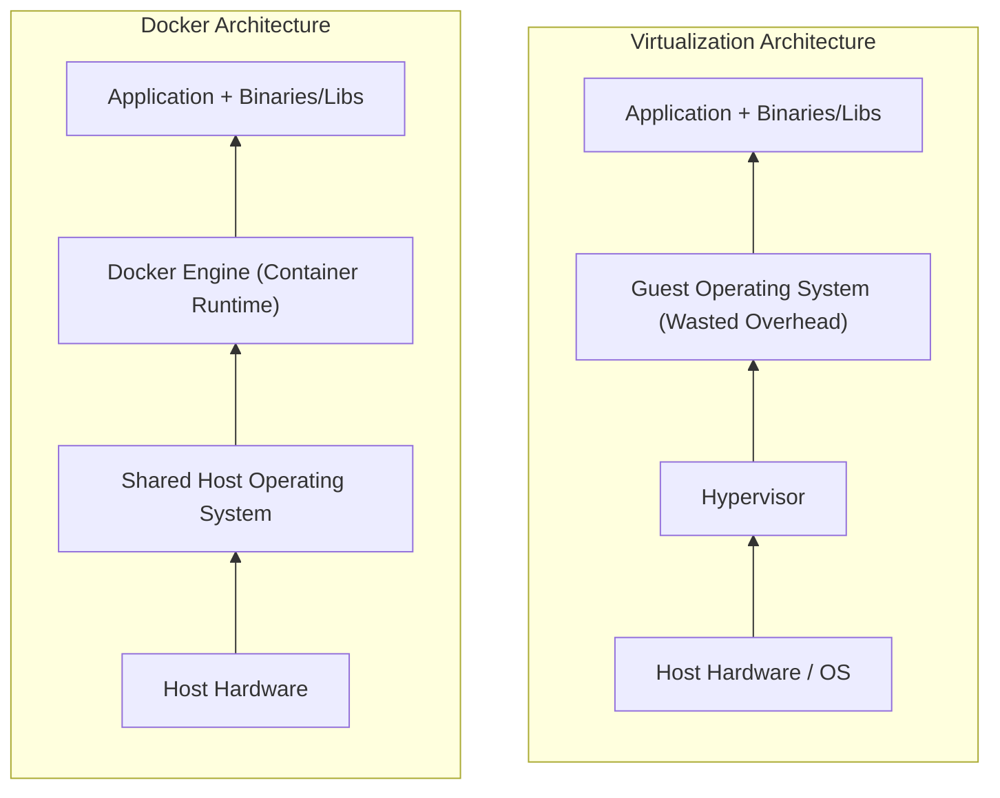

# Docker Containers vs. Virtual Machines

### Architectural Differences

The main difference lies in **how operating system resources are allocated**. Virtual Machines require a dedicated Guest OS per instance, while Docker containers share the host operating system's kernel.

---

### Detailed Comparison Matrix

| Feature / Aspect          | Docker (Containers)                                                              | Virtual Machines (Virtualization)                                                    |
| ------------------------- | -------------------------------------------------------------------------------- | ------------------------------------------------------------------------------------ |
| **OS Architecture**       | Shares the Host Operating System kernel                                          | Requires a full **Guest OS** for every instance                                      |
| **Hypervisor Dependency** | **No Hypervisor required**; runs via Docker Engine                               | **Requires Hypervisor** (and management OS layer)                                    |
| **Resource Overhead**     | **Lightweight** — uses resources on-demand                                       | **Heavyweight** — requires permanent hardware allocation before boot                 |
| **Startup Time**          | **Seconds** (instant boot)                                                       | **Minutes** (full OS boot cycle)                                                     |
| **Storage Size**          | **Megabytes (MB)** — packages only app code & dependencies                       | **Gigabytes (GB)** — packages entire OS image, kernel, & utilities                   |
| **Performance**           | **Higher performance** — runs directly on host server without hardware emulation | **Lower relative performance** — additional overhead due to hardware emulation       |
| **Portability & Scaling** | Fast scaling (scale in/out instantly); easily portable across environments       | Slower scaling; moving large VM images across networks is time-intensive             |
| **Ideal Use Case**        | Microservices, shorter task lifecycles, high-density deployments, rapid scaling  | Long-term stable workloads requiring full OS functionality or kernel-level isolation |

---

### Key Takeaways

1. **Elimination of Guest OS Waste:** VMs waste CPU, RAM, and disk space just to keep the Guest OS running. Containers eliminate this waste by sharing the host OS binaries and libraries.
2. **On-Demand Resource Allocation:** Containers only take system resources as needed at runtime, allowing you to maximize server density with minimal hardware infrastructure.
3. **Execution Speed:** Because containers run directly on the host without emulating hardware layer operations, they deliver near-native CPU and memory performance.
