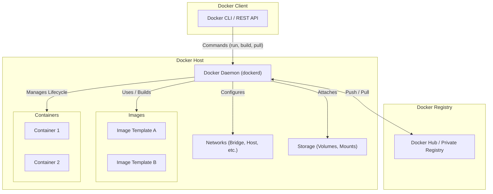
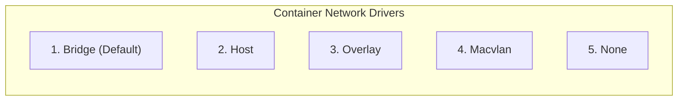
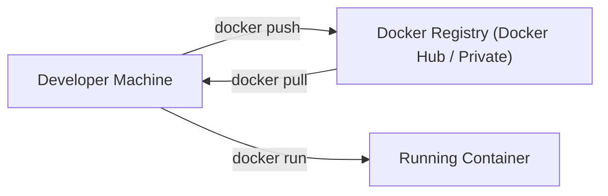

## 11. Comprehensive Docker Architecture

Docker operates on a **Client-Server architecture**. The client interacts with the host's background daemon, which handles all heavy lifting—building, running, and managing container environments.

---

### Core Components Breakdown

| Component                     | Function & Responsibilities                                                                                                |
| ----------------------------- | -------------------------------------------------------------------------------------------------------------------------- |
| **Docker Client**             | The user interface (CLI or REST API) used to execute Docker instructions. It communicates with one or more Docker Daemons. |
| **Docker Host**               | The physical or virtual machine running the Docker Engine environment.                                                     |
| **Docker Daemon (`dockerd`)** | The background service managing containers, images, networks, and storage volumes in response to API calls.                |
| **Docker Images**             | Immutable, read-only templates containing code, runtime, libraries, and metadata used to construct containers.             |
| **Docker Containers**         | Isolated, encapsulated runtime environments created from Docker images.                                                    |

---

### Container Networking Drivers

Networking allows isolated containers to communicate with each other, the host, or external networks.

1. **Bridge (Default):** Default network driver. Isolated private network created on the host for inter-container communication.
2. **Host:** Removes network isolation between the container and the Docker host (container shares the host's IP and ports directly).
3. **Overlay:** Enables networking across **multiple physical Docker hosts** or within Docker Swarm cluster services.
4. **Macvlan:** Assigns a real MAC address to a container, making it appear as a physical hardware device on the local network.
5. **None:** Switches off all container networking, completely isolating the container.

---

### Persistent Storage Techniques

While data can be stored in a container's ephemeral writable layer via storage drivers, production applications rely on four persistent storage techniques:

- **Data Volumes:** Dedicated host file system locations managed by Docker, using efficient Copy-on-Write (CoW) mechanisms.
- **Volume Containers:** Hosting a dedicated volume inside an independent container and mounting it across other worker containers.
- **Directory Mounts (Bind Mounts):** Directly mounting an arbitrary local directory or path from the host machine into a container path.
- **Storage Plugins:** Drivers connecting Docker directly to external enterprise storage systems, arrays, or cloud storage providers.

---

### Docker Registry & Image Commands

The **Docker Registry** is the central repository for storing and managing Docker images.

- **Public Registry:** Publicly accessible image repositories like **Docker Hub** or Docker Cloud.
- **Private Registry:** In-house registries used by organizations to distribute proprietary images securely within private networks.

#### Essential Image Operations

- `docker pull <image_name>` — Downloads an image from the registry to the local host.
- `docker push <image_name>` — Uploads a locally built image to the registry.
- `docker run <image_name>` — Instantiates and starts a running container from an image template.
