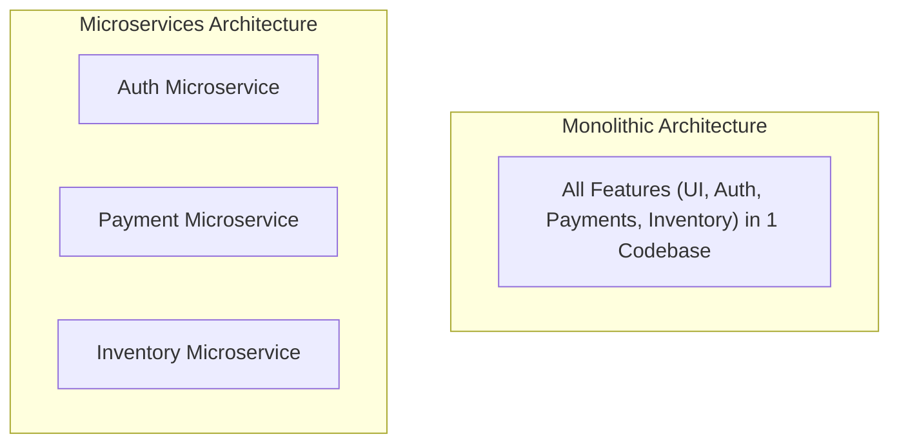
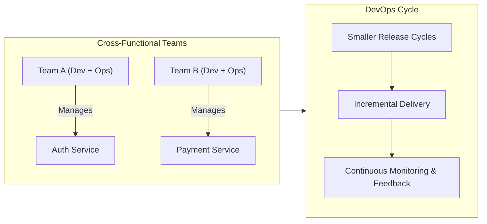

# Introduction to Microservices Architecture

### Evolution of Application Architecture

Application architecture has evolved across three major eras:

1. **Monolithic Architecture:** Entire applications built, packaged, and deployed as a single, tightly coupled unit.
2. **N-Tier Architecture:** Multi-layered division separating representation, business logic, and database management.
3. **Service-Oriented Architecture (SOA):** Designing software around discrete reusable services interacting via enterprise service buses.
4. **Microservices Architecture:** A modern refinement ("twist") of SOA where an application is decomposed into small, fine-grained, independently deployable services.

---

### How Microservices Enable the DevOps Ideology

Microservices break down large applications into modular segments handled by small, autonomous cross-functional teams. This structure directly aligns with and powers the DevOps philosophy:

- **Unified Responsibilities:** Eliminates siloing between Development and Operations teams—each team owns the full lifecycle of their assigned microservices.
- **Rapid Application Changes:** Independent services can be modified, tested, and deployed individually without risk to the surrounding infrastructure.
- **Short Production Schedules:** Features deliver incrementally in smaller release cycles, monitored in real time using continuous observability tools.

---

### Industry Benchmark Case Studies

Leading tech organizations adopted Microservices alongside DevOps to achieve unprecedented deployment scale and system resilience:

- **Amazon:** Transitioned from a monolithic codebase to a decentralized, microservice-driven architecture, enabling thousands of independent deployments per day.
- **Netflix:** Pioneered cloud-native microservices to handle millions of concurrent video streams reliably through fine-grained resilience and isolated fault domains.
