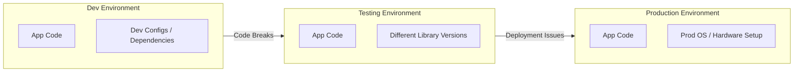
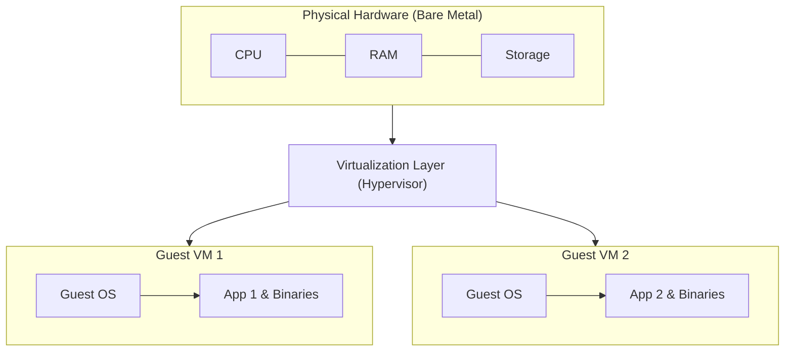
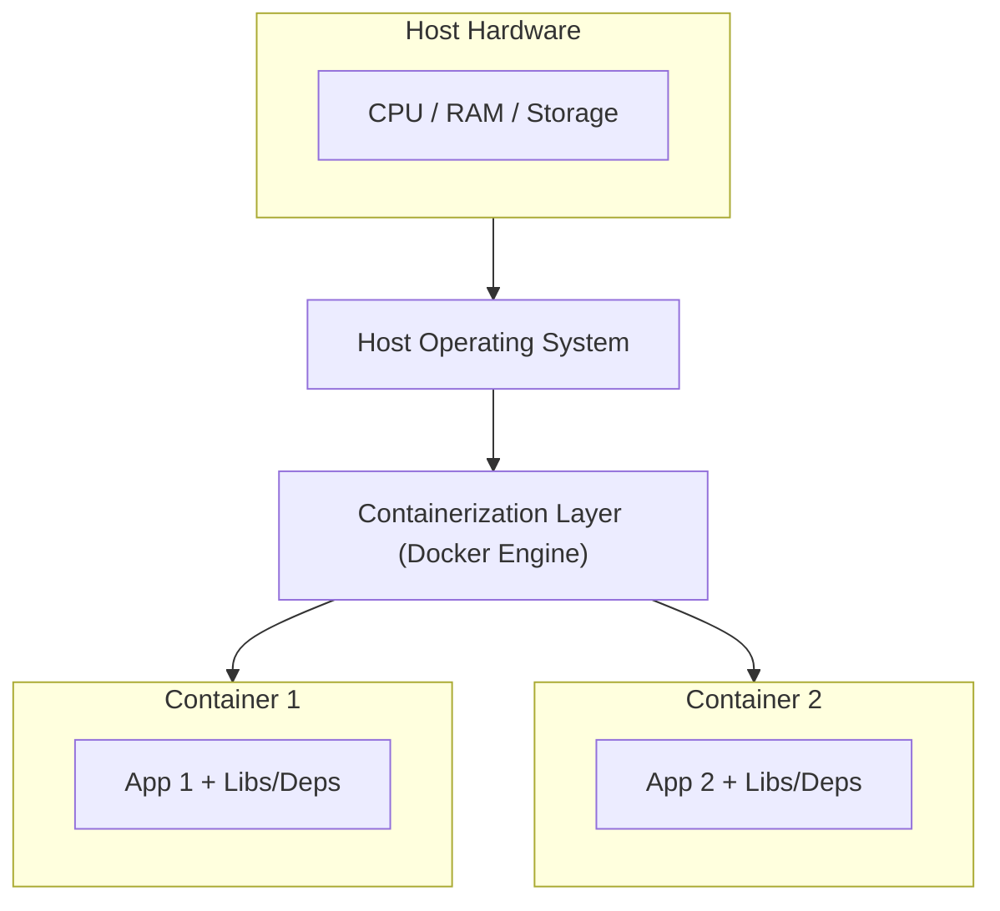
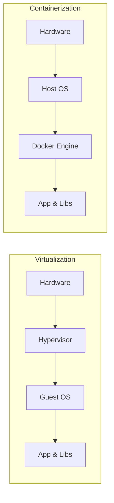

# 🐳 Notes: Docker, Virtualization & Containerization Fundamentals

## 1. The Pre-Docker Challenge: "It Works on My Machine"

Traditionally, software development involves multiple distinct teams:

- **Development Team** (writes the code)
- **Testing Team** (validates functionality)
- **Operations Team** (deploys and maintains in production)

### The Core Problem

Each team operates in its own **isolated, differently configured environment**.

**Key Issues Arising:**

- **Environment Drift:** Discrepancies in OS versions, libraries, runtime environments, and system configurations across environments.
- **Inconsistent Code Behavior:** Code that passes in local dev fails during QA or production deployment.
- **Deployment Delays:** Significant effort wasted troubleshooting configuration mismatches instead of writing features.

---

## 2. Solution 1: Virtualization (Hypervisor-Based)

Virtualization abstracts physical hardware, allowing a single physical server to run multiple completely isolated virtual environments.

### Key Characteristics

- **Virtual Machine (VM):** Acts as a full-fledged virtual computer with dedicated virtual CPU, memory, and storage.
- **Hypervisor:** A specialized layer (often running a lightweight Linux OS on bare metal) that segregates hardware resources and provisions them to guest VMs.

### Core Architecture Components

| Term                     | Description                                                                     |
| ------------------------ | ------------------------------------------------------------------------------- |
| **Host**                 | The physical bare-metal hardware resources managed by the hypervisor.           |
| **Guest**                | The full operating system installed on top of the VM to run the application.    |
| **Virtualization Layer** | The hypervisor software that creates, manages, and isolates guest environments. |

---

## 3. Solution 2: Containerization (Docker-Based)

Containerization provides OS-level virtualization, packaging the application code alongside only its necessary runtime dependencies.

### What is a Container?

A **container** is a lightweight, standardized unit of software that encapsulates code, binaries, libraries, and configuration files required for an application to run reliably across different computing environments.

### What is Docker?

**Docker** is an open platform implementation of containerization designed to develop, ship, and run applications independently of the underlying infrastructure.

### Key Advantages of Docker

- **Unified Environments:** Developers and testers run the exact same container image, eliminating configuration discrepancies.
- **Infrastructure Management:** Manage deployment infrastructure using the same pipelines used for application code.
- **Accelerated Delivery:** Drastically reduces the time gap between writing code in development and running it in production.

---

## 4. Summary: Virtualization vs. Containerization

| Feature               | Virtualization (VMs)                     | Containerization (Docker)                 |
| --------------------- | ---------------------------------------- | ----------------------------------------- |
| **Isolation Level**   | Hardware-level isolation                 | OS-level isolation (shared OS kernel)     |
| **Operating System**  | Each VM includes a full Guest OS         | Containers share the host OS kernel       |
| **Resource Overhead** | Heavy (runs multiple guest OS instances) | Lightweight (fast startup, low footprint) |
| **Primary Goal**      | Abstract physical hardware               | Package and isolate application code      |
