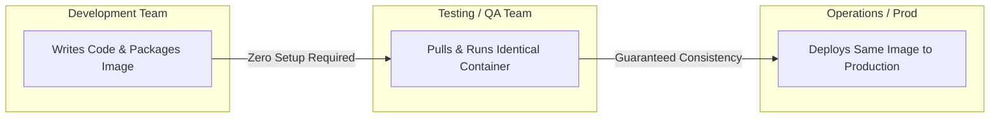
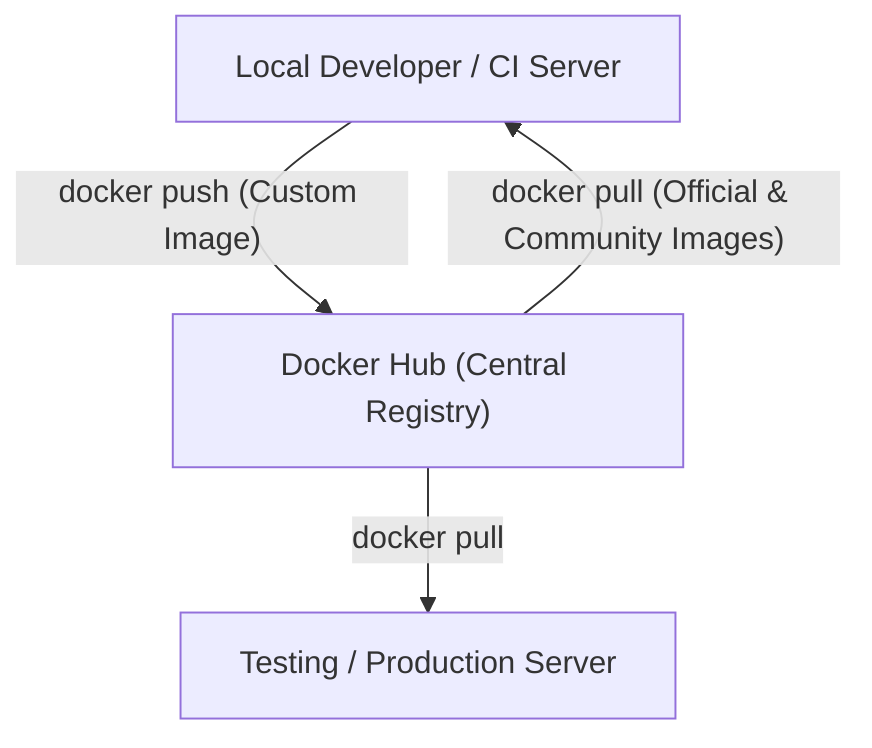

# Why Use Docker? Core Value & Docker Hub

### Key Drivers for Adopting Docker

While both Virtualization and Containerization allow running isolated workloads on a single host machine, Docker provides distinct operational advantages:

1. **Independent Runtime Bundling:** Bundles the complete runtime environment (application code, binaries, configuration, and libraries) into a single unified package.
2. **Dependency Isolation:** Solves dependency conflicts ("dependency hell") by isolating each application and its exact required library versions inside its own container.
3. **Cloud-Like Infrastructure Flexibility:** Brings cloud-native portability to any infrastructure (on-premise servers, local developer laptops, or public cloud providers) capable of running a container engine.
4. **Environment Consistency:** Guarantees absolute consistency across all pipeline stages — from local development to QA testing and production deployment.

---

### Impact on Multi-Team Collaboration

Docker eliminates manual software installation and setup overhead across engineering teams:

- **Zero-Setup Testing:** QA and testing teams no longer need to manually install dependencies, runtime frameworks, or database drivers to evaluate code.
- **Massive Time Savings:** Drastically cuts down onboarding and configuration time, allowing teams to focus on features rather than environment setup.

---

### Docker Hub: The Central Image Registry

Similar to how **GitHub** functions as a centralized repository for source code, **Docker Hub** serves as a public repository for Docker images.

- **Public & Community Images:** Access thousands of pre-built, vetted official images (e.g., Python, Node.js, PostgreSQL, NGINX, Redis) uploaded by official maintainers and open-source communities.
- **Custom Image Distribution:** Developers can build custom application images and push them to Docker Hub to easily pull and run them across any machine or environment worldwide.
