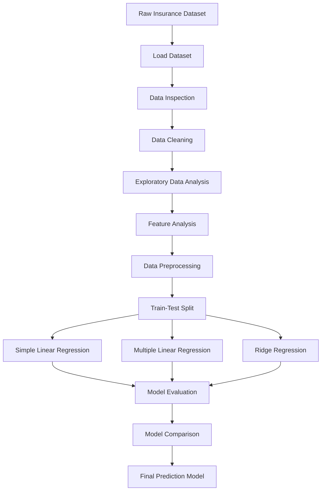

```mermaid
flowchart TD
    A[Raw Insurance Dataset] --> B[Load Dataset]
    B --> C[Data Inspection]
    C --> D[Data Cleaning]
    D --> E[Exploratory Data Analysis]
    E --> F[Feature Analysis]
    F --> G[Data Preprocessing]
    G --> H[Train-Test Split]
    H --> I[Simple Linear Regression]
    H --> J[Multiple Linear Regression]
    H --> K[Ridge Regression]
    I --> L[Model Evaluation]
    J --> L
    K --> L
    L --> M[Model Comparison]
    M --> N[Final Prediction Model]

```
