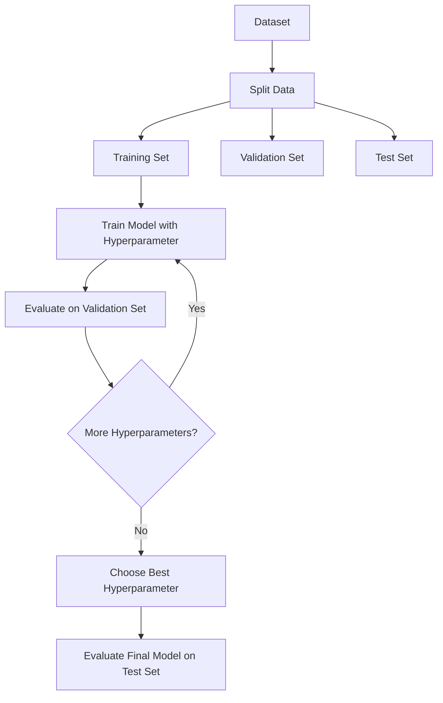
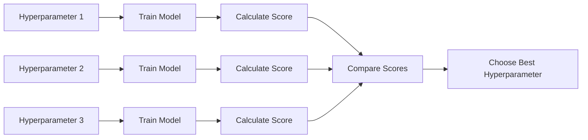
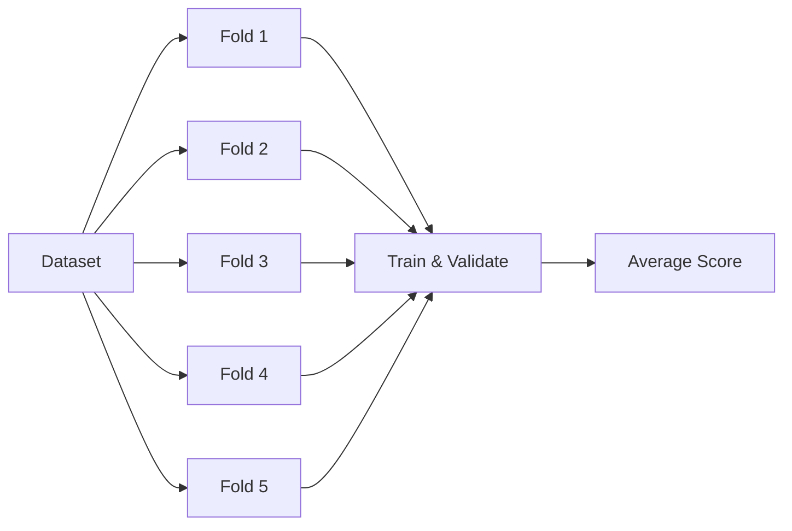
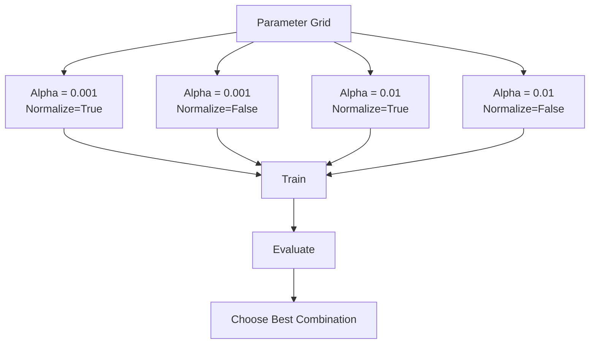
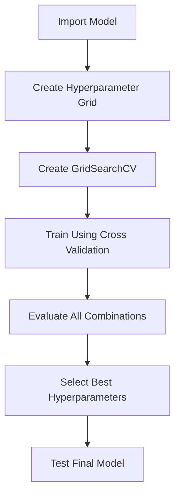

# Grid Search for Hyperparameter Tuning

## Overview

**Grid Search** is a hyperparameter optimization technique used to automatically find the **best combination of hyperparameters** for a machine learning model.

Instead of manually testing different parameter values, Grid Search systematically evaluates every possible combination using **Cross Validation**.

Scikit-learn provides this functionality through the **`GridSearchCV`** class.

---

# What are Hyperparameters?

Hyperparameters are **configuration values** that are set **before** training the model.

They are **not learned** from the data during training.

Examples:

- Alpha (Ridge Regression)
- Polynomial Degree
- Number of Neighbors (KNN)
- Maximum Depth (Decision Tree)
- Learning Rate

---

# Parameters vs Hyperparameters

| Parameters                       | Hyperparameters             |
| -------------------------------- | --------------------------- |
| Learned during training          | Set before training         |
| Example: Regression coefficients | Example: Alpha              |
| Optimized by learning algorithm  | Optimized using Grid Search |

---

# Why Do We Need Grid Search?

Choosing hyperparameters manually is:

- Time-consuming
- Error-prone
- May not produce the best model

Grid Search automatically tests multiple combinations and selects the best one.


---

# How Grid Search Works

Suppose we want to tune **Alpha** in Ridge Regression.

Possible values:

```
Alpha

0.001
0.01
0.1
1
10
100
```

Grid Search trains one model for **each** value.

---

# Grid Search Workflow



---

# Model Selection Process

For every hyperparameter value:

1. Train the model.
2. Predict validation data.
3. Compute evaluation metric.
4. Store the score.
5. Repeat for all values.
6. Select the best-performing model.



---

# Evaluation Metrics

Grid Search can optimize different metrics.

Common choices:

- **R² Score**
- **Mean Squared Error (MSE)**
- Accuracy
- Precision
- Recall
- F1 Score

### Selection Rule

| Metric | Best Value |
| ------ | ---------- |
| R²     | Highest    |
| MSE    | Lowest     |

---

# Cross Validation in Grid Search

Instead of evaluating on a single validation set, Grid Search usually performs **K-Fold Cross Validation**.

Example (5-Fold Cross Validation):



This provides a more reliable estimate of model performance.

---

# Grid Search in Scikit-Learn

Import the required library.

```python
from sklearn.model_selection import GridSearchCV
```

---

# Step 1: Create the Model

```python
from sklearn.linear_model import Ridge

ridge = Ridge()
```

---

# Step 2: Define Hyperparameter Grid

The hyperparameter grid is stored as a **Python dictionary**.

Example:

```python
parameters = {
    "alpha":[0.001,0.01,0.1,1,10,100]
}
```

Each:

- **Key** → Hyperparameter name
- **Value** → List of values to test

---

# Hyperparameter Grid

Example:

| Hyperparameter | Values                  |
| -------------- | ----------------------- |
| alpha          | 0.001, 0.01, 0.1, 1, 10 |

---

# Step 3: Create GridSearchCV Object

```python
Grid = GridSearchCV(
    ridge,
    parameters,
    cv=4
)
```

Parameters:

- **ridge** → Model
- **parameters** → Hyperparameter grid
- **cv** → Number of folds

Default scoring:

```
R² Score
```

---

# Step 4: Train Grid Search

```python
Grid.fit(X_train, y_train)
```

Grid Search automatically:

- Trains multiple models
- Performs Cross Validation
- Stores scores
- Finds the best parameters

---

# Best Hyperparameters

Retrieve the best model.

```python
Grid.best_estimator_
```

Example Output

```
Ridge(alpha=0.01)
```

---

# Cross Validation Results

Retrieve all evaluation results.

```python
Grid.cv_results_
```

Contains:

- Mean validation score
- Standard deviation
- Rank
- Parameter combinations

---

# Example Search

Suppose:

```
Alpha

0.001
0.01
0.1
1
```

Grid Search evaluates:

```
Model 1 → Alpha = 0.001

Model 2 → Alpha = 0.01

Model 3 → Alpha = 0.1

Model 4 → Alpha = 1
```

Then selects the highest R² (or lowest MSE).

---

# Searching Multiple Hyperparameters

Grid Search can optimize more than one hyperparameter simultaneously.

Example:

```python
parameters = {
    "alpha":[0.001,0.01,0.1,1],
    "normalize":[True,False]
}
```

---

# Hyperparameter Grid Example

| Alpha | Normalize |
| ----- | --------- |
| 0.001 | True      |
| 0.001 | False     |
| 0.01  | True      |
| 0.01  | False     |
| 0.1   | True      |
| 0.1   | False     |
| 1     | True      |
| 1     | False     |

Every combination is tested.

---

# Multiple Hyperparameter Workflow



---

# Number of Models Trained

Suppose:

```
Alpha = 6 values

Normalize = 2 values

Cross Validation = 5 folds
```

Total models trained:

```
6 × 2 × 5

= 60 Models
```

---

# Advantages of Grid Search

- Automatically tunes hyperparameters
- Easy to implement
- Works with Cross Validation
- Reduces manual experimentation
- Finds optimal parameter combinations
- Improves model performance

---

# Limitations

- Computationally expensive
- Slow for large parameter spaces
- Tests every combination, even poor ones
- Not suitable for very large search spaces

---

# Complete Workflow



---

# Key Scikit-Learn Attributes

| Attribute         | Purpose                                |
| ----------------- | -------------------------------------- |
| `best_estimator_` | Best trained model                     |
| `best_params_`    | Best hyperparameter values             |
| `best_score_`     | Best validation score                  |
| `cv_results_`     | Scores for every parameter combination |

---

# Key Points

- **Grid Search** automatically finds the best hyperparameters.
- Hyperparameters are **set before training** and are **not learned** by the model.
- Grid Search evaluates every combination of parameter values.
- It uses **Cross Validation** for reliable model evaluation.
- Common evaluation metrics include **R²** and **MSE**.
- The hyperparameter grid is defined using a **Python dictionary**.
- **`GridSearchCV`** automates training, validation, and parameter selection.
- Useful attributes include **`best_estimator_`**, **`best_params_`**, and **`cv_results_`**.

---

# Interview Questions

### 1. What is Grid Search?

A hyperparameter tuning technique that evaluates all possible parameter combinations using Cross Validation to find the best-performing model.

---

### 2. What are hyperparameters?

Hyperparameters are configuration values set before training, such as **alpha**, **max_depth**, or **learning_rate**.

---

### 3. What is the difference between parameters and hyperparameters?

Parameters are learned during training, whereas hyperparameters are chosen before training and control the learning process.

---

### 4. Which Scikit-learn class performs Grid Search?

`GridSearchCV`

---

### 5. Why is Cross Validation used in Grid Search?

To obtain a more reliable estimate of model performance by evaluating it on multiple validation splits.

---

### 6. Which metrics can Grid Search optimize?

Common metrics include **R²**, **Mean Squared Error (MSE)**, **Accuracy**, **Precision**, **Recall**, and **F1 Score**.

---

### 7. What does `best_estimator_` return?

The trained model with the best-performing hyperparameter combination.

---

### 8. What does `cv_results_` contain?

It stores detailed Cross Validation results, including scores, rankings, and parameter combinations.

---

### 9. What happens if two hyperparameters are included in the grid?

Grid Search evaluates **every possible combination** of their values.

---

### 10. What is the main disadvantage of Grid Search?

It can be computationally expensive because it exhaustively evaluates every parameter combination.
