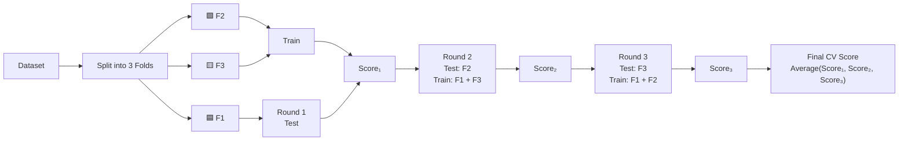
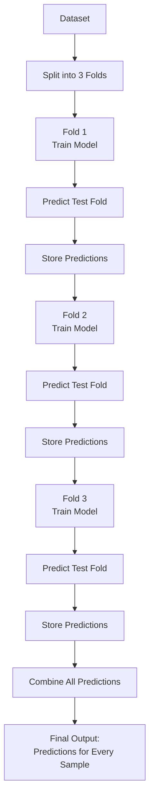

# Model Evaluation (Train/Test Split & Cross Validation)

## What is Model Evaluation?

Model evaluation measures **how well a machine learning model performs on unseen (real-world) data**.

> **Goal:** Estimate how accurately the trained model will predict new data.

---

# In-Sample vs Out-of-Sample Evaluation

## In-Sample Evaluation

Uses the **same data that trained the model**.

### Purpose

- Measures how well the model fits the training data.
- Cannot tell how well the model will perform on new data.

### Problem

A model may memorize the training data (**overfitting**), giving excellent training performance but poor real-world performance.

---

## Out-of-Sample Evaluation

Uses **new, unseen data** that was **not used during training**.

### Purpose

- Estimates real-world performance.
- Measures the model's **generalization ability**.

---

# Train-Test Split

The dataset is divided into two parts:

```
Entire Dataset
      │
      ▼
 ┌──────────────┬──────────────┐
 │ Training Set │ Testing Set  │
 │     70%      │     30%       │
 └──────────────┴──────────────┘
```

Typical split:

- **70%** → Training
- **30%** → Testing

(Other common ratios: 80/20, 75/25)

---

## Training Set

Used to:

- Learn patterns
- Build the predictive model
- Estimate model parameters

---

## Testing Set

Used to:

- Evaluate performance
- Estimate real-world accuracy
- Measure generalization error

---

# Workflow

```
Dataset
   │
   ▼
Split Data
   │
   ├────────► Training Data
   │            │
   │            ▼
   │      Train Model
   │
   └────────► Testing Data
                │
                ▼
        Evaluate Performance
```

---

# Using All Data After Evaluation

After selecting the best model:

- Train again using **100% of the dataset**.
- This allows the final model to learn from all available information.

---

# train_test_split() in Scikit-Learn

```python
from sklearn.model_selection import train_test_split

X_train, X_test, y_train, y_test = train_test_split(
    X_data,
    y_data,
    test_size=0.3,
    random_state=42
)
```

---

## Parameters

### `X_data`

Predictor variables (Features)

Example:

- Horsepower
- Engine Size
- Width
- Fuel Consumption

---

### `y_data`

Target variable

Example:

- Car Price

---

### `test_size`

Percentage of testing data.

Example:

```python
test_size = 0.3
```

Means:

- 70% Training
- 30% Testing

---

### `random_state`

Random seed used for reproducibility.

Example:

```python
random_state = 42
```

Ensures the dataset is split the same way every time.

---

# Output Variables

```python
X_train
```

Training features

```python
X_test
```

Testing features

```python
y_train
```

Training labels

```python
y_test
```

Testing labels

---

# Generalization Error

## Definition

Generalization Error is the error made when predicting **previously unseen data**.

```
Generalization Error
=
Real-world Prediction Error
```

Testing error is only an **approximation** of the true generalization error.

---

# Distribution Comparison

### Training Data

Actual values and predicted values usually look similar.

```
Actual  █████████
Predict ████████
```

Good fit.

---

### Testing Data

Predictions may differ more from actual values.

```
Actual  █████████
Predict █████
```

Difference represents **generalization error**.

---

# Trade-off: Training Size vs Testing Size

## Case 1: More Training Data

Example:

```
90% Train
10% Test
```

### Advantages

- Better learning
- More accurate model

### Disadvantages

- Small testing set
- Evaluation varies more
- Low precision of error estimate

---

## Case 2: More Testing Data

Example:

```
60% Train
40% Test
```

### Advantages

- More reliable evaluation
- Higher precision

### Disadvantages

- Less data for learning
- Lower model accuracy

---

# Why Cross Validation?

Train-test split depends on one random split.

Different random splits produce different performance estimates.

Cross Validation reduces this randomness.

---

# Cross Validation

The dataset is divided into **K equal parts (folds).**

Example:

```
Dataset

┌────┬────┬────┬────┐
│ F1 │ F2 │ F3 │ F4 │
└────┴────┴────┴────┘
```

Each fold becomes the testing set exactly once.

---

# Example (4-Fold Cross Validation)

### Round 1

```
Train : F2 F3 F4
Test  : F1
```

---

### Round 2

```
Train : F1 F3 F4
Test  : F2
```

---

### Round 3

```
Train : F1 F2 F4
Test  : F3
```

---

### Round 4

```
Train : F1 F2 F3
Test  : F4
```

---

Average all scores.

```
Final Score

=
(score1 + score2 + score3 + score4) / 4
```

---

# Advantages of Cross Validation

- Better estimate of real-world performance

- Uses all data for both training and testing

- Less dependent on one random split

- More reliable model evaluation

---

# cross_val_score()

Performs K-fold cross validation and returns evaluation scores.

```python
from sklearn.model_selection import cross_val_score

scores = cross_val_score(
lr,
X_data,
y_data,
cv=3
)

```

---

## Parameters

### `lr`

Machine Learning model

Example:

```python
LinearRegression()
```

---

### `X_data`

Feature matrix

---

### `y_data`

Target values

---

### `cv`

Number of folds.

Example:

```python
cv = 3
```

Dataset is split into **3 equal parts**.

---

# Output

Returns an array.

Example

```python
scores

array([0.72, 0.80, 0.76])
```

---

# Average Cross Validation Score

```python
import numpy as np

scores.mean()
```

or

```python
np.mean(scores)
```

Example

```
Scores

0.72
0.80
0.76

↓

Mean

0.76
```

This is the estimated **out-of-sample R² score**.

---

# cross_val_score Workflow



---

# cross_val_predict()

Sometimes we need **predicted values**, not just scores.

Use:

```python
from sklearn.model_selection import cross_val_predict

predictions = cross_val_predict(
    lr,
    X_data,
    y_data,
    cv=3
)
```

---

## Output

Returns predictions for every observation.

Example

```python
array([
    13450,
    21000,
    17890,
    ...
])
```

Instead of returning only R² scores.

---

# cross_val_predict Workflow



---

# train_test_split vs cross_val_score vs cross_val_predict

| Feature                       | train_test_split    | cross_val_score | cross_val_predict    |
| ----------------------------- | ------------------- | --------------- | -------------------- |
| Purpose                       | Split data          | Evaluate model  | Generate predictions |
| Output                        | Train/Test datasets | Scores          | Predictions          |
| Multiple splits               | No                  | Yes             | Yes                  |
| Uses every sample for testing | No                  | Yes             | Yes                  |
| Returns predictions           | No                  | No              | Yes                  |

---

# Key Interview Questions

### Q1. Why shouldn't we evaluate a model only on training data?

Because it only measures **in-sample performance** and cannot estimate how well the model will perform on unseen data (risk of overfitting).

---

### Q2. What is Generalization Error?

The error made by a model when predicting **new, unseen data**.

---

### Q3. Why is Cross Validation better than a single Train-Test Split?

- Uses multiple train/test splits.
- Produces a more reliable estimate of model performance.
- Reduces dependence on one random split.

---

### Q4. What does `cv=5` mean?

The dataset is divided into **5 folds**, and the model is trained and tested **5 times**, using a different fold as the test set each time.

---

### Q5. Difference between `cross_val_score()` and `cross_val_predict()`?

| cross_val_score()                  | cross_val_predict()                            |
| ---------------------------------- | ---------------------------------------------- |
| Returns evaluation scores          | Returns predicted values                       |
| Used to evaluate model performance | Used for prediction analysis and visualization |

---

# Summary

- Model evaluation estimates real-world performance.
- Training data builds the model; testing data evaluates it.
- `train_test_split()` creates training and testing subsets.
- Generalization error measures prediction performance on unseen data.
- More training data improves learning but may reduce evaluation precision.
- Cross Validation provides a more reliable estimate by evaluating multiple train/test splits.
- `cross_val_score()` returns evaluation metrics (e.g., R²).
- `cross_val_predict()` returns predictions for every sample across folds.
