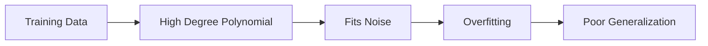
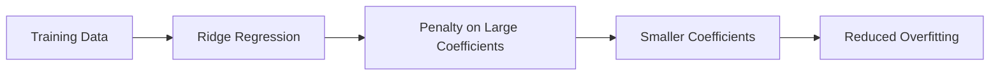
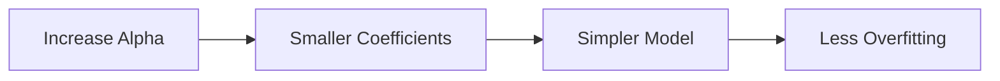
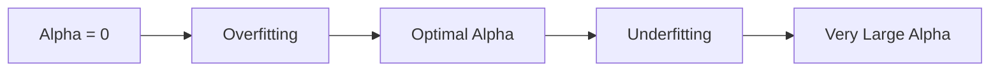
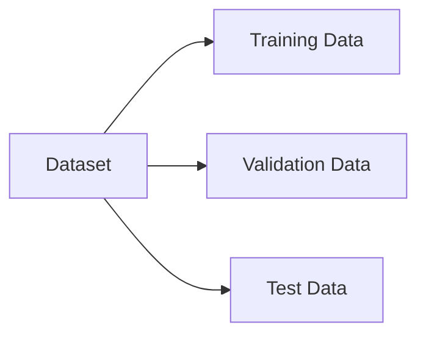
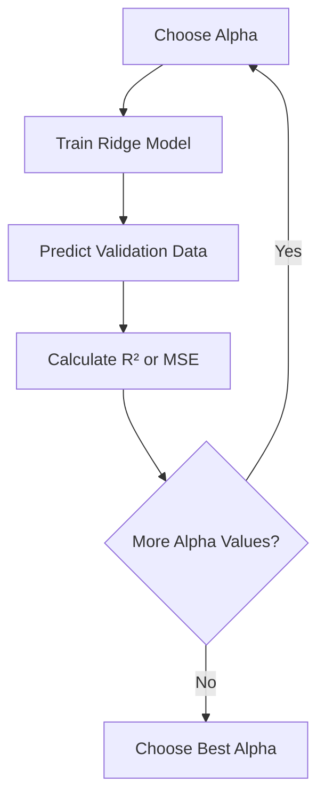
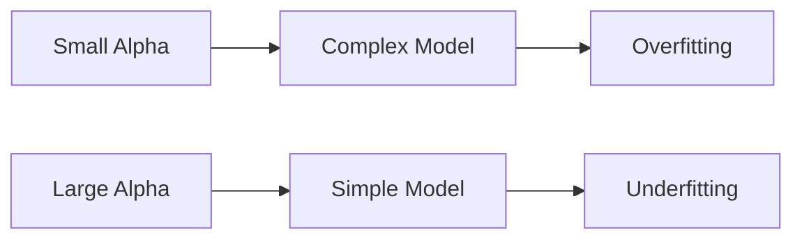
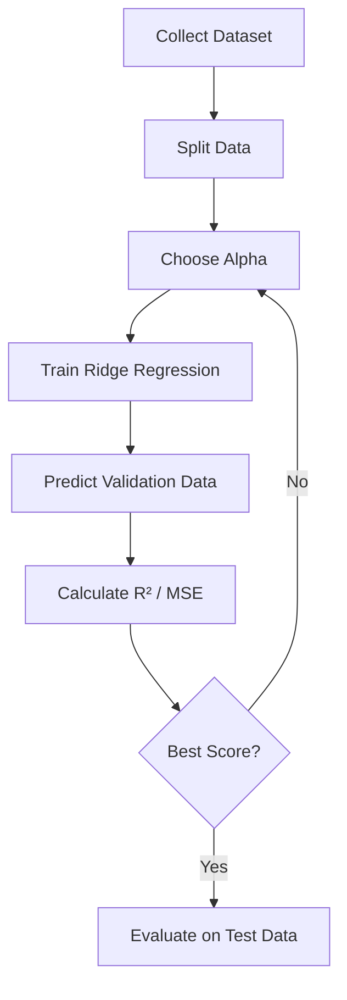

# Ridge Regression

## Overview

**Ridge Regression** is a regularization technique used to **prevent overfitting** by adding a penalty to the regression model. It is particularly useful when:

- Polynomial degree is high
- There are many input features
- Data contains outliers
- Model coefficients become excessively large

Unlike ordinary linear regression, Ridge Regression penalizes large coefficients, producing a simpler and more generalizable model.

---

# Why Do We Need Ridge Regression?

A high-degree polynomial can perfectly fit the training data, but it often learns **noise** instead of the true pattern.

### Example

- True Function → 4th Order Polynomial
- Fitted Model → 10th Order Polynomial

The higher-order model follows every training point, increasing the risk of **overfitting**.



---

# Effect of Outliers

Real-world datasets often contain **outliers**.

An outlier is a data point that does not follow the general pattern.

Example:

```
True Curve

       •
     •   •
   •       •
 •           •

             X  ← Outlier
```

Without regularization:

- The model bends toward the outlier.
- Predictions become inaccurate.
- Generalization performance decreases.

---

# Large Coefficients Problem

Without regularization:

Higher-degree polynomial coefficients become extremely large.

Example

```
y = 2
    + 1.5x
    - 0.8x²
    + 12x³
    - 180x⁴
    + 950x⁵
```

Notice how higher-order coefficients grow dramatically.

Large coefficients indicate a highly complex model that is sensitive to small changes in the data.

---

# Ridge Regression Solution

Ridge Regression introduces a **regularization parameter** called **Alpha (α)**.

Alpha controls the size of the regression coefficients.



---

# Ridge Regression Cost Function

Ordinary Linear Regression minimizes:

\[
RSS=\sum (y_i-\hat{y}\_i)^2
\]

Ridge Regression minimizes:

\[
RSS + \alpha \sum w_i^2
\]

Where:

- **RSS** = Residual Sum of Squares
- **w** = Model coefficients
- **α (Alpha)** = Regularization strength

The additional penalty discourages large coefficients.

---

# Alpha (α)

Alpha is a **hyperparameter** chosen before training.

It determines how much penalty is applied to the coefficients.

| Alpha Value | Effect                |
| ----------- | --------------------- |
| 0           | No Regularization     |
| Small       | Slight Regularization |
| Medium      | Balanced Model        |
| Large       | Strong Regularization |
| Very Large  | Underfitting          |

---

# Effect of Increasing Alpha

As Alpha increases:

- Polynomial coefficients become smaller.
- Model complexity decreases.
- Overfitting is reduced.



---

# Choosing Alpha

Choosing Alpha is critical.

## Alpha = 0

No regularization.

Result:

- Overfitting
- Large coefficients

---

## Alpha = 0.001

- Overfitting begins to reduce.
- Better generalization.

---

## Alpha = 0.01

Best balance.

- Tracks the actual function.
- Good prediction accuracy.

---

## Alpha = 1

Regularization becomes stronger.

Result:

- Slight underfitting.

---

## Alpha = 10

Coefficients become nearly zero.

Result:

- Severe underfitting.
- Model cannot follow the data.

---

# Alpha vs Model Complexity



---

# Coefficient Shrinkage

As Alpha increases:

| Alpha | Coefficient Magnitude |
| ----- | --------------------- |
| 0     | Very Large            |
| 0.001 | Large                 |
| 0.01  | Moderate              |
| 1     | Small                 |
| 10    | Nearly Zero           |

Higher-order polynomial coefficients shrink the fastest.

---

# Training Ridge Regression in Scikit-Learn

## Step 1

Import Ridge

```python
from sklearn.linear_model import Ridge
```

---

## Step 2

Create Ridge model

```python
ridge = Ridge(alpha=0.01)
```

---

## Step 3

Train the model

```python
ridge.fit(X_train, y_train)
```

---

## Step 4

Predict

```python
predictions = ridge.predict(X_test)
```

---

# Selecting the Best Alpha

Alpha is selected using **Validation Data** or **Cross Validation**.

Dataset Split



- **Training Data** → Train the model
- **Validation Data** → Choose Alpha
- **Test Data** → Final evaluation

---

# Alpha Selection Process

For each Alpha:

1. Train Ridge Regression.
2. Predict using Validation Data.
3. Calculate evaluation metric.
4. Store the score.
5. Repeat for multiple Alpha values.
6. Select the best Alpha.



---

# Evaluation Metrics

Common metrics used for selecting Alpha:

- **R² Score**
- **Mean Squared Error (MSE)**

Usually,

- Highest **R²**
- Lowest **MSE**

indicates the best Alpha.

---

# Ridge Regression with Multiple Features

Overfitting becomes much worse when datasets contain many features.

Example:

```
Price

↓

Horsepower
Weight
Engine Size
Fuel Consumption
Mileage
Age
...
```

Ridge Regression reduces overfitting by shrinking coefficients across all features.

---

# R² vs Alpha

Observed trend:

### Validation Data

As Alpha increases:

- R² increases initially.
- Eventually stabilizes around **0.75**.

```
R²
^

|         ________
|       /
|     /
|___/
+-------------------->

Alpha
```

---

### Training/Test Data

As Alpha increases:

- Training/Test R² gradually decreases.

Reason:

The model becomes simpler because of regularization.

---

# Trade-off



The goal is to find the Alpha that provides the best balance.

---

# Advantages of Ridge Regression

- Prevents overfitting
- Reduces variance
- Handles multicollinearity
- Produces more stable models
- Works well with many features
- Improves generalization

---

# Limitations

- Does not perform feature selection.
- All features remain in the model.
- Requires choosing the optimal Alpha.
- Very large Alpha causes underfitting.

---

# Workflow Summary



---

# Key Points

- Ridge Regression prevents **overfitting** using **L2 Regularization**.
- It adds a penalty proportional to the **square of the coefficients**.
- **Alpha (α)** controls the strength of regularization.
- Increasing Alpha shrinks coefficients.
- Small Alpha → Overfitting.
- Large Alpha → Underfitting.
- Alpha is selected using **Cross Validation** or **Validation Data**.
- R² and MSE are commonly used to evaluate different Alpha values.
- Ridge Regression is especially useful for datasets with many features or multicollinearity.

---

# Interview Questions

### 1. What is Ridge Regression?

A regularized version of linear regression that adds an L2 penalty to reduce overfitting.

---

### 2. Why is Ridge Regression used?

To prevent overfitting by shrinking large model coefficients.

---

### 3. What is Alpha (α)?

A hyperparameter that controls the strength of regularization.

---

### 4. What happens when Alpha = 0?

No regularization is applied, making the model prone to overfitting.

---

### 5. What happens when Alpha is very large?

Most coefficients shrink toward zero, causing underfitting.

---

### 6. Which coefficients shrink the most?

Higher-order polynomial coefficients generally shrink the fastest.

---

### 7. How is Alpha selected?

Using Validation Data or Cross Validation by choosing the Alpha with the highest R² or lowest MSE.

---

### 8. Which regularization does Ridge Regression use?

**L2 Regularization** (squared coefficient penalty).

---

### 9. Does Ridge Regression remove features?

No. It shrinks coefficients but keeps all features in the model.

---

### 10. When should Ridge Regression be preferred?

- High-dimensional datasets
- Polynomial regression
- Multicollinearity
- Models suffering from overfitting
- Datasets containing noisy observations
