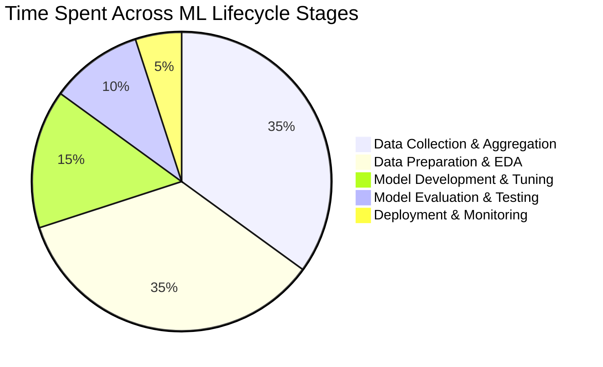
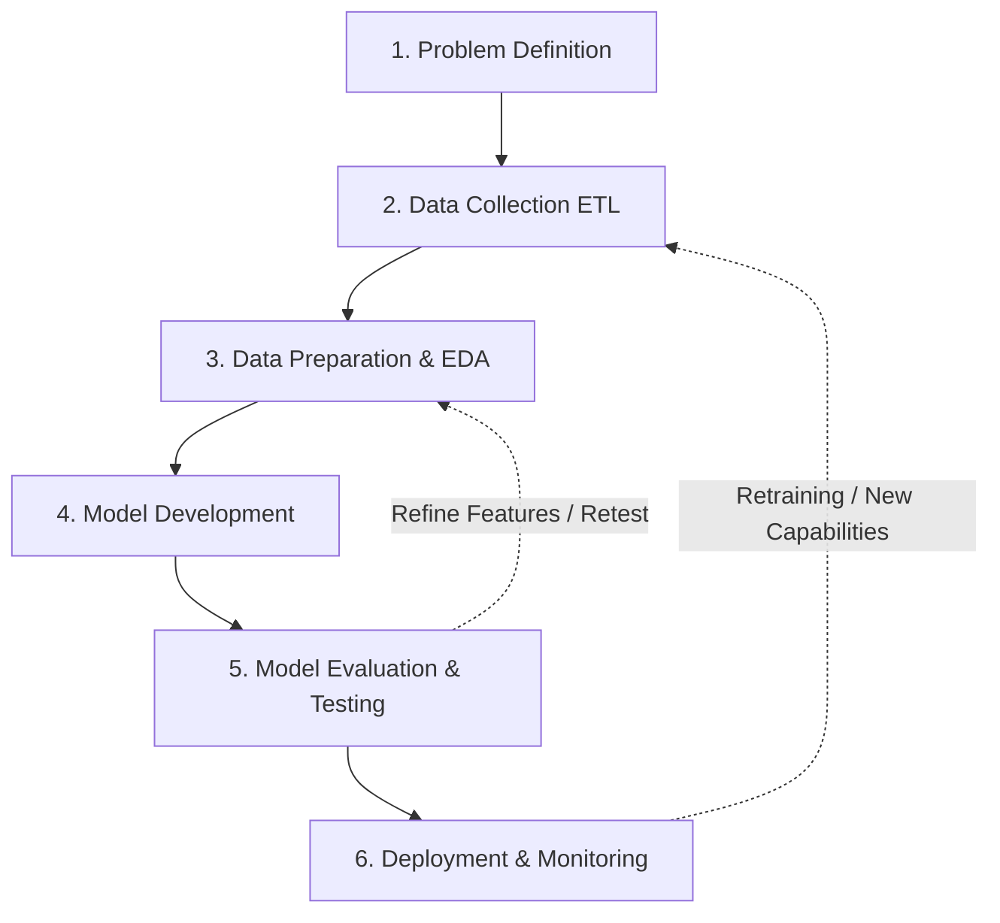
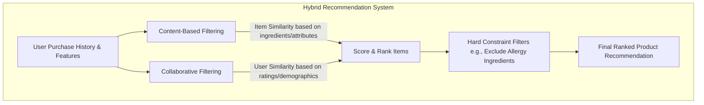

# A Day in the Life of a Machine Learning Engineer: E-Commerce Recommender System

## Overview & Core Objective

This note breaks down the end-to-end Machine Learning Model Lifecycle based on a real-world e-commerce application: building a **Beauty Product Recommendation Engine** to increase business revenue by addressing customer skin care needs based on purchase history.

---

## Time Distribution Across the Lifecycle

> ⚠️ **Key Takeaway:** **Data Collection and Data Preparation are the most time-consuming processes** in the entire ML lifecycle. Model development, tuning, and deployment depend heavily on the clean, engineered state produced during these initial stages.

---

## Detailed Machine Learning Lifecycle Stages

### 1. Problem Definition (Client & User Alignment)

- **Purpose:** Ensure the ML solution aligns directly with client business goals and solves a tangible end-user pain point.
- **User Story / Pain Point:**
  > _"As a beauty product customer, I would like to receive recommendations for other products based on my purchase history so that I will be able to address my skincare needs and improve the overall health of my skin."_

---

### 2. Data Collection (ETL Process - Part 1)

- **Goal:** Identify and extract raw data from disparate databases and map onto **one central source** (reducing the need to query multiple databases repeatedly).
- **Data Sources Collected:**
- **User Data:** Demographics, completed transaction/purchase history.
- **Product Data:** Inventory features, ingredients, targeted skin issues, popularity, average ratings.
- **Behavioral Data:** Saved/liked items, search history, most visited product pages.

---

### 3. Data Preparation & Exploratory Data Analysis (EDA) (ETL Process - Part 2)

_Done in tandem with Data Collection to format, clean, and validate data._

- **Data Cleaning:**
- Filter out irrelevant records.
- Handle missing data (remove or impute/randomly generate based on context).
- Remove extreme outliers to prevent model distortion.
- Correct data types (e.g., proper date formats, string casting).

- **Feature Engineering:**
- Calculate user purchase frequency (average duration between transactions).
- Identify most frequently purchased product categories.
- Map specific product ingredients/targets to user skin profiles.

- **Exploratory Data Analysis (EDA):**
- Visualize distribution patterns.
- Validate feature relationships with beauty product Subject Matter Experts (SMEs).
- Perform correlation analysis to identify key drivers of user buying habits.

- **Train/Test Splitting Strategy:**
- **Method Chosen:** Temporal split putting each user's **most recent transaction in the Test Set**, while keeping prior transactions in the **Training Set**.

---

### 4. Model Development (Hybrid Recommendation Architecture)

Leverages pre-existing ML frameworks to build a **Hybrid Recommender System** combining Content-Based and Collaborative approaches.

- **Technique 1: Content-Based Filtering**
- Computes item-to-item similarity based on product characteristics (e.g., recommending a high-hydration moisturizer to a user buying a deep cleanser for dry skin).
- Applies constraint filtering (e.g., filtering out excluded ingredients based on user search/negative preferences).

- **Technique 2: Collaborative Filtering**
- Groups users with similar demographics (age, region, skin type) and rating behaviors.
- Calculates average group preferences to recommend products that similar users rated highly.

- **Final Model:** A hybrid aggregation of both techniques to maximize accuracy and coverage.

---

### 5. Model Evaluation & Testing

- **Offline Evaluation:** Fine-tune hyperparameters and validate metrics against the held-out test set (most recent transactions).
- **Online / User Feedback Testing:**
- Deploy candidate model to a test user cohort.
- **Key Metrics Tracked:** User recommendation ratings, Click-Through Rate (CTR), Conversion/Purchase Rate.

---

### 6. Deployment & Continuous Monitoring

- **Integration:** Embed the trained model engine directly into the mobile application and website infrastructure.
- **Post-Deployment Tasks:**
- Continuous performance monitoring to detect accuracy decay or drift over time.
- Trigger iterative model retraining pipelines when fresh transaction data accumulates.

---

## Stage-by-Stage Summary Table

| Stage                       | Main Objective                          | Key Deliverables / Actions                                                         |
| --------------------------- | --------------------------------------- | ---------------------------------------------------------------------------------- |
| **Problem Definition**      | Align ML objectives with business goals | Client/User pain point formulation                                                 |
| **Data Collection**         | Extract & centralize data               | Unified dataset merging User, Product, and Behavioral data                         |
| **Data Preparation**        | Clean, engineer, and validate data      | Outlier removal, feature engineering, correlation analysis, train/test split       |
| **Model Development**       | Build recommendation engine             | Hybrid model (Content-Based + Collaborative Filtering)                             |
| **Model Evaluation**        | Validate accuracy & user feedback       | Offline split testing, hyperparameter tuning, online user testing (CTR/Conversion) |
| **Deployment & Monitoring** | Deliver to production & track metrics   | App/Web integration, live metric tracking, retraining pipelines                    |
