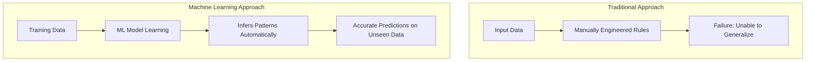
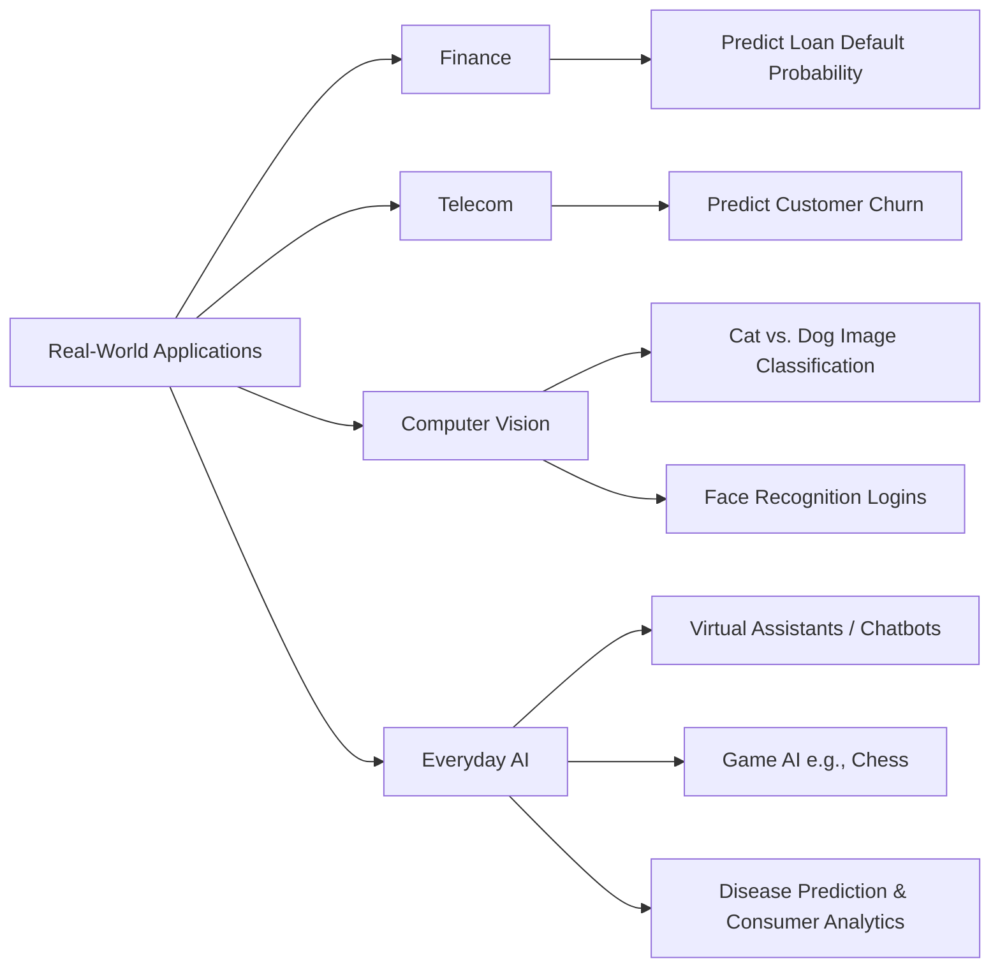
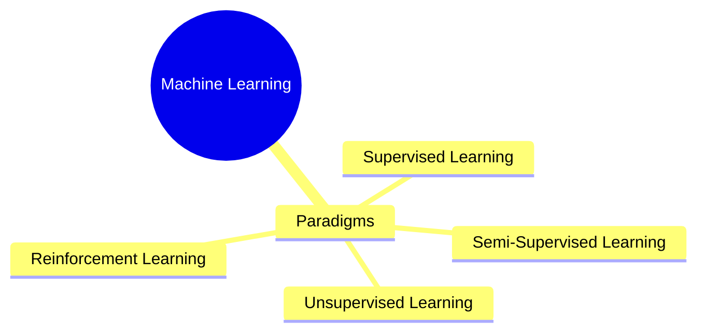
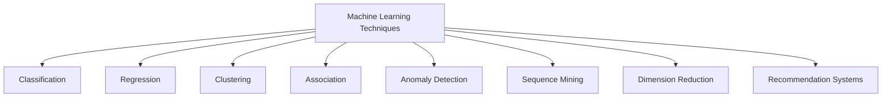

# Machine Learning Overview

## What is Machine Learning?

Machine Learning (ML) is a subset of Artificial Intelligence (AI) that uses algorithms to learn patterns from data and make predictions or decisions without being explicitly programmed. ML typically requires **feature engineering** by practitioners to extract meaningful signals from raw input.

---

## Traditional Rules vs. Machine Learning

- **Traditional Rule-Based Approach (Failed):** Painstakingly crafting explicit rules (e.g., counting eyes, ears, tails, wings).
  - _Why it failed:_ Required too many rules, was overly dependent on the specific dataset, and could not generalize to unseen cases.
- **Machine Learning Approach (Modern):** Models automatically learn distinguishing features from known examples to infer outcomes on unseen data.

---

## Machine Learning Applications

| Domain                      | Use Case                   | ML Mechanism                                                                           | Human Involvement                                                                            |
| --------------------------- | -------------------------- | -------------------------------------------------------------------------------------- | -------------------------------------------------------------------------------------------- |
| **Banking & Finance**       | Loan Approval              | Predict default probability                                                            | **Human-in-the-loop:** Bankers review ML-driven loan rejections to understand the reasoning. |
| **Telecommunications**      | Churn Prediction           | Segment customers using demographic data to predict unsubscribes within the next month | Marketing/Retention teams execute targeted campaigns based on predictions.                   |
| **Computer Vision**         | Image Classification       | Detect and differentiate objects/animals (e.g., cats vs. dogs)                         | Face recognition for phone authentication.                                                   |
| **Daily Life / AI Systems** | Assistants, Gaming, Health | Chatbots, chess bots, disease prediction, consumer behavior analysis                   | Enhances decision-making and automated support.                                              |

---

## Machine Learning Learning Paradigms

---

## Key Machine Learning Techniques

- **Classification:** Categorizing data into distinct labels (e.g., Cat vs. Dog, Churn vs. Retain).
- **Regression:** Predicting continuous values.
- **Clustering:** Grouping similar data points without existing labels (e.g., customer segmentation).
- **Association:** Discovering relationships between variables.
- **Anomaly Detection:** Identifying abnormal patterns or outliers.
- **Sequence Mining:** Finding sequential patterns in time-series or sequential data.
- **Dimension Reduction:** Reducing input features while retaining core information.
- **Recommendation Systems:** Suggesting items based on preference history (similar to friend recommendations).
