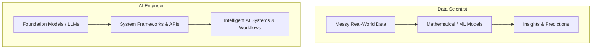
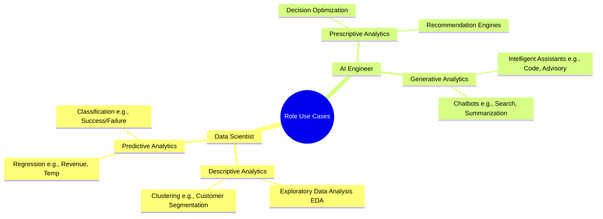
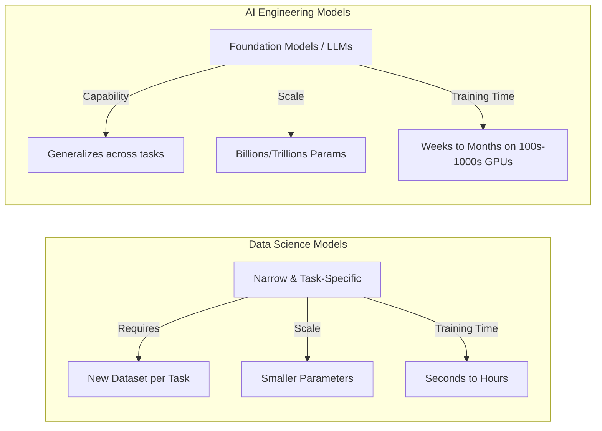

# Data Scientist vs. AI Engineer (Generative AI)

## Overview

While traditional data science focuses on extracting insights from data using statistical and machine learning models, **AI Engineering** has emerged as a distinct discipline centered on leveraging **Foundation Models** to build intelligent, end-to-end generative AI systems.

---

## Core Roles & Mental Models

- **Data Scientist = "Data Storyteller":** Takes massive, messy real-world datasets and uses mathematical models to translate them into actionable business insights.
- **AI Engineer = "AI System Builder":** Uses foundation models to build generative AI applications that automate and transform business processes.

---

## The 4 Key Areas of Difference

### 1. Primary Use Cases

- **Data Science Use Cases:**
- **Descriptive Analytics (Describing the Past):** Exploratory Data Analysis (EDA) for statistical inference, clustering for customer segmentation.
- **Predictive Analytics (Predicting Outcomes):** Regression models for numeric values (e.g., revenue), classification models for categorical outcomes (e.g., success/failure).

- **AI Engineering Use Cases:**
- **Prescriptive Analytics (Choosing Best Action):** Decision optimization to assess optimal business paths, recommendation engines for targeted campaigns.
- **Generative Analytics (Creating Content & Interaction):** Intelligent assistants (coding advisors) and chatbots (information retrieval, search, summarization).

---

### 2. Data Types & Scale

| Dimension             | Data Scientist                                                                  | AI Engineer                                                          |
| --------------------- | ------------------------------------------------------------------------------- | -------------------------------------------------------------------- |
| **Primary Data Type** | Structured Data (Tabular data, SQL, CSVs)                                       | Unstructured Data (Text, Images, Audio, Video)                       |
| **Data Scale**        | Hundreds to hundreds of thousands of rows                                       | Billions to trillions of text tokens                                 |
| **Data Preparation**  | Heavy cleaning: removing outliers, joins, filtering, manual feature engineering | Ingestion, chunking, embedding generation, RAG vector index building |

---

### 3. Underlying Models & Architecture

- **Traditional ML Models (Data Science):**
- Narrow scope; requires training a brand-new model for each specific task/dataset.
- Smaller parameter size, low compute requirements, fast training (seconds to hours).

- **Foundation Models / LLMs (AI Engineering):**
- Wide scope; single pre-trained model generalizes across diverse tasks out of the box.
- Billions to trillions of parameters; requires massive compute clusters (100s–1000s of GPUs) and long pre-training cycles (weeks to months).

---

### 4. Process & Implementation Workflow

#### Data Science Workflow (Train-From-Scratch / Traditional ML)

- Key techniques: Feature engineering, cross-validation, hyperparameter tuning.

#### AI Engineering Workflow (Democratized / Pre-trained Foundation)

- **AI Democratization:** Foundation models are publicly accessible via open-source communities (e.g., Hugging Face) or hosted APIs.
- **Core Frameworks & Building Blocks:**
- **Prompt Engineering:** Structuring natural language instructions to steer model behavior.
- **Prompt Chaining:** Linking multiple prompts together in sequence.
- **PEFT (Parameter-Efficient Fine-Tuning):** Adapting models to domain-specific data with minimal compute.
- **RAG (Retrieval-Augmented Generation):** Grounding outputs in factual knowledge bases.
- **Autonomous Agents:** Constructing multi-step reasoning networks to execute complex tasks.
- **System Integration:** Embedding model outputs into user interfaces, chatbots, or automated enterprise workflows.

---

## High-Level Comparison Matrix

| Feature              | Data Scientist                                                                                                                                    | AI Engineer                                             |
| -------------------- | ------------------------------------------------------------------------------------------------------------------------------------------------- | ------------------------------------------------------- |
| **Primary Identity** | Data Storyteller                                                                                                                                  | AI System Builder                                       |
| **Analytics Focus**  | Descriptive & Predictive                                                                                                                          | Prescriptive & Generative                               |
| **Data Choice**      | Structured (Tabular)                                                                                                                              | Unstructured (Text, Vision, Audio)                      |
| **Model Scope**      | Narrow, task-specific models                                                                                                                      | Wide, generalized foundation models                     |
| **Workflow Focus**   | Data cleaning, feature engineering, model training                                                                                                | Pre-trained model orchestration, RAG, Agents, Prompting |
| **Overlap Area**     | Both utilize ML/AI to solve business problems; data scientists may do prescriptive tasks, while AI engineers occasionally work with tabular data. |                                                         |
