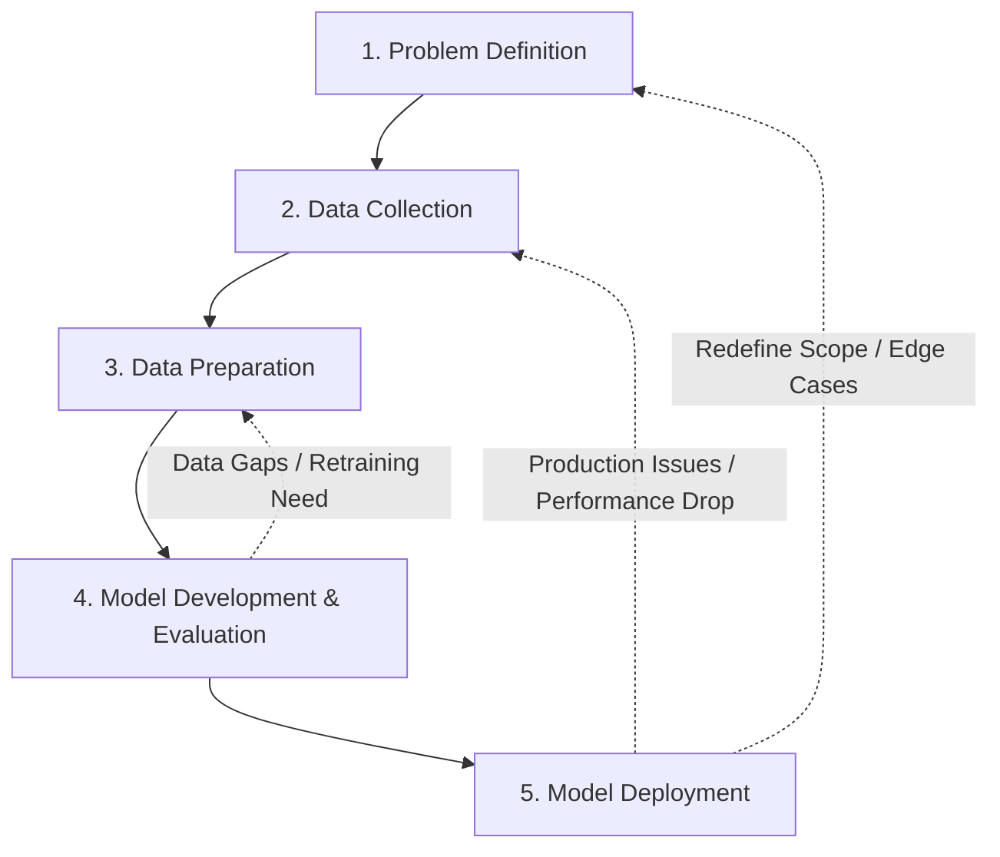
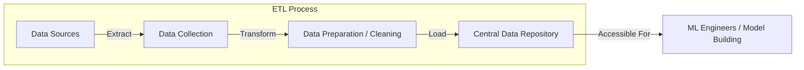

# Machine Learning Model Lifecycle

## Overview

The Machine Learning (ML) Model Lifecycle represents the end-to-end process of taking an ML product from initial concept to a deployed production model.

---

## 5 Core Stages of the ML Lifecycle

1. **Problem Definition:** Define the business situation, goals, and problem to be solved using machine learning.
2. **Data Collection:** Gather raw data from various relevant sources.
3. **Data Preparation:** Clean, transform, and structure the data so it is accessible and ready for modeling.
4. **Model Development & Evaluation:** Build ML models, train them on prepared data, and evaluate their performance.
5. **Model Deployment:** Release the evaluated model into a production environment to serve end-users.

---

## The Iterative Nature of the Lifecycle

The ML lifecycle is **non-linear and iterative**. Issues detected in production or during model evaluation often require rolling back to earlier stages to refine data or redefine the business problem.

---

## Data Pipeline: Extract, Transform, and Load (ETL)

The combination of **Data Collection** and **Data Preparation** constitutes the **ETL process**:

- **Extract:** Collect data from multiple disparate sources.
- **Transform:** Clean, standardize, and transform raw data into a usable format.
- **Load:** Store the cleaned data in a unified central repository, making it accessible for ML Engineers to build and evaluate models.

