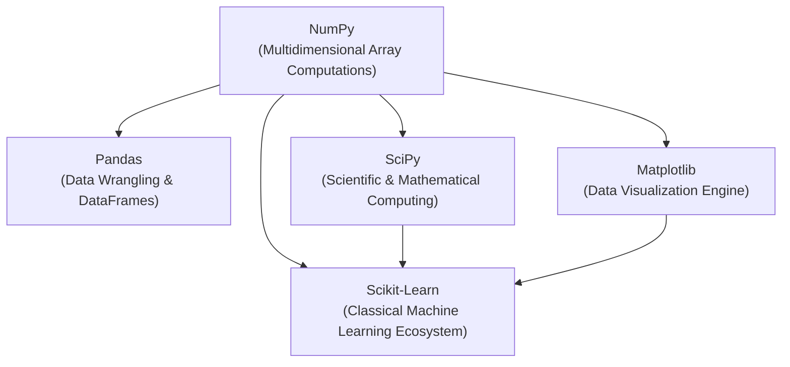
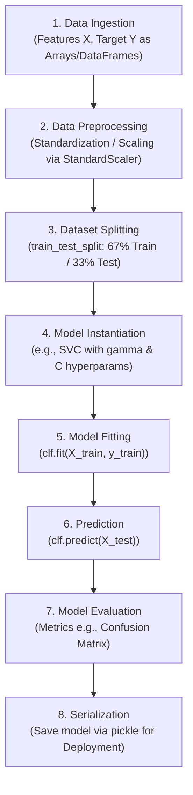

# Scikit-Learn & Python Machine Learning Ecosystem

## Overview & Definition

The **Machine Learning (ML) Ecosystem** refers to the interconnected network of tools, frameworks, libraries, platforms, and processes that support the end-to-end lifecycle of machine learning models—from data ingestion and cleaning to training, evaluation, deployment, and monitoring.

---

## Python Core ML Library Stack

Python's open-source ecosystem is built in modular layers, where higher-level machine learning frameworks build directly upon core scientific and mathematical libraries.



| Library          | Core Responsibilities                                                                  | Architectural Role                          |
| ---------------- | -------------------------------------------------------------------------------------- | ------------------------------------------- |
| **NumPy**        | Efficient numerical computations on multidimensional arrays.                           | Foundational math & matrix primitive layer. |
| **Pandas**       | Tabular data analysis, visual inspection, cleaning, wrangling via DataFrames.          | Data manipulation & preprocessing layer.    |
| **SciPy**        | Specialized algorithms for optimization, integration, linear algebra, and statistics.  | Scientific algorithm module layer.          |
| **Matplotlib**   | Generating customizable static and interactive plots.                                  | Foundational data visualization engine.     |
| **Scikit-Learn** | Complete pipeline for classification, regression, clustering, and dimension reduction. | Unified ML modeling & pipeline framework.   |

---

## Key Features of Scikit-Learn

- **Comprehensive Algorithm Suite:** Implements state-of-the-art algorithms for classification, regression, clustering, and dimensionality reduction.
- **Built-in End-to-End Pipeline Functions:** Native support for preprocessing (scaling, feature selection, feature extraction), dataset splitting, hyperparameter cross-validation, and performance evaluation.
- **Ecosystem Compatibility:** Seamlessly operates on native Python data structures, NumPy N-dimensional arrays, and Pandas DataFrames.
- **Production Readiness:** Models can be easily serialized (e.g., as `.pkl` files) for fast production retrieval and inference deployment.

---

## The Scikit-Learn Workflow Pipeline



---

## Standard Scikit-Learn Code Implementation Pattern

```python
import pickle
from sklearn.preprocessing import StandardScaler
from sklearn.model_selection import train_test_split
from sklearn.svm import SVC
from sklearn.metrics import confusion_matrix

# 1. Preprocess / Scale Features
scaler = StandardScaler()
X_scaled = scaler.fit_transform(X)

# 2. Train / Test Split
X_train, X_test, y_train, y_test = train_test_split(
    X_scaled, y, test_size=0.33, random_state=42
)

# 3. Instantiate Model Object with Hyperparameters
clf = SVC(gamma='scale', C=1.0)

# 4. Train Model on Training Dataset
clf.fit(X_train, y_train)

# 5. Predict on Unseen Test Data
y_pred = clf.predict(X_test)

# 6. Evaluate Model Accuracy
cm = confusion_matrix(y_test, y_pred)

# 7. Serialize & Save Model for Production
with open('model.pkl', 'wb') as f:
    pickle.dump(clf, f)


```
