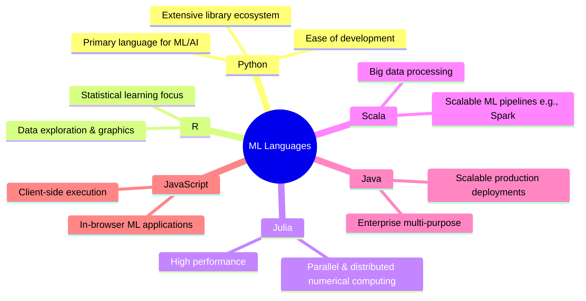
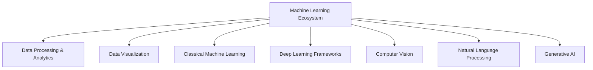

# Tools for Machine Learning: Ecosystem & Languages

## Overview & Role of Data

Data is a collection of raw facts, figures, and information used to extract insights, drive decisions, and fuel advanced technologies. It sits at the core of every machine learning (ML) algorithm as the primary source for pattern discovery and predictions.

**Machine Learning Tools** provide functionalities across the entire ML pipeline—from data ingestion and preprocessing to model building, evaluation, optimization, and deployment.

---

## Programming Languages for Machine Learning



| Language       | Primary Strengths & Target Use Cases                                              |
| -------------- | --------------------------------------------------------------------------------- |
| **Python**     | De-facto industry standard; rich ecosystem for data wrangling, ML, DL, and GenAI. |
| **R**          | Statistical learning, data exploration, and advanced data visualization.          |
| **Julia**      | High-performance, parallel, and distributed numerical computing for research.     |
| **Scala**      | High-throughput big data processing and building distributed ML pipelines.        |
| **Java**       | Multi-purpose language for deploying scalable ML systems in production.           |
| **JavaScript** | Executing client-side ML models directly in web browsers.                         |

---

## Machine Learning Tool Taxonomy



### 1. Data Processing & Analytics Tools

Tools designed to extract, store, wrangle, clean, and compute on tabular and big data formats.

- **PostgreSQL:** Open-source object-relational database using SQL for structured data storage and querying.
- **Apache Hadoop:** Disk-based, highly scalable solution for distributed storage and batch processing of massive datasets.
- **Apache Spark:** Distributed, in-memory data processing framework for real-time big data processing; significantly faster than Hadoop.
- **Apache Kafka:** Distributed event-streaming platform for building real-time data pipelines and analytics.
- **Pandas:** Foundational Python data manipulation library centered on the `DataFrame` for tabular data cleaning and transformation.
- **NumPy:** Python library providing N-dimensional array objects, linear algebra routines, and GPU/distributed computing primitives.

---

### 2. Data Visualization Tools

Tools to inspect data distributions, structural patterns, and present statistical graphics.

- **Matplotlib:** Core Python library for creating static, customizable, and interactive plots.
- **Seaborn:** High-level statistical visualization library built on top of Matplotlib.
- **ggplot2:** Layered grammar-of-graphics data visualization package in R.
- **Tableau:** Enterprise business intelligence platform for interactive dashboards.

---

### 3. Classical Machine Learning Tools

Libraries for feature preparation, linear algebra, optimization, and traditional ML algorithms.

- **SciPy:** Built on NumPy; provides algorithms for scientific computing, optimization, integration, and statistics.
- **Scikit-learn:** Python framework for traditional ML (classification, regression, clustering, dimensionality reduction); built on NumPy, SciPy, and Matplotlib.

---

### 4. Deep Learning Frameworks

Neural network engine frameworks for training and evaluating large-scale deep learning models.

- **TensorFlow:** Open-source ecosystem for high-performance numerical computation and enterprise deep learning.
- **Keras:** User-friendly, high-level neural network API running on top of deep learning engines.
- **PyTorch:** Flexible, open-source deep learning framework widely used in research, vision, and NLP experimentation.
- **Theano:** Historical/foundational library for efficiently defining and optimizing mathematical expressions with multi-dimensional arrays.

---

### 5. Computer Vision (CV) Tools

Engineered specifically for object detection, image classification, segmentation, and feature extraction.

- **OpenCV:** Open-source real-time computer vision library for visual filtering, detection, and AR.
- **Scikit-Image:** Python library for image processing (filters, segmentation, morphological ops) compatible with SciPy/Pandas.
- **TorchVision:** PyTorch-native package providing computer vision datasets, standard transformations, and pre-trained model architectures.

---

### 6. Natural Language Processing (NLP) Tools

Specialized libraries designed to tokenize, parse, analyze, and interpret human language.

- **NLTK (Natural Language Toolkit):** Comprehensive library for text processing, tokenization, and stemming.
- **TextBlob:** Simple Python interface for POS tagging, sentiment analysis, noun-phrase extraction, and translation.
- **Stanza:** Stanford NLP Group library featuring accurate pre-trained models for dependency parsing, POS tagging, and NER.

---

### 7. Generative AI Tools

Frameworks and pre-trained foundation models focused on generating synthetic content (text, image, audio, code).

- **Hugging Face Transformers:** Central library providing access to pre-trained transformer architectures for text/multimodal generation.
- **ChatGPT:** Conversational LLM system by OpenAI used for dialogue, text generation, and reasoning tasks.
- **DALL-E:** Generative model by OpenAI for synthesizing high-resolution images from natural language prompts.
- **PyTorch (GenAI Context):** Underlying deep learning framework used to train Generative Adversarial Networks (GANs) and Transformer architectures.

```

```

```

```
