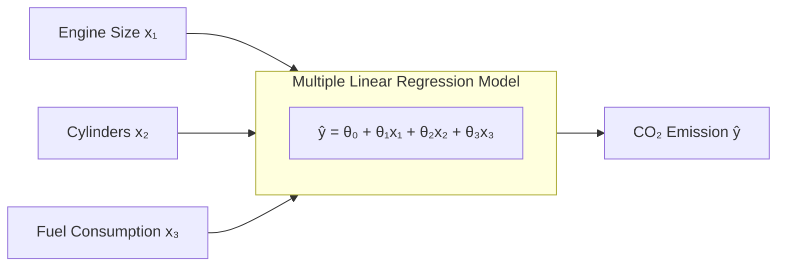
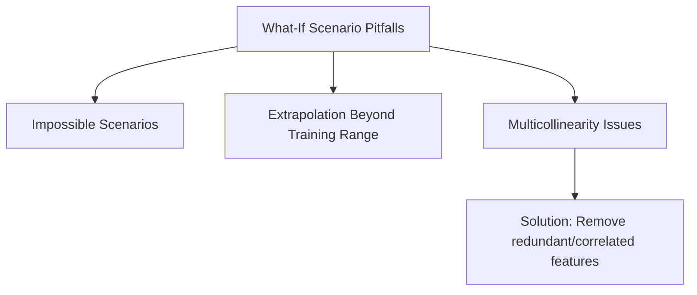
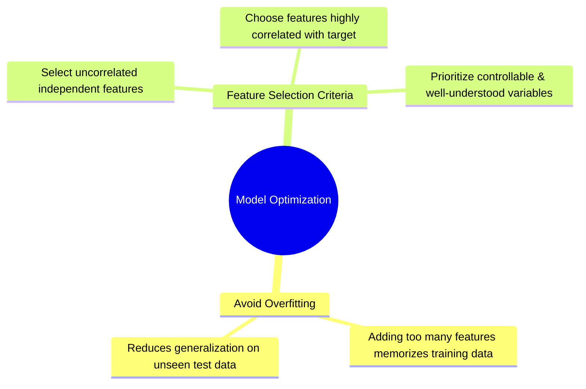

# Multiple Linear Regression

## 1. Overview

Multiple Linear Regression (MLR) extends Simple Linear Regression by using **two or more independent variables** ($x_1, x_2, \dots, x_n$) to estimate a continuous target variable ($y$). Incorporating multiple explanatory features typically yields a more accurate predictive model than relying on a single feature.

---

## 2. Mathematical Formulation

The target variable is modeled as a linear combination of input features:

$$\hat{y} = \theta_0 + \theta_1 x_1 + \theta_2 x_2 + \dots + \theta_n x_n = X \theta$$

- **$\hat{y}$ (y-hat):** Predicted continuous response.
- **$x_i$:** Individual explanatory feature values.
- **$\theta_0$:** Bias or y-intercept term (accounted for in matrix form by prepending a constant column of $1$s to the feature matrix $X$).
- **$\theta_i$:** Weight/coefficient assigned to each feature $x_i$, indicating its relative importance.

### Geometric Interpretation Across Dimensions

| Dimensions / Features                    | Geometric Shape of Model |
| ---------------------------------------- | ------------------------ |
| **1 Feature ($x_1$)**                    | Line                     |
| **2 Features ($x_1, x_2$)**              | Plane                    |
| **$\ge 3$ Features ($x_1, \dots, x_n$)** | Hyperplane               |

---

## 3. Working with Categorical Variables

To include non-numeric categorical variables into a regression model, convert them to quantitative indicators:

- **Binary Variables:** Map values to $0$ and $1$ (e.g., `Manual = 0`, `Automatic = 1`).
- **Multi-Class Variables:** Transform into **One-Hot Encoded / Dummy Boolean features** (creating a dedicated $0/1$ feature for each class).

---

## 4. Parameter Estimation Methods

Parameters ($\theta$) are estimated by minimizing the **Mean Squared Error (MSE)** between actual values ($y$) and predicted values ($\hat{y}$):

$$\text{MSE} = \frac{1}{n} \sum_{i=1}^{n} (y_i - \hat{y}_i)^2$$

| Estimation Method                   | Approach                                                                                          | Best Used When...                                                     |
| ----------------------------------- | ------------------------------------------------------------------------------------------------- | --------------------------------------------------------------------- |
| **Ordinary Least Squares (OLS)**    | Solves for $\theta$ analytically using closed-form linear algebra operations on input matrix $X$. | Small to medium-sized datasets.                                       |
| **Gradient Descent (Optimization)** | Iteratively updates coefficients starting from random values to minimize loss.                    | Large datasets where matrix operations are computationally expensive. |

---

## 5. Applications & What-If Analysis

- **Key Use Cases:** Educational outcome analysis (exam scores vs. study time, attendance, anxiety), medical predictions (blood pressure changes vs. BMI), sales, and environmental analytics.
- **What-If Scenarios:** Evaluating outcome shifts by altering one feature while holding others constant.

---

## 6. Model Trade-offs & Best Practices

---

## 7. Sample Prediction Calculation

Given learned parameters:

$$\theta_0 = 62.43, \quad \theta_1 = 9.19 \text{ (Engine Size)}, \quad \theta_2 = 8.70 \text{ (Cylinders)}$$

For a vehicle with **$2.4\text{L}$ Engine Size** and **$4$ Cylinders**:

$$\hat{y} = 62.43 + (9.19 \times 2.4) + (8.70 \times 4) = 62.43 + 22.056 + 34.8 = 219.286 \text{ g/km}$$

_(Note: Plugging in $x_1 = 2.4$ and $x_2 = 4$ yields $219.29$, assuming additional features fill out the transcript's total of $208.34$.)_
