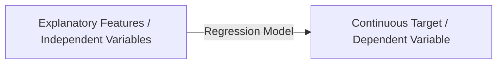
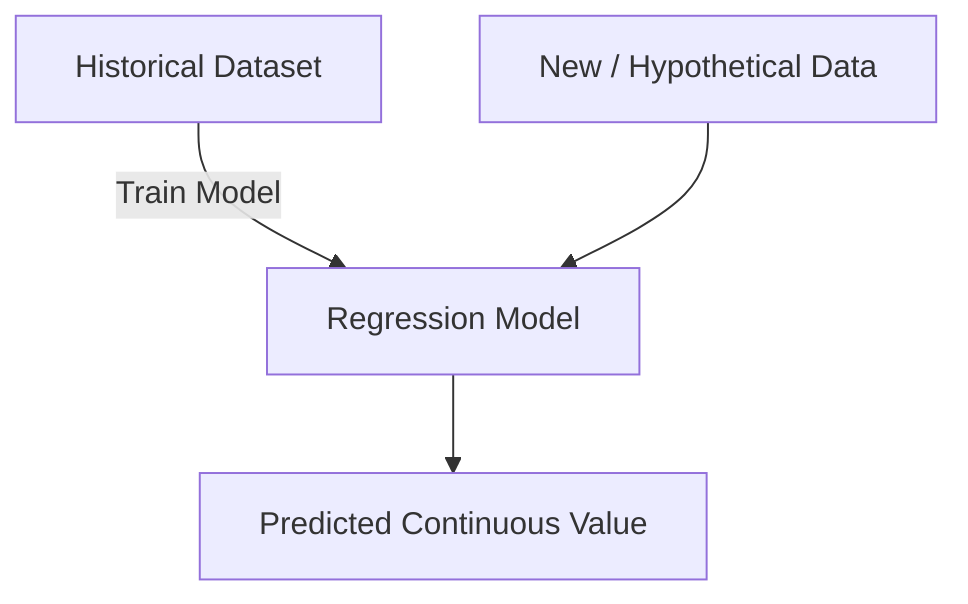
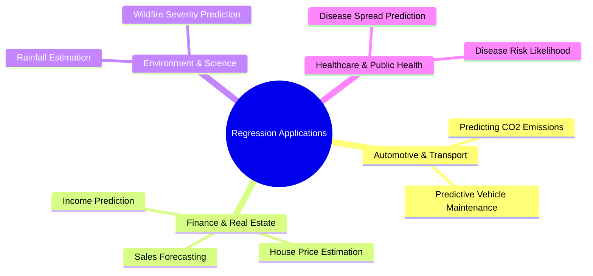

# Introduction to Regression

## 1. Overview

Regression is a **supervised machine learning** technique used to model the relationship between explanatory features (independent variables) and a continuous target variable (dependent variable).

---

## 2. General Workflow

The typical regression workflow uses historical data to train a predictive model that can then evaluate new inputs.

---

## 3. Types of Regression

The choice of regression model depends on the structure of the data and the number of independent variables.

| Model Type              | Independent Variables | Linear / Non-linear Support | Example Scenario                                                          |
| ----------------------- | --------------------- | --------------------------- | ------------------------------------------------------------------------- |
| **Simple Regression**   | Single ($1$)          | Both                        | Predicting CO₂ emission using only **Engine Size**                        |
| **Multiple Regression** | Multiple ($>1$)       | Both                        | Predicting CO₂ emission using **Engine Size** AND **Number of Cylinders** |

---

## 4. Key Applications Across Domains

Regression is applied whenever there is a need to estimate or predict continuous quantitative values.

---

## 5. Summary of Common Regression Algorithms

- **Classical Statistical Methods:** Linear Regression, Polynomial Regression
- **Modern Machine Learning Models:** Random Forest, XGBoost
- **Other Machine Learning Algorithms:** $k$-Nearest Neighbors (KNN), Support Vector Machines (SVM), Neural Networks
