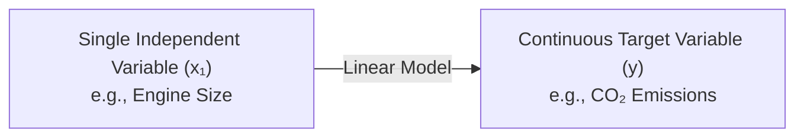
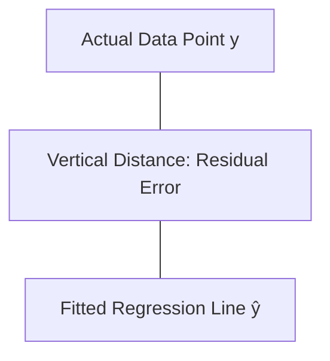

# Introduction to Simple Linear Regression

## 1. Overview

Simple Linear Regression models a **linear relationship** between a single continuous target variable (dependent variable, $y$) and a single explanatory feature (independent variable, $x_1$).

---

## 2. Mathematical Model & Notation

The linear relationship is expressed via the standard slope-intercept line equation:

$$\hat{y} = \theta_0 + \theta_1 x_1$$

- **$\hat{y}$ (y-hat):** Predicted response / target value.
- **$x_1$:** Predictor / independent variable.
- **$\theta_0$ (Theta Zero):** Y-intercept (also known as the **bias coefficient**).
- **$\theta_1$ (Theta One):** Slope / regression coefficient for the feature.

---

## 3. Ordinary Least Squares (OLS) & Residuals

The target model line is selected by minimizing the discrepancy between predicted values and actual values.

- **Residual Error:** The vertical distance between an actual data point ($y_i$) and the predicted value ($\hat{y}_i$).
- _Example:_ If actual emission = $250$ and predicted $\hat{y} = 340$, the residual discrepancy is $\vert{}250 - 340\vert{} = 90$.

- **Mean Squared Error (MSE):** The average of the squared residual errors, measuring overall model fit.
- **Objective of OLS:** Determine coefficients $\theta_0$ and $\theta_1$ such that the total MSE is minimized.

### Analytical Solution (Gauss & Legendre)

The OLS parameters are directly computed using sample means ($\bar{x}$ and $\bar{y}$):

$$\theta_1 = \frac{\sum (x_i - \bar{x})(y_i - \bar{y})}{\sum (x_i - \bar{x})^2}$$

$$\theta_0 = \bar{y} - \theta_1 \bar{x}$$

---

## 4. Example Calculation

Given a calculated model equation:

$$\text{CO}_2\text{ Emission} = 108.05 + 39 \times (\text{Engine Size})$$

For an input engine size of **$2.4$**:

$$\hat{y} = 108.05 + (39 \times 2.4) = 108.05 + 93.6 = 201.65$$

---

## 5. Pros & Cons of OLS Regression

| Advantages                                                                | Limitations                                                                 |
| ------------------------------------------------------------------------- | --------------------------------------------------------------------------- |
| **Easy to interpret:** Straightforward mathematical equation              | **Simplistic:** Fails to capture complex, non-linear relationships          |
| **No tuning needed:** Uses exact closed-form calculations                 | **Sensitive to outliers:** Extreme values heavily distort the best-fit line |
| **Fast execution:** Computationally lightweight for small/medium datasets | High variance when assumptions are violated                                 |
