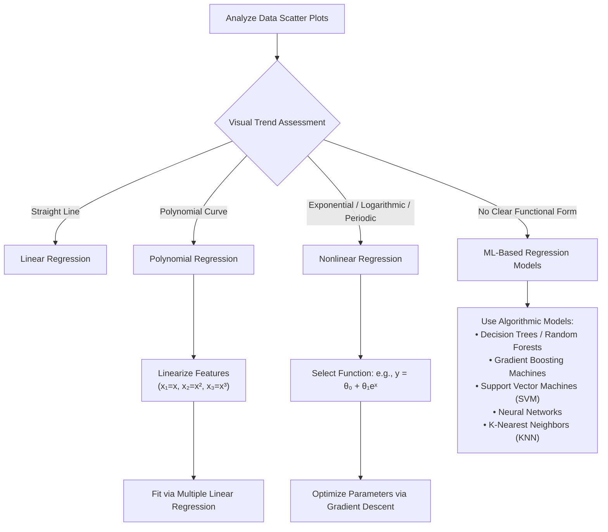

# Intro to Polynomial and Nonlinear Regression

## 1. Overview & Core Concepts

- **Nonlinear Regression:** Modeling relationships between a dependent variable ($y$) and independent variables ($x$) using equations with non-linear parameters or curved functional forms.
- **Why use it?** Real-world background trends are rarely straight lines; linear models often **underfit** non-linear data.
- **Goal:** Capture the underlying trend without overfitting (memorizing noise and large variations).

---

## 2. Model Decision & Selection Flow

## 3. Polynomial vs. Non-Polynomial Regression

| Feature / Model         | Polynomial Regression                                                                                                                    | Non-Polynomial Regression                                                         |
| ----------------------- | ---------------------------------------------------------------------------------------------------------------------------------------- | --------------------------------------------------------------------------------- |
| **Equation Example**    | $y = \theta_0 + \theta_1 x + \theta_2 x^2 + \theta_3 x^3$                                                                                | $y = \theta_0 + \theta_1 e^x$                                                     |
| **Linearization**       | **Yes:** Can transform features ($x_1 = x, x_2 = x^2, \dots$) and solve using standard Ordinary Least Squares (OLS) / Linear Regression. | **No:** Cannot always be reduced to linear parameters.                            |
| **Risk of Overfitting** | **High** at higher degrees (passes through all noise/points instead of learning the trend).                                              | Depends on function complexity and parameter tuning.                              |
| **Best Used For**       | Continuous curved trends (quadratic, cubic shapes).                                                                                      | Complex natural behaviors (exponential growth, diminishing returns, periodicity). |

---

## 4. Real-World Applications

- **Exponential / Compound Growth:**
- _Example:_ China's GDP growth (1960–2014) or investment interest.
- _Characteristics:_ Growth rate increases over time ($y = \theta_0 + \theta_1 e^x$).

- **Logarithmic (Diminishing Returns):**
- _Example:_ Human productivity over consecutive work hours.
- _Characteristics:_ Initial linear gain (e.g., first 6 hours), followed by tapering performance/gains per additional input.

- **Periodic / Sinusoidal:**
- _Example:_ Seasonal environmental variations (e.g., monthly rainfall, seasonal temperature).

---

## 5. Summary Checklist for Implementation

1. **Plot Scatter Plots:** Check target variable vs. input variables.
2. **Match Functions:** Identify linear, exponential, logarithmic, or sinusoidal shapes.
3. **Optimize Parameters:** Use optimization algorithms like **Gradient Descent** for defined mathematical expressions.
4. **Evaluate Model Fit:** Plot predictions against actual target values to analyze errors and guard against overfitting.
