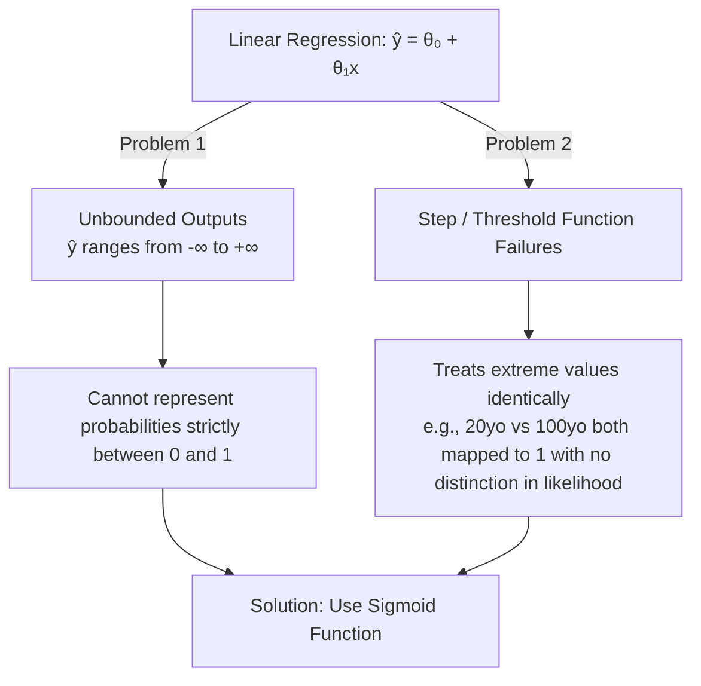
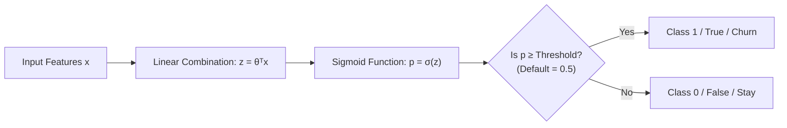

# Intro to Logistic Regression

## 1. Overview & Core Definition

- **Logistic Regression:** A statistical modeling technique and binary classifier that predicts the **probability ($\hat{p}$)** of an observation belonging to one of two classes (e.g., 0/1, True/False, No/Yes).
- **Dual Nature:** Functions both as a **probability predictor** ($\hat{p} = P(y=1|x)$) and a **binary classifier** ($\hat{y} \in \{0, 1\}$) once a threshold is applied.
- **Complementary Class Probability:** $P(y=0|x) = 1 - P(y=1|x)$.

---

## 2. When to Use Logistic Regression

1. **Binary Target:** The target variable is categorical with two outcomes (0 or 1).
2. **Probabilistic Outputs:** When you need the probability of an event (e.g., probability of a customer buying a product).
3. **Feature Importance / Explainability:** Allows feature selection and analysis of feature impact using model coefficients/weights ($\theta$).
4. **Linearly Separable Data:** The decision boundary is a line, plane, or hyperplane (e.g., $\theta_0 + \theta_1 x_1 + \theta_2 x_2 > 0$).

### Key Real-World Applications

- **Healthcare:** Disease diagnosis (e.g., predicting diabetes or heart attack risk based on age, BMI, blood pressure).
- **Customer Analytics:** Subscription churn prediction (e.g., telecommunication churn based on demographics and service usage).
- **Finance:** Mortgage default prediction.
- **Engineering:** Product or system failure risk analysis.

---

## 3. Why Linear Regression Fails for Binary Classification

## 4. The Sigmoid (Logit) Function

To constrain continuous real-valued predictions within the $[0, 1]$ interval, linear regression outputs are passed through the **Sigmoid Function** $\sigma(x)$:

$$\sigma(z) = \frac{1}{1 + e^{-z}}$$

Where $z = \hat{y}_{linear} = \theta_0 + \theta_1 x_1 + \dots + \theta_n x_n$.

### Properties of the Sigmoid Curve

- **Key Values:**
- $\sigma(0) = 0.5$
- As $z \to +\infty$, $\sigma(z) \to 1$
- As $z \to -\infty$, $\sigma(z) \to 0$

- S-shaped continuous curve that smoothly compresses inputs to valid probability scores.

---

## 5. Classification & Decision Boundary

- **Decision Boundary:** The chosen threshold probability (typically $0.5$) used to separate classes.
- If $\hat{p} \ge 0.5 \implies \hat{y} = 1$
- If $\hat{p} < 0.5 \implies \hat{y} = 0$
