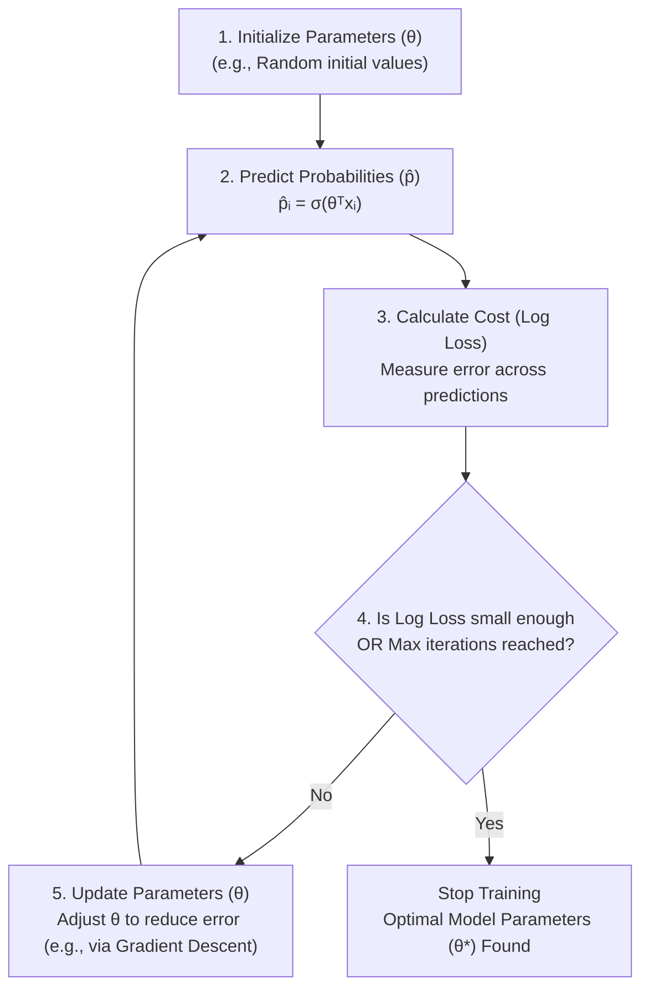
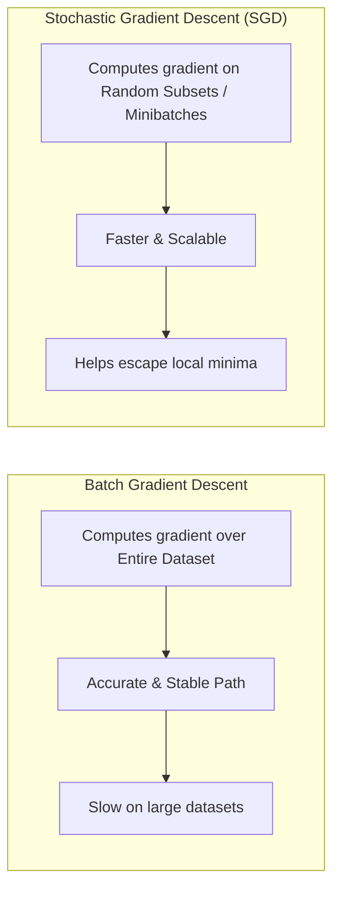

# Training a Logistic Regression Model

## 1. Overview & Training Objective

- **Objective:** Find the optimal parameter vector ($\theta$) that maps input features to target outcomes, minimizing classification error.
- **Optimization Goal:** Iteratively adjust $\theta$ to minimize a specific cost function (**Log Loss**).

---

## 2. Logistic Regression Training Process

---

## 3. The Cost Function: Log Loss (Binary Cross-Entropy)

Log Loss measures how well predicted probabilities ($\hat{p}_i$) match actual class labels ($y_i \in \{0, 1\}$).

$$\text{Log Loss} = -\frac{1}{n} \sum_{i=1}^{n} \left[ y_i \ln(\hat{p}_i) + (1 - y_i) \ln(1 - \hat{p}_i) \right]$$

### Key Behavior of Log Loss

- **Favors Confident Correct Predictions:** When $y_i = 1$ and $\hat{p}_i \approx 1$ (or $y_i = 0$ and $\hat{p}_i \approx 0$), the loss approaches **0**.
- **Heavily Penalizes Confident Incorrect Predictions:** When $y_i = 0$ and $\hat{p}_i \approx 1$ (or $y_i = 1$ and $\hat{p}_i \approx 0$), the loss becomes **extremely large**.

---

## 4. Optimization Techniques

### Standard Gradient Descent vs. Stochastic Gradient Descent (SGD)

| Parameter / Feature         | Standard Gradient Descent (Batch GD)       | Stochastic Gradient Descent (SGD)                                   |
| --------------------------- | ------------------------------------------ | ------------------------------------------------------------------- |
| **Data used per iteration** | Entire dataset ($n$ rows)                  | Random subset / minibatch of dataset                                |
| **Speed & Scalability**     | Slow on large datasets                     | Very fast and scales well to large datasets                         |
| **Accuracy / Path**         | Smooth, direct path toward minimum         | Noisier path; wanders around global minimum                         |
| **Local Minima**            | More likely to get trapped in local minima | Randomness helps skip local minima to find global minima            |
| **Convergence Strategy**    | Fixed or decaying learning rate ($\alpha$) | Decaying learning rate OR increasing sample batch size near minimum |

---

## 5. Core Concepts & Terminology

- **Gradient:** Vector pointing in the direction of steepest _ascent_ on the loss surface. Updating parameters in the direction of the **negative gradient** achieves steepest _descent_.
- **Learning Rate ($\alpha$):** Scaler controlling the step size per iteration.
- _Too small:_ Extremely slow convergence.
- _Too large:_ Risk of overshooting the minimum or failing to converge.

- **Stopping Criteria:** Satisfactory log loss threshold achieved OR maximum iteration limit reached.
