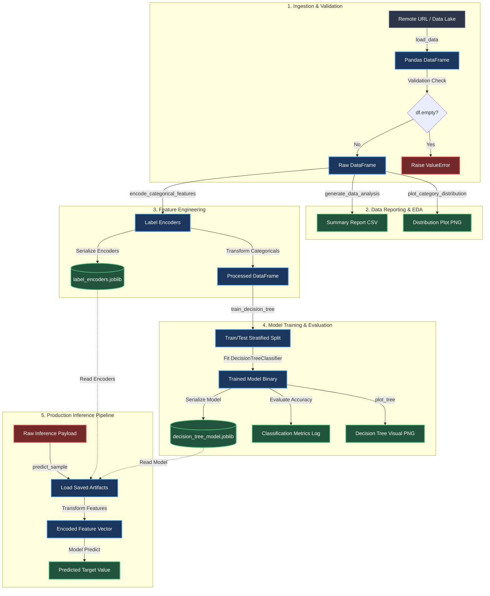

```mermaid
flowchart TD
    %% Global Styling
    classDef storage fill:#2d3748,stroke:#cbd5e0,stroke-width:2px,color:#fff
    classDef process fill:#1a365d,stroke:#4299e1,stroke-width:2px,color:#fff
    classDef artifact fill:#22543d,stroke:#48bb78,stroke-width:2px,color:#fff
    classDef test fill:#742a2a,stroke:#f56565,stroke-width:2px,color:#fff

    subgraph Phase1 [1. Ingestion & Validation]
        A[Remote URL / Data Lake]
        B[Pandas DataFrame]
        C[Raw DataFrame]
        ERR1[Raise ValueError]

        A -->|load_data| B
        B -->|Validation Check| B_Val{df.empty?}
        B_Val -->|Yes| ERR1
        B_Val -->|No| C
    end

    subgraph Phase2 [2. Data Reporting & EDA]
        D[Summary Report CSV]
        E[Distribution Plot PNG]

        C -->|generate_data_analysis| D
        C -->|plot_category_distribution| E
    end

    subgraph Phase3 [3. Feature Engineering]
        F[Label Encoders]
        G[(label_encoders.joblib)]
        H[Processed DataFrame]

        C -->|encode_categorical_features| F
        F -->|Serialize Encoders| G
        F -->|Transform Categoricals| H
    end

    subgraph Phase4 [4. Model Training & Evaluation]
        I[Train/Test Stratified Split]
        J[Trained Model Binary]
        K[(decision_tree_model.joblib)]
        L[Classification Metrics Log]
        M[Decision Tree Visual PNG]

        H -->|train_decision_tree| I
        I -->|Fit DecisionTreeClassifier| J
        J -->|Serialize Model| K
        J -->|Evaluate Accuracy| L
        J -->|plot_tree| M
    end

    subgraph Phase5 [5. Production Inference Pipeline]
        N[Raw Inference Payload]
        O[Load Saved Artifacts]
        P[Encoded Feature Vector]
        Q[Predicted Target Value]

        N -->|predict_sample| O
        G -.->|Read Encoders| O
        K -.->|Read Model| O
        O -->|Transform Features| P
        P -->|Model Predict| Q
    end

    %% Apply Classes
    class A storage
    class B,C,F,H,I,J,O,P process
    class D,E,G,K,L,M,Q artifact
    class ERR1,N test

```
