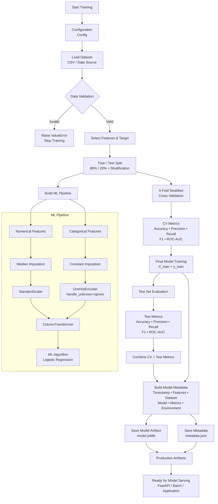

```python

"""
Generic Production ML Training Pipeline
---------------------------------------
Designed to work with most scikit-learn-compatible algorithms.

Examples:
    LogisticRegression()
    RandomForestClassifier()
    GradientBoostingClassifier()
    XGBClassifier()
    LGBMClassifier()
    SVC(probability=True)
    RandomForestRegressor()
    HistGradientBoostingRegressor()

Key properties:
    - No preprocessing leakage
    - Configurable features/model
    - Data validation
    - Reproducible splits
    - Cross-validation
    - Multiple evaluation metrics
    - Structured logging
    - Model metadata
    - Atomic artifact persistence
"""

from __future__ import annotations

import json
import logging
import platform
import sys
from dataclasses import dataclass
from datetime import datetime, timezone
from pathlib import Path
from typing import Any

import joblib
import numpy as np
import pandas as pd

from sklearn.compose import ColumnTransformer
from sklearn.impute import SimpleImputer
from sklearn.metrics import (
    accuracy_score,
    f1_score,
    precision_score,
    recall_score,
    roc_auc_score,
)
from sklearn.model_selection import (
    StratifiedKFold,
    cross_validate,
    train_test_split,
)
from sklearn.pipeline import Pipeline
from sklearn.preprocessing import OneHotEncoder, StandardScaler
from sklearn.linear_model import LogisticRegression


# ============================================================
# CONFIGURATION
# ============================================================

@dataclass(frozen=True)
class Config:
    random_state: int = 42

    test_size: float = 0.20
    cv_folds: int = 5

    artifact_dir: Path = Path("artifacts")
    model_filename: str = "model.joblib"
    metadata_filename: str = "metadata.json"

    target_column: str = "Survived"

    numeric_features: tuple[str, ...] = (
        "age",
        "fare",
    )

    categorical_features: tuple[str, ...] = (
        "embarked",
        "sex",
    )


CONFIG = Config()


# ============================================================
# LOGGING
# ============================================================

logging.basicConfig(
    level=logging.INFO,
    format="%(asctime)s | %(levelname)s | %(name)s | %(message)s",
)

logger = logging.getLogger("ml_training")


# ============================================================
# DATA VALIDATION
# ============================================================

def validate_dataset(
    data: pd.DataFrame,
    config: Config,
) -> None:
    """
    Validate the minimum schema and basic data integrity.
    """

    required_columns = set(
        config.numeric_features
        + config.categorical_features
        + (config.target_column,)
    )

    missing_columns = required_columns - set(data.columns)

    if missing_columns:
        raise ValueError(
            f"Missing required columns: {sorted(missing_columns)}"
        )

    if data.empty:
        raise ValueError("Dataset is empty.")

    if data[config.target_column].isna().any():
        raise ValueError("Target column contains missing values.")

    if data[config.target_column].nunique() < 2:
        raise ValueError(
            "Target must contain at least two classes."
        )

    logger.info(
        "Dataset validation passed: rows=%d columns=%d",
        len(data),
        len(data.columns),
    )


# ============================================================
# PREPROCESSOR
# ============================================================

def build_preprocessor(
    config: Config,
) -> ColumnTransformer:
    """
    Build preprocessing that can safely be fitted inside
    a model Pipeline.

    This prevents train/test preprocessing leakage.
    """

    numeric_pipeline = Pipeline(
        steps=[
            (
                "imputer",
                SimpleImputer(strategy="median"),
            ),
            (
                "scaler",
                StandardScaler(),
            ),
        ]
    )

    categorical_pipeline = Pipeline(
        steps=[
            (
                "imputer",
                SimpleImputer(
                    strategy="constant",
                    fill_value="missing",
                ),
            ),
            (
                "onehot",
                OneHotEncoder(
                    handle_unknown="ignore",
                ),
            ),
        ]
    )

    return ColumnTransformer(
        transformers=[
            (
                "numeric",
                numeric_pipeline,
                list(config.numeric_features),
            ),
            (
                "categorical",
                categorical_pipeline,
                list(config.categorical_features),
            ),
        ],
        remainder="drop",
    )


# ============================================================
# MODEL
# ============================================================

def build_model(config: Config):
    """
    Replace this function to use another algorithm.

    Examples:

        RandomForestClassifier(
            n_estimators=300,
            random_state=config.random_state,
        )

        XGBClassifier(...)

        LGBMClassifier(...)

        SVC(probability=True)
    """

    return LogisticRegression(
        random_state=config.random_state,
        max_iter=1000,
    )


# ============================================================
# COMPLETE ML PIPELINE
# ============================================================

def build_pipeline(config: Config) -> Pipeline:
    """
    Combine preprocessing + model into one serializable object.
    """

    return Pipeline(
        steps=[
            (
                "preprocessor",
                build_preprocessor(config),
            ),
            (
                "model",
                build_model(config),
            ),
        ]
    )


# ============================================================
# METRICS
# ============================================================

def evaluate_classifier(
    model: Pipeline,
    X_test: pd.DataFrame,
    y_test: pd.Series,
) -> dict[str, float]:
    """
    Evaluate a binary classifier.
    """

    predictions = model.predict(X_test)

    metrics = {
        "accuracy": float(
            accuracy_score(y_test, predictions)
        ),
        "precision": float(
            precision_score(
                y_test,
                predictions,
                zero_division=0,
            )
        ),
        "recall": float(
            recall_score(
                y_test,
                predictions,
                zero_division=0,
            )
        ),
        "f1": float(
            f1_score(
                y_test,
                predictions,
                zero_division=0,
            )
        ),
    }

    # ROC-AUC requires probability/decision scores.
    if hasattr(model, "predict_proba"):
        probabilities = model.predict_proba(X_test)[:, 1]

        metrics["roc_auc"] = float(
            roc_auc_score(y_test, probabilities)
        )

    elif hasattr(model, "decision_function"):
        scores = model.decision_function(X_test)

        metrics["roc_auc"] = float(
            roc_auc_score(y_test, scores)
        )

    return metrics


# ============================================================
# CROSS VALIDATION
# ============================================================

def cross_validate_model(
    model: Pipeline,
    X_train: pd.DataFrame,
    y_train: pd.Series,
    config: Config,
) -> dict[str, float]:
    """
    Perform stratified K-fold cross-validation.

    Preprocessing remains inside the Pipeline, therefore
    every fold gets independently fitted preprocessing.
    """

    cv = StratifiedKFold(
        n_splits=config.cv_folds,
        shuffle=True,
        random_state=config.random_state,
    )

    scoring = {
        "accuracy": "accuracy",
        "precision": "precision",
        "recall": "recall",
        "f1": "f1",
        "roc_auc": "roc_auc",
    }

    results = cross_validate(
        model,
        X_train,
        y_train,
        cv=cv,
        scoring=scoring,
        n_jobs=-1,
        return_train_score=False,
    )

    cv_metrics = {}

    for metric in scoring:
        values = results[f"test_{metric}"]

        cv_metrics[f"{metric}_mean"] = float(
            np.mean(values)
        )

        cv_metrics[f"{metric}_std"] = float(
            np.std(values)
        )

    return cv_metrics


# ============================================================
# METADATA
# ============================================================

def build_metadata(
    config: Config,
    metrics: dict[str, float],
    dataset: pd.DataFrame,
) -> dict[str, Any]:

    return {
        "created_at": datetime.now(
            timezone.utc
        ).isoformat(),

        "target": config.target_column,

        "features": {
            "numeric": list(config.numeric_features),
            "categorical": list(
                config.categorical_features
            ),
        },

        "dataset": {
            "rows": int(len(dataset)),
            "columns": int(len(dataset.columns)),
        },

        "model": {
            "algorithm": "LogisticRegression",
        },

        "metrics": metrics,

        "environment": {
            "python": sys.version,
            "platform": platform.platform(),
            "numpy": np.__version__,
            "pandas": pd.__version__,
        },
    }


# ============================================================
# ARTIFACT STORAGE
# ============================================================

def save_artifacts(
    model: Pipeline,
    metadata: dict[str, Any],
    config: Config,
) -> None:

    config.artifact_dir.mkdir(
        parents=True,
        exist_ok=True,
    )

    model_path = (
        config.artifact_dir
        / config.model_filename
    )

    metadata_path = (
        config.artifact_dir
        / config.metadata_filename
    )

    # Save model
    joblib.dump(
        model,
        model_path,
        compress=3,
    )

    # Save metadata
    with metadata_path.open(
        "w",
        encoding="utf-8",
    ) as file:
        json.dump(
            metadata,
            file,
            indent=2,
        )

    logger.info(
        "Model saved to %s",
        model_path,
    )

    logger.info(
        "Metadata saved to %s",
        metadata_path,
    )


# ============================================================
# TRAINING
# ============================================================

def train(
    data: pd.DataFrame,
    config: Config,
) -> tuple[Pipeline, dict[str, float]]:

    validate_dataset(data, config)

    X = data[
        list(config.numeric_features)
        + list(config.categorical_features)
    ]

    y = data[config.target_column]

    # --------------------------------------------------------
    # Hold-out test set
    # --------------------------------------------------------

    X_train, X_test, y_train, y_test = train_test_split(
        X,
        y,
        test_size=config.test_size,
        random_state=config.random_state,
        stratify=y,
    )

    logger.info(
        "Train rows=%d | Test rows=%d",
        len(X_train),
        len(X_test),
    )

    # --------------------------------------------------------
    # Build pipeline
    # --------------------------------------------------------

    model = build_pipeline(config)

    # --------------------------------------------------------
    # Cross-validation
    # --------------------------------------------------------

    logger.info(
        "Running %d-fold cross-validation...",
        config.cv_folds,
    )

    cv_metrics = cross_validate_model(
        model,
        X_train,
        y_train,
        config,
    )

    logger.info(
        "CV F1: %.4f ± %.4f",
        cv_metrics["f1_mean"],
        cv_metrics["f1_std"],
    )

    # --------------------------------------------------------
    # Final training
    # --------------------------------------------------------

    logger.info("Training final model...")

    model.fit(X_train, y_train)

    # --------------------------------------------------------
    # Test evaluation
    # --------------------------------------------------------

    test_metrics = evaluate_classifier(
        model,
        X_test,
        y_test,
    )

    logger.info(
        "Test metrics: %s",
        test_metrics,
    )

    # Combine metrics
    metrics = {
        **cv_metrics,
        **{
            f"test_{key}": value
            for key, value in test_metrics.items()
        },
    }

    # --------------------------------------------------------
    # Save artifacts
    # --------------------------------------------------------

    metadata = build_metadata(
        config,
        metrics,
        data,
    )

    save_artifacts(
        model,
        metadata,
        config,
    )

    return model, metrics


# ============================================================
# ENTRY POINT
# ============================================================

def main() -> None:

    url = (
        "https://raw.githubusercontent.com/"
        "datasciencedojo/datasets/master/titanic.csv"
    )

    logger.info("Loading dataset...")

    data = pd.read_csv(url)

    train(
        data=data,
        config=CONFIG,
    )


if __name__ == "__main__":
    main()


```
