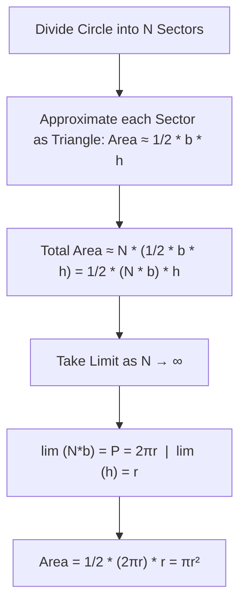
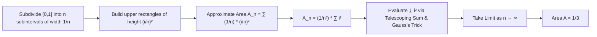

# Lecture Notes: Geometric Area Calculations and Limits

This video covers two main area derivations known to the ancient Greeks:

1. **Area of a Circle** using perimeter and limiting sectors.
2. **Area under a Parabola** ($y = x^2$ from $x = 0$ to $x = 1$) using upper Riemann sums, telescoping sums, and limits.

---

## 1. Basics: Areas bounded by Straight Lines

### Rectangle and Triangle

- **Rectangle**: $\text{Area} = b \cdot h$
  - Serves as the foundation for defining multiplication of positive real numbers.
- **Triangle**: $\text{Area} = \frac{1}{2}b \cdot h$
  - **Proof Intuition**: Dropping an altitude of height $h$ splits the base $b$ into $b_1 + b_2 = b$. The triangle is enclosed by two rectangles of widths $b_1$ and $b_2$. The triangle's area consists of half of each rectangle's area:
    $$\text{Area} = \frac{1}{2}b_1 h + \frac{1}{2}b_2 h = \frac{1}{2}(b_1 + b_2)h = \frac{1}{2}b h$$

> **Key takeaway**: Any polygon bounded by straight lines can be decomposed into triangles to find its total area.

---

## 2. Area of a Circle ($A = \pi r^2$)

### Derivation Steps

1. Divide a circle of radius $r$ into $N$ equal sectors (e.g., $N = 4, 8, 16, \dots$).
2. Connect the vertices along the perimeter with straight line segments of length $b$.
3. Each sector is approximated by a triangle of base $b$ and height/altitude $h$.
4. Taking the limit as $N \to \infty$:
   - Height of triangle: $\lim_{N \to \infty} h = r$
   - Perimeter approximation: $\lim_{N \to \infty} (N \cdot b) = P = 2\pi r$



### Connection to Derivatives

- $\text{Area } A(r) = \pi r^2$
- $\text{Perimeter } P(r) = 2\pi r$
- $\frac{dA}{dr} = 2\pi r = P$

> Area is an **antiderivative** of perimeter.

---

## 3. Area Under the Parabola ($y = x^2$ on $[0, 1]$)

We want to find the exact area $A$ under $y = x^2$ from $x = 0$ to $x = 1$.



---

### Step-by-Step Mathematical Derivation

#### Step 1: Set up the Upper Sum

Divide $[0, 1]$ into $n$ subintervals of equal width $\Delta x = \frac{1}{n}$.
Height of $i$-th rectangle: $y_i = \left(\frac{i}{n}\right)^2$.

$$\text{Area}_n = \sum_{i=1}^n \left(\frac{1}{n}\right)\left(\frac{i}{n}\right)^2 = \frac{1}{n^3} \sum_{i=1}^n i^2$$

#### Step 2: The Telescoping Sum Method

To find $\sum_{i=1}^n i^2$, expand the identity $n^3$:

$$n^3 = \sum_{i=1}^n \left[ i^3 - (i-1)^3 \right]$$

Expand the inner cubical terms:

$$i^3 - (i-1)^3 = i^3 - (i^3 - 3i^2 + 3i - 1) = 3i^2 - 3i + 1$$

Substitute back into the summation:

$$n^3 = \sum_{i=1}^n (3i^2 - 3i + 1) = 3 \sum_{i=1}^n i^2 - 3 \sum_{i=1}^n i + \sum_{i=1}^n 1$$

$$n^3 = 3 \sum_{i=1}^n i^2 - 3 \sum_{i=1}^n i + n$$

#### Step 3: Gauss's Trick for $\sum_{i=1}^n i$

Let $S = 1 + 2 + \dots + n$.
Writing $S$ forwards and backwards:

$$2S = (n+1) + (n+1) + \dots + (n+1) = n(n+1)$$

$$S = \sum_{i=1}^n i = \frac{n(n+1)}{2}$$

#### Step 4: Solve for $\sum_{i=1}^n i^2$

Substitute Gauss's result into the telescoping relation:

$$n^3 = 3 \sum_{i=1}^n i^2 - 3 \left( \frac{n(n+1)}{2} \right) + n$$

Isolate $\sum_{i=1}^n i^2$:

$$3 \sum_{i=1}^n i^2 = n^3 + \frac{3n(n+1)}{2} - n$$

$$\sum_{i=1}^n i^2 = \frac{2n^3 + 3n^2 + n}{6} = \frac{n(n+1)(2n+1)}{6}$$

#### Step 5: Calculate the Limit

$$A = \lim_{n \to \infty} \left( \frac{1}{n^3} \cdot \frac{2n^3 + 3n^2 + n}{6} \right)$$

$$A = \lim_{n \to \infty} \left( \frac{2 + \frac{3}{n} + \frac{1}{n^2}}{6} \right) = \frac{2}{6} = \frac{1}{3}$$

---

## 4. Key Techniques & Summary

| Technique                   | Application                                                                 |
| --------------------------- | --------------------------------------------------------------------------- |
| **Limiting Polygon**        | Approximates circle area via sector triangles as $N \to \infty$.            |
| **Sigma Notation ($\sum$)** | Compact representation of large sums.                                       |
| **Telescoping Sums**        | Expanding $n^3$ using cancellations to isolate power sum formulas.          |
| **Gauss's Trick**           | Evaluating $\sum_{i=1}^n i = \frac{n(n+1)}{2}$ by reversing addition order. |
| **Limits at Infinity**      | Converting discrete approximations into exact continuous areas.             |

```

```
