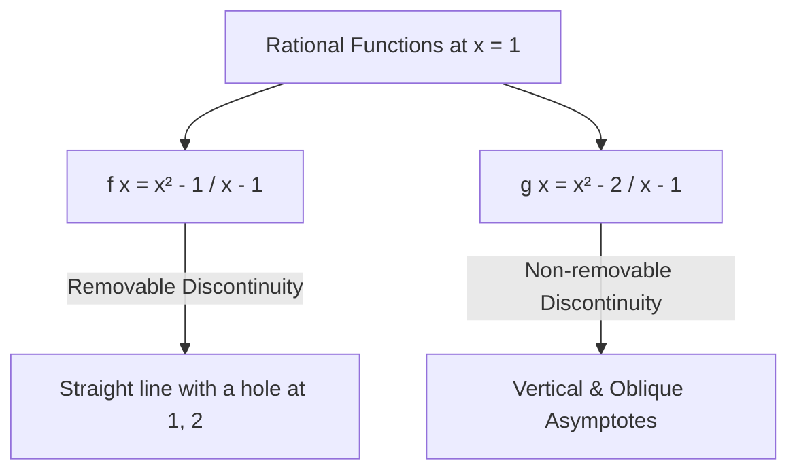
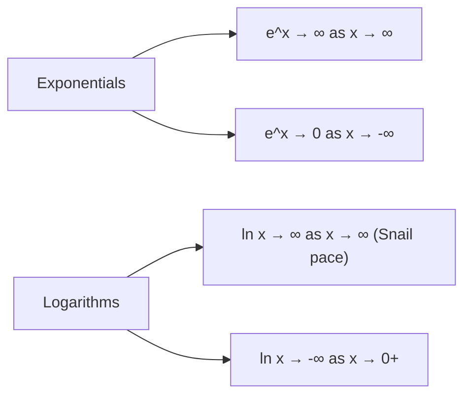

**Core Concept: What is a Limit?**

- **Definition:** A mathematical tool to evaluate and control function behavior as an input approaches an ideal, forbidden, or out-of-bounds point without actually reaching it.
- **Notation:**
- $\lim_{x \to a} f(x) = L$ (As $x$ approaches $a$, $f(x)$ approaches $L$).
- Superscripts: $x \to a^+$ (approaching from above/right), $x \to a^-$ (approaching from below/left).
- $\infty$ and $-\infty$: Symbols indicating values grow arbitrarily large positively or negatively (not actual numbers).

---

**Comparing Rational Functions near $x = 1$**

Both functions are undefined at $x = 1$ due to division by zero ($\frac{\text{anything}}{0}$), but display starkly different behaviors:

### Case 1: Removable Hole — $f(x) = \frac{x^2 - 1}{x - 1}$

1. **Numerical Exploration:**

- $f(1.1) = 2.1$, $f(1.01) = 2.01$, $f(0.9999) = 1.9999$

2. **Algebraic Simplification:**

$$f(x) = \frac{(x + 1)(x - 1)}{x - 1} = x + 1 \quad (x \neq 1)$$

3. **Limit Conclusion:**

$$\lim_{x \to 1} \frac{x^2 - 1}{x - 1} = 2$$

- _Graph:_ The line $y = x + 1$ with a single point (hole) missing at $(1, 2)$.

---

### Case 2: Asymptotic Explosion — $g(x) = \frac{x^2 - 2}{x - 1}$

1. **Numerical Exploration:**

- $g(1.1) = -7.9$, $g(1.01) \approx -98$, $g(0.9999) > 10,000$ (Wild behavior!)

2. **Polynomial Long Division:**

$$g(x) = (x + 1) - \frac{1}{x - 1}$$

3. **One-Sided Limits at $x = 1$ (Vertical Asymptote):**

- $\lim_{x \to 1^+} g(x) = -\infty$ (Since $\frac{1}{0^+} \to +\infty$, $(x+1) - \infty \to -\infty$)
- $\lim_{x \to 1^-} g(x) = +\infty$ (Since $\frac{1}{0^-} \to -\infty$, $(x+1) - (-\infty) \to +\infty$)

4. **End-Behavior Limits (Oblique Asymptote):**

- As $x \to \pm\infty$, $\frac{1}{x - 1} \to 0$.
- Therefore, $g(x)$ approaches the straight line $y = x + 1$ at the far edges of the graph.

---

**Asymptotes & Standard Limits Catalog**

### 1. Simple Hyperbola: $y = \frac{1}{x}$

| Limit                    | Mathematical Statement                                                             | Geometric Interpretation |
| ------------------------ | ---------------------------------------------------------------------------------- | ------------------------ |
| **Horizontal Asymptote** | $\lim_{x \to \infty} \frac{1}{x} = 0$, $\lim_{x \to -\infty} \frac{1}{x} = 0$      | $x$-axis ($y=0$)         |
| **Vertical Asymptote**   | $\lim_{x \to 0^+} \frac{1}{x} = +\infty$, $\lim_{x \to 0^-} \frac{1}{x} = -\infty$ | $y$-axis ($x=0$)         |

---

### 2. Exponential & Logarithmic Functions

- **Natural Exponential ($y = e^x$):**

$$\lim_{x \to \infty} e^x = \infty \quad \text{and} \quad \lim_{x \to -\infty} e^x = 0$$

- Has a horizontal asymptote at $y = 0$ as $x \to -\infty$.

- **Reflected Exponential ($y = e^{-x}$):**

$$\lim_{x \to \infty} e^{-x} = 0 \quad \text{and} \quad \lim_{x \to -\infty} e^{-x} = \infty$$

- **Natural Logarithm ($y = \ln x$):**

$$\lim_{x \to \infty} \ln(x) = \infty \quad \text{(Extremely slow logarithmic growth)}$$

$$\lim_{x \to 0^+} \ln(x) = -\infty \quad \text{(Vertical asymptote at } x = 0\text{)}$$
