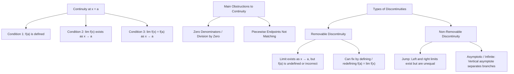
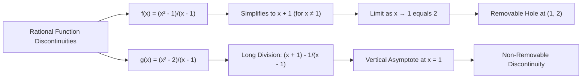

---

**Core Concept: Continuity**

- **Intuitive Definition:** A function is continuous if its graph can be drawn without lifting your pen off the paper (no gaps, holes, or sudden jumps).
- **Examples of Continuous Functions:**
- Linear: $y = x$, $y = k$
- Polynomials: $y = x^2$
- Trigonometric: $y = \sin x$
- Exponential & Logarithmic: $y = e^x$, $y = \ln x$

- **Formal Definition:** A function $f(x)$ is continuous at $x = a$ if and only if:

$$\lim_{x \to a} f(x) = f(a)$$

---

**Common Causes of Discontinuity**

1. **Division by Zero:** Zero in the denominator of a fraction creates undefined points or asymptotic behavior.
2. **Piecewise Misalignments:** Sub-functions meeting at boundary points fail to connect.

---

**Comparing Piecewise Examples**

### 1. Continuous Piecewise: $f(x) = \vert{}x\vert{}$

Defined as:

$$f(x) = \begin{cases} x & \text{if } x \ge 0 \\ -x & \text{if } x < 0 \end{cases}$$

- The two pieces meet seamlessly at the origin $(0, 0)$.
- Drawn continuously as a single V-shape without lifting the pen.

### 2. Discontinuous Jump: $f(x) = \frac{x}{\vert{}x\vert{}}$

Defined as:

$$f(x) = \begin{cases} 1 & \text{if } x > 0 \\ -1 & \text{if } x < 0 \end{cases}$$

- **Right-hand limit:** $\lim_{x \to 0^+} \frac{x}{\vert{}x\vert{}} = 1$
- **Left-hand limit:** $\lim_{x \to 0^-} \frac{x}{\vert{}x\vert{}} = -1$
- **Conclusion:** Because the one-sided limits are unequal ($\lim_{x \to 0^+} \neq \lim_{x \to 0^-}$), the overall two-sided limit does not exist, creating an unfixable jump discontinuity.

---

**Removable vs. Non-Removable Discontinuities**

| Type              | Condition                                                            | Example                        | Resolution                                                    |
| ----------------- | -------------------------------------------------------------------- | ------------------------------ | ------------------------------------------------------------- |
| **Removable**     | $\lim_{x \to a} f(x)$ exists, but $f(a)$ is undefined or mismatched. | $f(x) = \frac{x^2 - 1}{x - 1}$ | Redefine $f(a) = \lim_{x \to a} f(x)$ to fill the hole.       |
| **Non-Removable** | $\lim_{x \to a} f(x)$ does not exist (infinite asymptote or jump).   | $g(x) = \frac{x^2 - 2}{x - 1}$ | Cannot be made continuous at $a$ by assigning a single value. |

---

**Classic Removable Discontinuity Case Study: $f(x) = \frac{\sin x}{x}$**

- **Domain:** All $x \neq 0$ (undefined at $x = 0$).
- **Behavior:**
- Periodic undulations dampened by the $\frac{1}{x}$ factor as $\vert{}x\vert{} \to \infty$.
- Reflectional symmetry about the $y$-axis (Even function).

- **Limit at $x = 0$:**

$$\lim_{x \to 0} \frac{\sin x}{x} = 1$$

- **Continuous Extension:**

$$f(x) = \begin{cases} \frac{\sin x}{x} & \text{if } x \neq 0 \\ 1 & \text{if } x = 0 \end{cases}$$

- **Applications:** Widely used in acoustics, optics, signal processing, and spectroscopy.
