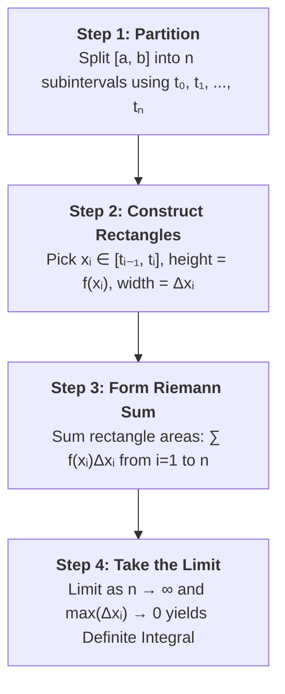
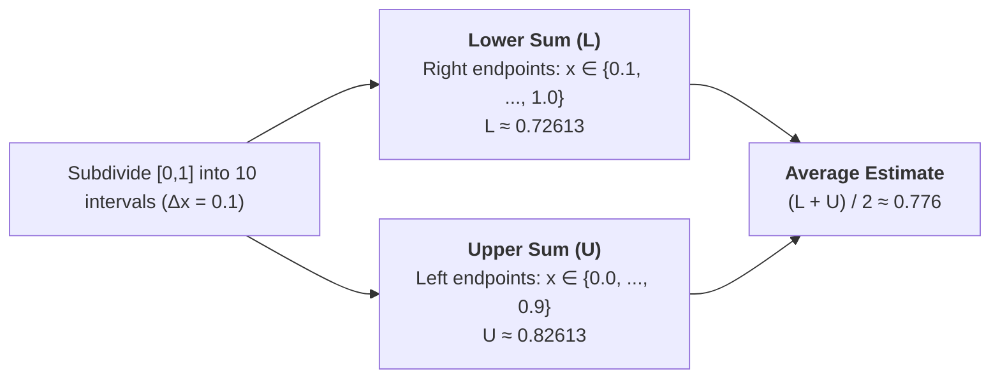

# Lecture Notes: Formalizing Areas with Riemann Sums and Definite Integrals

This lesson introduces the formal process of calculating exact areas under curves via **Riemann Sums** and defines the **Definite Integral**. Historical contributions span from Leibniz in the 17th century to Bernhard Riemann in the 19th century.

---

## 1. The 4-Step Method of Riemann Sums

To calculate the exact area $A$ under a continuous function $y = f(x)$ on an interval $[a, b]$:

### Detailed Breakdown

1. **Partition the Interval**:
   Choose points $a = t_0 < t_1 < t_2 < \dots < t_{n-1} < t_n = b$. These points define $n$ subintervals.
2. **Construct Rectangles**:
   For each subinterval $[t_{i-1}, t_i]$:

- Width: $\Delta x_i = t_i - t_{i-1}$
- Choose any sample point $x_i \in [t_{i-1}, t_i]$
- Height: $f(x_i)$
- Area of $i$-th rectangle: $f(x_i) \Delta x_i$

3. **Sum the Areas (Riemann Sum)**:

$$\text{Area} \approx \sum_{i=1}^n f(x_i) \Delta x_i = f(x_1)\Delta x_1 + f(x_2)\Delta x_2 + \dots + f(x_n)\Delta x_n$$

4. **Take the Limit (Definite Integral)**:
   As $n \to \infty$ such that every $\Delta x_i \to 0$, the sum approaches the exact area $A$:

$$A = \lim_{n \to \infty} \sum_{i=1}^n f(x_i) \Delta x_i = \int_{a}^{b} f(x) \, dx$$

---

## 2. Anatomy of Definite Integral Notation

The integral symbol $\int$ (introduced by Leibniz) represents an elongated "S" for a **continuous sum** of infinitely thin rectangles of height $f(x)$ and width $dx$.

$$\int_{a}^{b} f(x) \, dx$$

| Symbol | Name                   | Description                                                                  |
| ------ | ---------------------- | ---------------------------------------------------------------------------- |
| $\int$ | **Integral Sign**      | Stylized "S" indicating a continuous sum                                     |
| $a, b$ | **Terminals (Limits)** | Lower limit $a$ (subscript) and Upper limit $b$ (superscript)                |
| $f(x)$ | **Integrand**          | Function determining the height of each infinitesimal rectangle              |
| $dx$   | **Differential**       | Represents the infinitesimal width of each rectangle (replaces $\Delta x_i$) |

---

## 3. Example: Estimating $\frac{\pi}{4}$ Using Circle Quadrant

To estimate the area of a quarter circle $y = \sqrt{1 - x^2}$ on $[0, 1]$ (exact area $= \frac{\pi}{4} \approx 0.7854$), divide $[0, 1]$ into $10$ equal subintervals of width $\Delta x = 0.1$.

- **Lower Sum ($L$)**: Evaluated at right endpoints where height is smaller.

$$L = 0.1 \times \sum_{k=1}^{10} \sqrt{1 - (0.1k)^2} \approx 0.72613$$

- **Upper Sum ($U$)**: Evaluated at left endpoints where height is larger.

$$U = 0.1 \times \sum_{k=0}^{9} \sqrt{1 - (0.1k)^2} \approx 0.82613$$

- **Average Estimate**:

$$\text{Area} \approx \frac{L + U}{2} = \frac{0.72613 + 0.82613}{2} \approx 0.776$$

_(Underestimates slightly because the curve is concave down, making trapezoidal approximations sit below the curve)._

---

## 4. Fundamental Properties of Definite Integrals

### Degenerate & Reversed Terminals

- **Zero Interval**:

$$\int_{a}^{a} f(x) \, dx = 0$$

- **Reversing Integration Limits**:

$$\int_{b}^{a} f(x) \, dx = -\int_{a}^{b} f(x) \, dx$$

_(Moving right-to-left makes $\Delta x$ negative, reversing the sign)._

### Signed Area & Interval Splitting

- **Below the $x$-axis**: Regions where $f(x) < 0$ yield negative area.
- _Example_: $\int_{0}^{\pi} \cos(x) \, dx = \int_{0}^{\pi/2} \cos(x) \, dx + \int_{\pi/2}^{\pi} \cos(x) \, dx = 1 + (-1) = 0$

- **Splitting Intervals**:

$$\int_{a}^{c} f(x) \, dx = \int_{a}^{b} f(x) \, dx + \int_{b}^{c} f(x) \, dx$$

### Linearity Properties

1. **Additivity**:

$$\int_{a}^{b} [f(x) + g(x)] \, dx = \int_{a}^{b} f(x) \, dx + \int_{a}^{b} g(x) \, dx$$

2. **Constant Multiple**:

$$\int_{a}^{b} c \cdot f(x) \, dx = c \int_{a}^{b} f(x) \, dx$$

---

## 5. Worked Example: Linear Combination

Given:

- $\int_{0}^{1} x^2 \, dx = \frac{1}{3}$
- $\int_{0}^{1} 1 \, dx = 1$

Calculate $\int_{0}^{1} (12x^2 - 5) \, dx$:

$$\int_{0}^{1} (12x^2 - 5) \, dx = 12 \int_{0}^{1} x^2 \, dx - 5 \int_{0}^{1} 1 \, dx$$

$$= 12\left(\frac{1}{3}\right) - 5(1) = 4 - 5 = -1$$

_(The result is negative because the area below the $x$-axis exceeds the area above it over this interval)._
