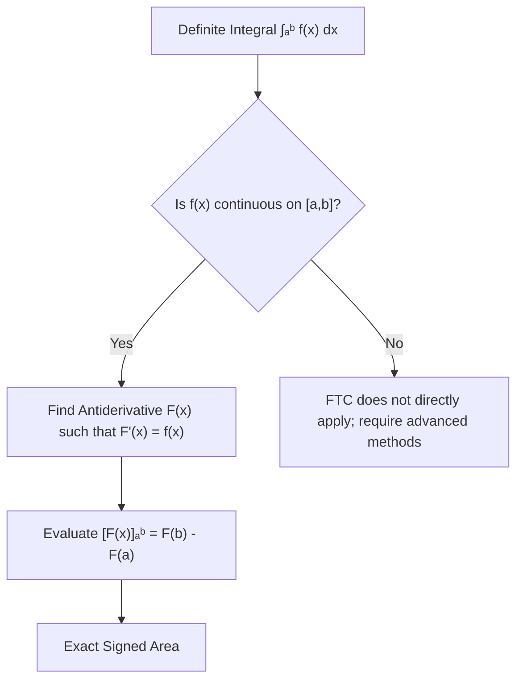

# Lecture Notes: The Fundamental Theorem of Calculus & Antiderivatives

This lecture introduces the **Fundamental Theorem of Calculus (FTC)**, bridging the gap between definite integrals (areas under curves) and antiderivatives.

---

## 1. Definite Integrals vs. Antiderivatives

- **Definite Integral**: Represents the exact numerical area under a curve $y = f(x)$ over an interval $[a, b]$. In principle, it is defined via the limit of a Riemann Sum:

$$\int_{a}^{b} f(x) \, dx = \lim_{n \to \infty} \sum_{i=1}^{n} f(x_i) \Delta x$$

- **Antiderivative**: A function $F(x)$ whose derivative is $f(x)$. That is:

$$F'(x) = f(x)$$

Unlike differentiation, which follows mechanical rules (Chain, Product, Quotient rules), finding antiderivatives requires skill and ingenuity.

---

## 2. The Fundamental Theorem of Calculus (FTC)

Whenever $f(x)$ is continuous on $[a, b]$, the FTC allows us to evaluate a definite integral directly using an antiderivative $F(x)$, skipping Riemann sums:

$$\int_{a}^{b} f(x) \, dx = \Big[ F(x) \Big]_{a}^{b} = F(b) - F(a)$$

> **Square Bracket Notation**: $[F(x)]_a^b$ is a standard shorthand meaning _"evaluate $F(x)$ at $b$, evaluate $F(x)$ at $a$, and subtract the two values."_

---

## 3. Uniqueness and the Constant of Integration ($C$)

Antiderivatives are **not unique**. If $F(x)$ and $G(x)$ are both antiderivatives of $f(x)$:

$$\frac{d}{dx} \Big[ F(x) - G(x) \Big] = F'(x) - G'(x) = f(x) - f(x) = 0$$

Since a function with a derivative of zero everywhere must be a horizontal line, $F(x) - G(x) = C$. Thus, all antiderivatives differ only by a **constant of integration ($C$)**.

- **Indefinite Integral**: Denotes the general family of antiderivatives (written without limits):

$$\int f(x) \, dx = F(x) + C$$

---

## 4. Common Integration Formulas

| Function $f(x)$        | Indefinite Integral $\int f(x) \, dx$ | Notes / Conditions                     |
| ---------------------- | ------------------------------------- | -------------------------------------- |
| $1$                    | $x + C$                               | Base case                              |
| $x^n$                  | $\frac{x^{n+1}}{n+1} + C$             | Valid for $n \neq -1$ (Power Rule)     |
| $\frac{1}{x} = x^{-1}$ | $\ln\vert{}x\vert{} + C$              | Absolute value handles negative $x$    |
| $e^x$                  | $e^x + C$                             | Exponential function                   |
| $\cos(x)$              | $\sin(x) + C$                         | Derivative of $\sin(x)$ is $\cos(x)$   |
| $\sin(x)$              | $-\cos(x) + C$                        | Derivative of $\cos(x)$ is $-\sin(x)$  |
| $\sec^2(x)$            | $\tan(x) + C$                         | Derivative of $\tan(x)$ is $\sec^2(x)$ |
| $\ln(x)$               | $x\ln(x) - x + C$                     | Found via Integration by Parts         |

---

## 5. Worked Examples

### Example 1: Area Under $y = x^2$ on $[0, 1]$

An antiderivative of $x^2$ is $\frac{x^3}{3}$.

$$\int_{0}^{1} x^2 \, dx = \left[ \frac{x^3}{3} \right]_0^1 = \frac{1^3}{3} - \frac{0^3}{3} = \frac{1}{3}$$

---

### Example 2: Area Under $y = 12x^2 - 5$ on $[0, 1]$

Find the antiderivative term-by-term:

- Antiderivative of $12x^2 = 12 \cdot \frac{x^3}{3} = 4x^3$
- Antiderivative of $-5 = -5x$

$$\int_{0}^{1} (12x^2 - 5) \, dx = \Big[ 4x^3 - 5x \Big]_0^1 = (4(1)^3 - 5(1)) - (0) = 4 - 5 = -1$$

---

### Example 3: Area Under $y = \frac{1}{x}$ on $[1, 2]$

$$\int_{1}^{2} \frac{1}{x} \, dx = \Big[ \ln(x) \Big]_1^2 = \ln(2) - \ln(1) = \ln(2)$$

_(Note: If integrating backward from $1$ to $k$ where $k < 1$, $\int_{1}^{k} \frac{1}{x} \, dx = \ln(k) < 0$. To represent positive area, reverse limits: $-\int_{k}^{1} \frac{1}{x} \, dx = -\ln(k)$)._

---

### Example 4: Trigonometric Definite Integrals

1. **Area under $\sin(x)$ on $[\frac{\pi}{2}, \pi]$**:

$$\int_{\pi/2}^{\pi} \sin(x) \, dx = \Big[ -\cos(x) \Big]_{\pi/2}^{\pi} = (-\cos(\pi)) - (-\cos(\pi/2)) = -(-1) - 0 = 1$$

2. **Area under $\sin(x)$ on $[\frac{\pi}{2}, 2\pi]$**:

$$\int_{\pi/2}^{2\pi} \sin(x) \, dx = \Big[ -\cos(x) \Big]_{\pi/2}^{2\pi} = (-\cos(2\pi)) - (-\cos(\pi/2)) = -1 - 0 = -1$$

_(The region below the $x$-axis subtracts from the total value)._

---

## Summary Flowchart

