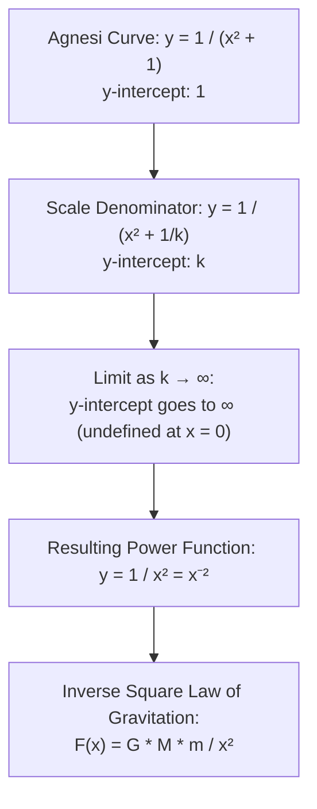
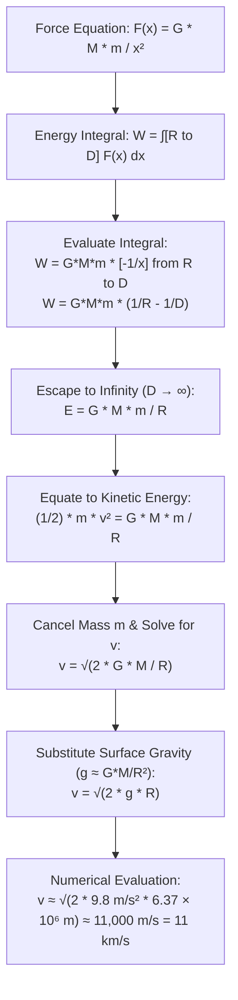
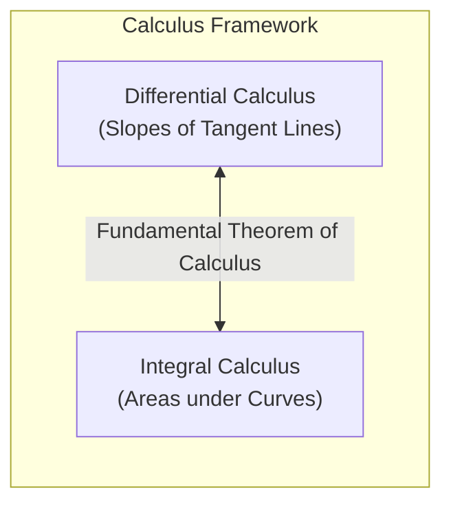

# Note: Newton, Escape Velocity & Course Synthesis

This note synthesizes the historical motivation of calculus, the mathematical derivation of gravitational escape velocity, and a comprehensive review of the primary concepts covered throughout the course.

---

## 1. Mathematical Transition: Agnesi to Inverse Square Law

The transition from the family of curves known as the **Witch of Agnesi** to the **Inverse Square Law** provides a clear view of vertical scaling and limiting behavior.

### Analytical Properties of $y = x^{-2}$

- **Function:** $y = \frac{1}{x^2} = x^{-2}$
- **First Derivative:** $y' = -2x^{-3} = -\frac{2}{x^3}$
- $y' > 0$ for $x < 0$ (increasing)
- $y' < 0$ for $x > 0$ (decreasing)
- Undefined at $x = 0$

- **Second Derivative:** $y'' = 6x^{-4} = \frac{6}{x^4}$
- $y'' > 0$ for all $x \neq 0$ (concave up everywhere)

---

## 2. Derivation of Escape Velocity

To determine the initial velocity $v$ required for a object (cannonball or rocket) of mass $m$ to escape Earth's gravitational field completely, we calculate the total work done against gravity.

### Key Physical Parameters

- $M$: Mass of the Earth
- $m$: Mass of the projectile (cancels out during derivation)
- $R$: Radius of the Earth ($\approx 6.37 \times 10^6 \text{ m}$, first calculated by Eratosthenes)
- $g$: Acceleration due to gravity at Earth's surface ($\approx 9.8 \text{ m/s}^2$)
- $G$: Universal gravitational constant

---

## 3. Integral Calculus & Course Synthesis

The course integrates pre-calculus foundation with differential and integral calculus, linked via the **Fundamental Theorem of Calculus**.

### Complete Course Summary

| Module Focus                     | Primary Mathematical Concepts                                                   | Key Applications & Tools                                                     |
| -------------------------------- | ------------------------------------------------------------------------------- | ---------------------------------------------------------------------------- |
| **1 & 2: Pre-Calculus**          | Functions, limits, algebraic manipulation, and geometric approximations.        | Parabolic trajectories, early area estimations (Eratosthenes, Archimedes).   |
| **3 & 4: Differential Calculus** | Rates of change, derivatives, tangents, and second-derivative concavity.        | Velocity/acceleration vectors, curve sketching via sign diagrams.            |
| **5: Integral Calculus**         | Definite/indefinite integrals, Riemann sums, substitution, and antiderivatives. | Work/energy calculations, escape velocity, and logistic population dynamics. |

### Summary of Integration Principles

1. **Riemann Sums & Definite Integral:**

$$\int_a^b f(x) \, dx = \lim_{\Delta x \to 0} \sum_{i=1}^n f(x_i^*) \Delta x$$

2. **Fundamental Theorem of Calculus:**

$$\int_a^b f(x) \, dx = F(b) - F(a) \quad \text{where } F'(x) = f(x)$$

3. **Integration by Substitution:** Direct counterpart to the derivative Chain Rule.
4. **Symmetry Rules:**

- **Odd Functions** ($f(-x) = -f(x)$): Rotational symmetry about origin $\implies \int_{-a}^a f(x) \, dx = 0$.
- **Logistic Curves:** $180^\circ$ rotational symmetry around the inflection point $\left(t_{\text{inflection}}, \frac{M}{2}\right)$.
