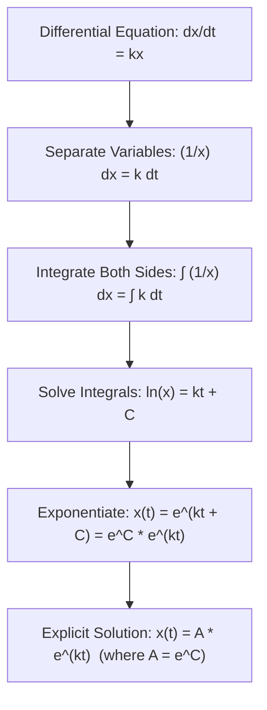
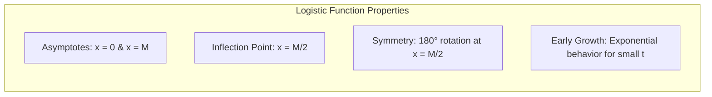

# Note: Logistic Growth Model & Population Dynamics

This note summarizes the mathematical derivation, behavior, and properties of exponential and logistic growth models.

---

## 1. Exponential Growth Model

In an environment with unlimited resources, population growth rate is directly proportional to current population size.

### Differential Equation

$$\frac{dx}{dt} = kx$$

- $x(t)$: Dependent variable (population size at time $t$)
- $t$: Independent variable (time)
- $k$: Growth rate constant ($k > 0$)

### Derivation via Separation of Variables

### Limitation

Exponential growth assumes unlimited resources. As $t \to \infty$, $x(t) \to \infty$, which is physically unrealistic in constrained environments.

---

## 2. Logistic Growth Model

To account for environmental constraints and limited resources, an **inhibition factor** $\left(1 - \frac{x}{M}\right)$ is introduced.

### Differential Equation

$$\frac{dx}{dt} = kx \left(1 - \frac{x}{M}\right)$$

- $M$: Carrying capacity (maximal sustainable population, $M > 0$)
- $\left(1 - \frac{x}{M}\right)$: Inhibition factor
- When $x \ll M$, factor $\approx 1 \implies$ growth is approximately exponential ($\frac{dx}{dt} \approx kx$).
- When $x \to M$, factor $\to 0 \implies$ growth slows down to zero ($\frac{dx}{dt} \to 0$).

---

## 3. Derivation of the Logistic Function

### Step 1: Separation of Variables

$$\frac{dx}{x \left(1 - \frac{x}{M}\right)} = k \, dt$$

Expressing the left side integrand as a rational function:

$$\int \frac{1}{x \left(1 - \frac{x}{M}\right)} \, dx = \int k \, dt$$

---

### Step 2: Partial Fraction Decomposition

Decompose the integrand into simpler components:

$$\frac{1}{x \left(1 - \frac{x}{M}\right)} = \frac{A}{x} + \frac{B}{1 - \frac{x}{M}}$$

Multiply out numerator:

$$1 = A\left(1 - \frac{x}{M}\right) + Bx$$

- Set $A = 1$: $1 - \frac{x}{M} + Bx = 1 \implies B = \frac{1}{M}$

Substitute back:

$$\frac{1}{x \left(1 - \frac{x}{M}\right)} = \frac{1}{x} + \frac{1/M}{1 - \frac{x}{M}} = \frac{1}{x} + \frac{1}{M - x}$$

---

### Step 3: Integration

$$\int \left(\frac{1}{x} + \frac{1}{M - x}\right) dx = \int k \, dt$$

Assuming $0 < x < M$:

$$\ln(x) - \ln(M - x) = kt + C'$$

Combine logarithms:

$$\ln\left(\frac{x}{M - x}\right) = kt + C'$$

---

### Step 4: Solving for $x(t)$

Exponentiate both sides:

$$\frac{x}{M - x} = e^{kt + C'} = e^{C'} e^{kt}$$

Reciprocate both sides:

$$\frac{M - x}{x} = \frac{1}{e^{C'} e^{kt}}$$

$$\frac{M}{x} - 1 = K e^{-kt} \quad \left(\text{where } K = e^{-C'}\right)$$

$$\frac{M}{x} = 1 + K e^{-kt}$$

Solve explicitly for $x(t)$:

$$x(t) = \frac{M}{1 + K e^{-kt}}$$

---

## 4. Analytical Properties of the Logistic Curve

### Key Features

1. **Domain & Range:** $0 < x(t) < M$ for all $t$.
2. **Asymptotic Limits:**

- Future limit ($t \to \infty$): $\lim_{t \to \infty} x(t) = M$
- Past limit ($t \to -\infty$): $\lim_{t \to -\infty} x(t) = 0$

3. **Maximum Growth Rate Point:**

- Rewriting $\frac{dx}{dt} = \frac{k}{M} x (M - x)$ gives a downward-opening parabola as a function of $x$.
- Peak growth rate occurs at the apex: $x = \frac{M}{2}$.
- The point on the logistic curve where $x(t) = \frac{M}{2}$ is an **inflection point**, around which the curve has $180^\circ$ rotational symmetry.

4. **Early Behavior:** For small $t$ (left side of the graph), $1 + K e^{-kt} \approx K e^{-kt}$, meaning $x(t) \approx \frac{M}{K} e^{kt}$, resembling standard exponential growth before environmental constraint factors dominate.
