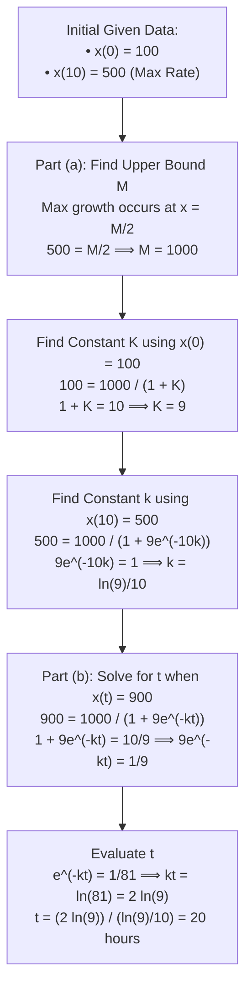
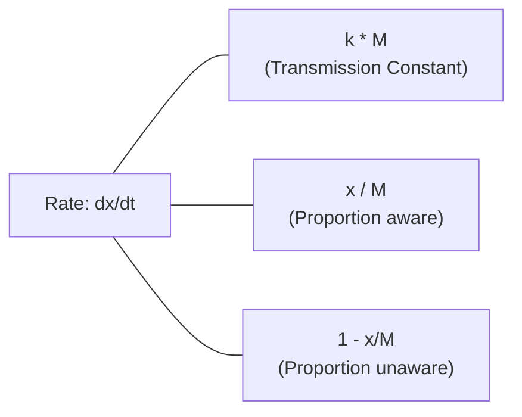

# Note: Applications of the Logistic Model

This note covers the step-by-step solution to a yeast population dynamics problem, the geometric symmetry property that allows for quick intuitive solving, and an application to sociological rumor spread.

---

## 1. Yeast Colony Example

### Problem Statement

A yeast colony starts with **100 cells**. It grows most rapidly **10 hours later**, at which point **500 cells** are present. Assuming a logistic growth model $x(t) = \frac{M}{1 + K e^{-kt}}$:

1. **Part (a):** Find the upper bound ($M$) for the colony size.
2. **Part (b):** Find the time $t$ required to reach **90% of the maximum population** ($900$ cells).

---

### Algebraic Solution Workflow

---

## 2. Geometric Symmetry & Intuitive Solution

The logistic curve $x(t)$ possesses **$180^\circ$ rotational symmetry** around its point of inflection $\left(t_{\text{inflection}}, \frac{M}{2}\right)$.

### Point Mapping Analysis

- **Inflection Point:** $(10, 500)$ — time when population reaches half of carrying capacity $M$.
- **Initial Point:** $(0, 100)$ — at $t = 0$, distance below $M/2$ is $500 - 100 = 400$.
- **Symmetrical Point:** Rotating $(0, 100)$ by $180^\circ$ across $(10, 500)$:
- **Vertical position:** $\frac{M}{2} + 400 = 500 + 400 = 900$ (which is $90\%$ of $M$).
- **Horizontal position:** $10 + (10 - 0) = 20$ hours.

> **Key Takeaway:** Any point $(10 - \Delta t, 500 - \Delta x)$ maps directly to $(10 + \Delta t, 500 + \Delta x)$ via rotational symmetry. Therefore, reaching $900$ cells ($500 + 400$) takes the exact same time interval as growing from $100$ cells ($500 - 400$) to the inflection point.

---

## 3. Sociological Application: Spread of a Rumor

The same mathematical model applies to information flow in a population.

### Scenario

- **Town Population ($M$):** $1,000$ people.
- **Initial Aware ($x(0)$):** $100$ people.
- **Aware after 10 days ($x(10)$):** $500$ people.
- **Target ($x(t)$):** $900$ people ($90\%$ of population).

### Mathematical Interpretation of the Rate Equation

$$\frac{dx}{dt} = (kM) \cdot \left(\frac{x}{M}\right) \cdot \left(1 - \frac{x}{M}\right)$$

- **Early Phase ($x \ll M$):** Almost everyone is unaware ($1 - \frac{x}{M} \approx 1$). Growth is near-exponential as aware individuals share the rumor.
- **Peak Phase ($x = \frac{M}{2}$):** Half the population knows, maximizing potential contacts between aware and unaware people ($\frac{dx}{dt}$ reaches maximum).
- **Late Phase ($x \to M$):** Most people know the rumor ($1 - \frac{x}{M} \to 0$). Finding someone unaware becomes increasingly difficult, and growth slows to a trickle.

**Result:** It takes **20 days** for 900 people to hear the rumor (identical dynamics to the yeast colony).
