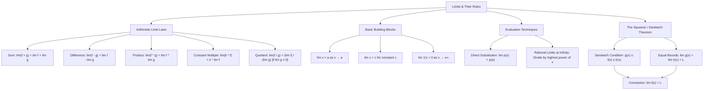
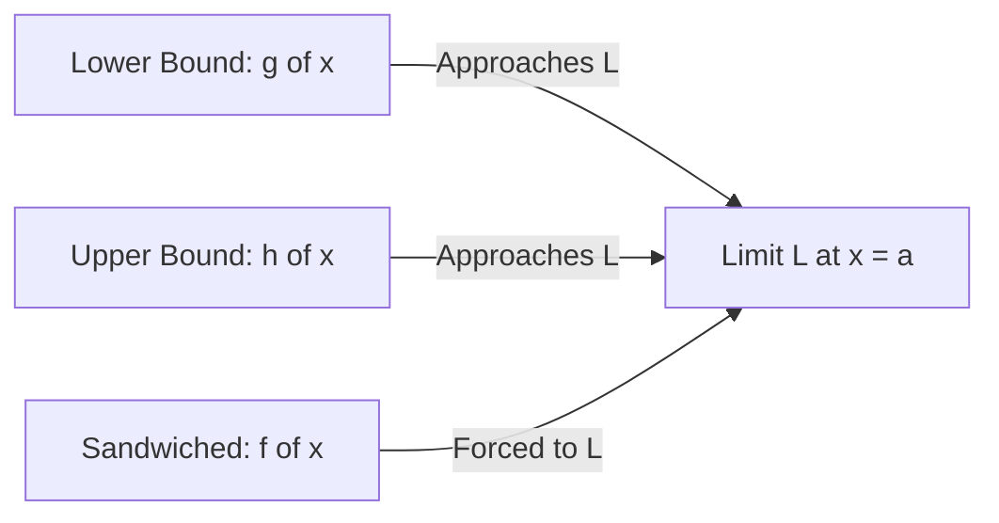

---

**Arithmetic Limit Laws**

When component limits exist, limits respect standard arithmetic:

- **Sum Law:** $\lim [f(x) + g(x)] = \lim f(x) + \lim g(x)$
- **Difference Law:** $\lim [f(x) - g(x)] = \lim f(x) - \lim g(x)$
- **Product Law:** $\lim [f(x) \cdot g(x)] = \lim f(x) \cdot \lim g(x)$
- **Constant Multiple Law:** $\lim [k \cdot f(x)] = k \cdot \lim f(x)$ _(constants pull out front)_
- **Quotient Law:** $\lim \left[\frac{f(x)}{g(x)}\right] = \frac{\lim f(x)}{\lim g(x)}$ **(provided $\lim g(x) \neq 0$)**

> **Note:** These laws apply universally whether $x \to a$, $x \to a^+$, $x \to a^-$, or $x \to \pm\infty$.

---

**Basic Building Blocks & Polynomial Continuity**

- **Identity:** $\lim_{x \to a} x = a$
- **Constant:** $\lim_{x \to a} c = c$
- **Reciprocal at Infinity:** $\lim_{x \to \pm\infty} \frac{1}{x} = 0$
- **Polynomial Direct Substitution:** For any polynomial $p(x)$, $\lim_{x \to a} p(x) = p(a)$.

$$\text{Example: } \lim_{x \to 1} (x^3 + 4x - 3) = (1)^3 + 4(1) - 3 = 2$$

---

**Evaluating Rational Limits at Infinity ($x \to \infty$)**

When evaluating $\lim_{x \to \infty} \frac{P(x)}{Q(x)}$:

1. **Heuristic Method:** Focus only on leading terms (highest powers); throw away lower-order terms.
2. **Rigorous Method:** Divide numerator and denominator by the highest power of $x$ in the expression, then apply $\lim_{x \to \infty} \frac{1}{x^n} = 0$.

$$\text{Example: } \lim_{x \to \infty} \frac{3x^3 + 2x^2 - 1}{2x^3 - 5x + 4} = \lim_{x \to \infty} \frac{3 + \frac{2}{x} - \frac{1}{x^3}}{2 - \frac{5}{x^2} + \frac{4}{x^3}} = \frac{3 + 0 - 0}{2 - 0 + 0} = \frac{3}{2}$$

---

**The Squeeze (Sandwich) Theorem**

If $g(x) \le f(x) \le h(x)$ near $x = a$, and $\lim_{x \to a} g(x) = \lim_{x \to a} h(x) = L$, then:

$$\lim_{x \to a} f(x) = L$$

### Derivation of $\lim_{x \to 0} \frac{\sin x}{x} = 1$

1. **Geometric Setup (Unit Circle):**
   Compare areas of three shapes formed by angle $x$:

$$\text{Area}_{\text{Inner Triangle}} \le \text{Area}_{\text{Circular Sector}} \le \text{Area}_{\text{Outer Triangle}}$$

$$\frac{\sin x}{2} \le \frac{x}{2} \le \frac{\tan x}{2}$$

2. **Algebraic Manipulation:**

- Multiply by $2$: $\sin x \le x \le \frac{\sin x}{\cos x}$
- Divide by $\sin x$: $1 \le \frac{x}{\sin x} \le \frac{1}{\cos x}$
- Reciprocate (reverses inequalities): $\cos x \le \frac{\sin x}{x} \le 1$

3. **Apply Limits as $x \to 0$:**

- Left bound: $\lim_{x \to 0} \cos x = 1$
- Right bound: $\lim_{x \to 0} 1 = 1$
- By the Squeeze Theorem: $\lim_{x \to 0} \frac{\sin x}{x} = 1$

---

**Trigonometric Limit Applications**

- **Evaluating $\lim_{x \to 0} \frac{\tan x}{x}$:**

$$\lim_{x \to 0} \left( \frac{\sin x}{x} \cdot \frac{1}{\cos x} \right) = \left(\lim_{x \to 0} \frac{\sin x}{x}\right) \cdot \left(\frac{1}{\lim_{x \to 0} \cos x}\right) = 1 \cdot 1 = 1$$

- **Evaluating $\lim_{x \to 0} \frac{\tan(2x)}{x}$:**

$$\lim_{x \to 0} \frac{2 \tan(2x)}{2x} = 2 \cdot \lim_{y \to 0} \frac{\tan y}{y} = 2 \cdot 1 = 2 \quad (\text{letting } y = 2x)$$
