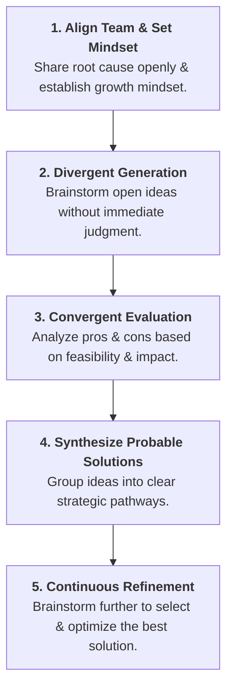
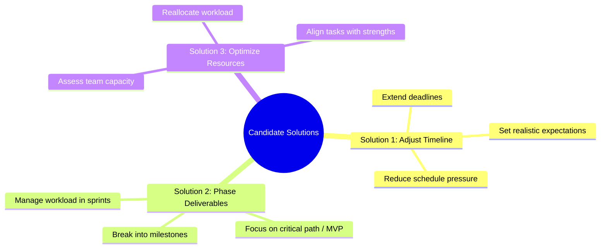

# Collaborative Brainstorming & Solution Generation

## Scenario Context

**Phase:** Step 3 – Brainstorming & Solution Identification  
**Facilitator:** Mia (Project Manager)  
**Team:** Alex (Developer), Lily (Assistant), and the project team

After adopting a **growth mindset** and diagnosing the root cause (_an overly aggressive project schedule_), Mia leads a collaborative, open-door brainstorming session. By tapping into collective team creativity, the team moves from diagnosing the issue to defining actionable, high-impact solutions.

---

## Key Principles of Collaborative Brainstorming

- **Psychological Safety:** Encourages all team members to share perspective regardless of how unconventional ideas may seem.
- **Open Idea Generation:** Focuses on quantity and variety of ideas first before critical evaluation.
- **Objective Evaluation:** Ideas are systematically assessed based on **feasibility, impact, and practicality** by weighing pros and cons together.

---

## Brainstorming & Evaluation Workflow

---

## The 3 Candidate Solutions Generated

From the initial session, the team distilled all inputs into **three core actionable strategies**:

### Detailed Evaluation Matrix

| #     | Solution Strategy                   | Core Mechanism                                                    | Primary Benefit                                                | Key Consideration                                            |
| ----- | ----------------------------------- | ----------------------------------------------------------------- | -------------------------------------------------------------- | ------------------------------------------------------------ |
| **1** | **Re-evaluate & Adjust Timeline**   | Renegotiate target delivery dates to fit actual scope.            | Directly targets root cause; relieves undue schedule pressure. | Requires client/stakeholder approval and alignment.          |
| **2** | **Prioritize & Phase Deliverables** | Group features into phases (e.g., MVP first, enhancements later). | Delivers core value on time while staggering bandwidth.        | Demands strict scope control and clear milestone definition. |
| **3** | **Optimize Resource Capacity**      | Audit team workload and reassign tasks to match strengths.        | Prevents team burnout and removes bottlenecks.                 | Capacity remains capped by total team size.                  |

---

## Next Steps

1. **Refine & Combine:** Test whether combining elements (e.g., _Phasing deliverables + adjusting final timeline_) provides the optimal balance.
2. **Decision Making:** Apply evaluation criteria (e.g., using **Six Thinking Hats** or a **Decision Matrix**) to select and finalize the ultimate execution plan.
3. **Execute via PDCA:** Pilot the chosen solution strategy within the next iteration cycle.
