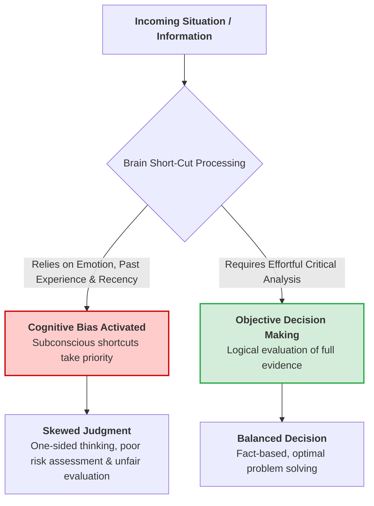
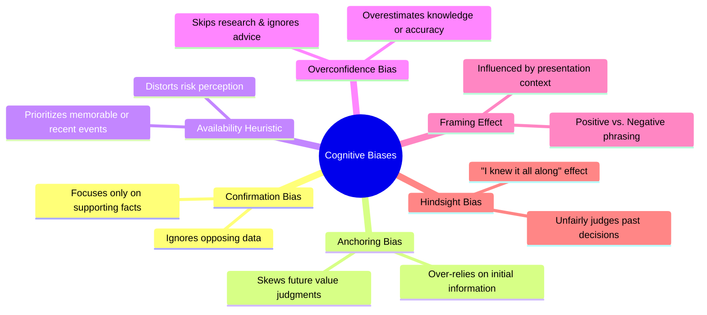
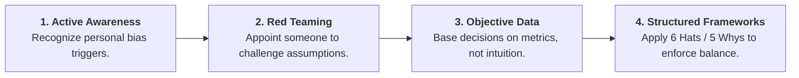

# Understanding Cognitive Biases in Decision Making

## Overview

**Cognitive Bias** refers to systematic patterns of deviation from norm or rationality in judgment. They occur when our brains use mental shortcuts (heuristics)—relying on past experiences, emotions, or social influence—to process information quickly instead of relying strictly on logic and objective facts.

While these shortcuts save cognitive energy, they often lead to skewed judgments, flawed problem-solving, and poor strategic decisions.

---

## Brain Decision-Making Architecture

---

## Key Types of Cognitive Biases

---

## Detailed Comparison & Real-World Examples

| Cognitive Bias             | Core Mechanism                                                                                                  | Practical Example                                                                                    | Impact on Decision Making                                                                             |
| -------------------------- | --------------------------------------------------------------------------------------------------------------- | ---------------------------------------------------------------------------------------------------- | ----------------------------------------------------------------------------------------------------- |
| **Confirmation Bias**      | Seeking or favoring data that supports pre-existing beliefs while discounting contradictory evidence.           | A manager believing a developer is slow only tracks delay logs, ignoring early deliveries.           | Leads to one-sided analysis, rigid thinking, and failure to adapt to actual facts.                    |
| **Anchoring Bias**         | Fixating on the first piece of information received ("the anchor") when making subsequent estimates.            | Item original price listed at $500 marked down to $400 feels like a bargain, even if worth $200.     | Warps value perceptions and keeps decisions tied to arbitrary initial baselines.                      |
| **Availability Heuristic** | Overestimating the likelihood or frequency of events based on how easily recent/dramatic examples come to mind. | Fearing plane crashes after watching news coverage, despite driving being statistically far riskier. | Causes teams to overreact to recent crises while ignoring lower-visibility, higher-probability risks. |
| **Overconfidence Bias**    | Overestimating one's knowledge, capability, or accuracy in predicting outcomes.                                 | Launching a product without proper testing because leadership is certain it cannot fail.             | Encourages unnecessary risk-taking, skipping due diligence, and ignoring expert feedback.             |
| **Framing Effect**         | Drawing different conclusions from the same information depending on how it is presented.                       | Preferring a medical treatment with a "90% survival rate" over one with a "10% mortality rate."      | Causes irrational preference shifts driven by phrasing rather than underlying facts.                  |
| **Hindsight Bias**         | Viewing past events as having been predictable after the outcome is already known ("I knew it all along").      | Blaming a manager for a risky decision that made sense with the limited data available at the time.  | Fosters unfair criticism and distorts post-project reviews by ignoring past uncertainty.              |

---

## Strategies to Mitigate Cognitive Biases

1. **Cultivate Self-Awareness:** Actively question personal assumptions before committing to a final decision.
2. **Encourage Constructive Dissent:** Assign a team member to play "Devil's Advocate" to challenge the consensus.
3. **Rely on Data over Instinct:** Establish quantitative benchmarks and metrics during decision-making.
4. **Use Structured Frameworks:** Techniques like the **Six Thinking Hats** or **Fishbone Diagram** force teams to systematically view issues from all sides.
