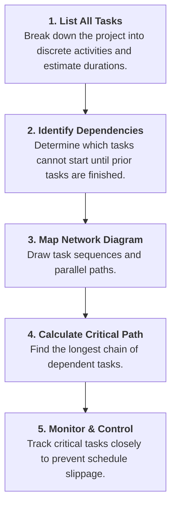
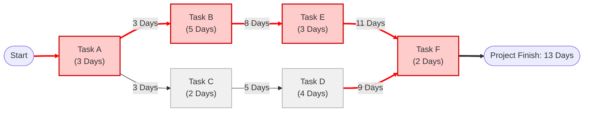

# Critical Path Method (CPM)

## Overview

The **Critical Path Method (CPM)** is a step-by-step project management technique used to identify the longest sequence of dependent tasks required to complete a project from start to finish.

By mapping out task dependencies and durations, CPM determines the **minimum total time** needed to complete the project and highlights the specific tasks that directly dictate the completion deadline.

---

## Key Concepts

- **Critical Path:** The longest continuous sequence of dependent tasks through a project network.
- **Minimum Project Duration:** The shortest possible timeframe required to finish the entire project (equal to the total duration of the Critical Path).
- **Zero Float / Slack:** Tasks on the critical path have zero float—meaning any delay in a critical path task directly delays the entire project completion date.
- **Non-Critical Path Tasks:** Tasks with "slack" or "float" that can be delayed slightly without pushing back the project deadline.

---

## Step-by-Step Implementation Workflow

### Detailed Steps

1. **List All Tasks & Durations:** Break down the work breakdown structure (WBS) and define how long each task takes.
2. **Determine Task Dependencies:** Classify predecessor and successor tasks (e.g., Task B cannot start until Task A completes).
3. **Build the Network Diagram:** Visually link tasks in order of execution, branching out parallel streams where work can happen concurrently.
4. **Calculate Path Durations & Identify the Critical Path:** Add up task durations across all possible paths. The longest path is your **Critical Path**.
5. **Monitor Critical Tasks:** Focus resources, tracking, and risk mitigation efforts heavily on critical path items.

---

## Visual Network Diagram Example

Below is a network diagram illustrating a sample project. **Path A → B → E → F** is the longest chain (13 days) and forms the **Critical Path**.

### Path Breakdown Comparison

| Path Sequence     | Tasks Included                                        | Total Duration | Status            | Impact of Delay                                          |
| ----------------- | ----------------------------------------------------- | -------------- | ----------------- | -------------------------------------------------------- |
| **Path 1 (Red)**  | Task A (3d) → Task B (5d) → Task E (3d) → Task F (2d) | **13 Days**    | **Critical Path** | Any 1-day delay pushes project completion to 14 days.    |
| **Path 2 (Gray)** | Task A (3d) → Task C (2d) → Task D (4d) → Task F (2d) | **11 Days**    | Non-Critical      | Has **2 days of float/slack** before impacting schedule. |

---

## Summary of the 6 Problem-Solving Methods

With the Critical Path Method added, here is how all six structured methods complement one another:

| Technique                       | Primary Purpose                   | When to Use                                                                   |
| ------------------------------- | --------------------------------- | ----------------------------------------------------------------------------- |
| **1. 5 Whys**                   | Deep root-cause analysis          | Uncovering underlying issues behind a specific recurring defect or error.     |
| **2. Pareto Principle (80/20)** | Issue prioritization              | Isolating the 20% of critical causes generating 80% of the friction.          |
| **3. Six Thinking Hats**        | Multi-perspective decision making | Balancing logic, emotion, risk, optimism, and creativity in discussions.      |
| **4. Fishbone Diagram**         | Visual cause classification       | Categorizing potential causes across People, Processes, Tools, and Materials. |
| **5. PDCA Cycle**               | Continuous process improvement    | Testing solutions through iterative pilot runs before scaling globally.       |
| **6. Critical Path Method**     | Project schedule optimization     | Mapping task dependencies to protect deadlines and prevent schedule delays.   |
