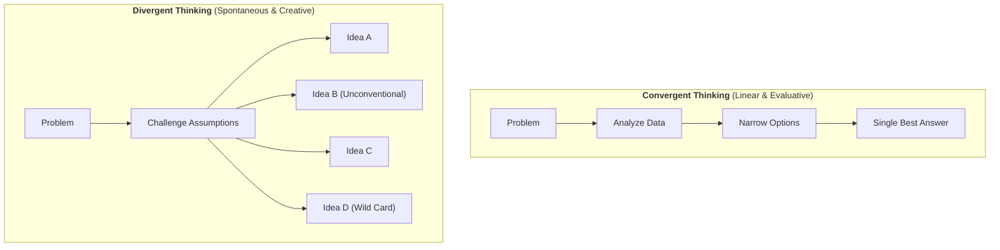
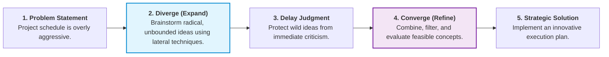

# Divergent & Lateral Thinking in Problem Solving

## Overview

When standard analytical methods and bias-checks leave a team feeling stuck, **Divergent Thinking** and **Lateral Thinking** break through stagnation. Instead of refining existing assumptions line-by-line (convergent thinking), divergent thinking expands the search space to generate a wide variety of unexpected, non-linear solutions.

---

## Convergent vs. Divergent Thinking

---

## Key Divergent & Lateral Thinking Techniques

| Technique               | How It Works                                                                                                     | Practical Application for Mia's Team                                                                              |
| ----------------------- | ---------------------------------------------------------------------------------------------------------------- | ----------------------------------------------------------------------------------------------------------------- |
| **Assumption Reversal** | List every core belief about the project and reverse them (e.g., _"What if we didn't have a schedule at all?"_). | Forces the team to question rigid constraints like strict sequential milestones or fixed role boundaries.         |
| **SCAMPER Framework**   | **S**ubstitute, **C**ombine, **A**dapt, **M**odify, **P**ut to another use, **E**liminate, **R**everse.          | Systematically transforms existing ideas into entirely new operating models.                                      |
| **Random Association**  | Pair the problem with a completely unrelated noun or object to unlock new mental pathways.                       | Connects project scheduling to unexpected analogies like traffic management or restaurant kitchen service.        |
| **Worst Possible Idea** | Intentionally brainstorm the most destructive solutions to remove judgment and lower psychological friction.     | Takes away the fear of sounding foolish, opening the floor to unconventional ideas that contain seeds of insight. |

---

## The Creative Problem-Solving Cycle

---

## Mia’s Facilitation Strategy to Foster Innovation

1. **Remove Judgment Early:** Strictly separate the **generation phase** from the **evaluation phase**. No idea is rejected during brainstorming.
2. **Reward Risk-Taking:** Praise team members for proposing unconventional concepts, reinforcing psychological safety.
3. **Change the Environment:** Shift the meeting dynamic—use visual whiteboards, rapid-fire sticky notes, or time-boxed silent brainwriting to break cognitive routines.
