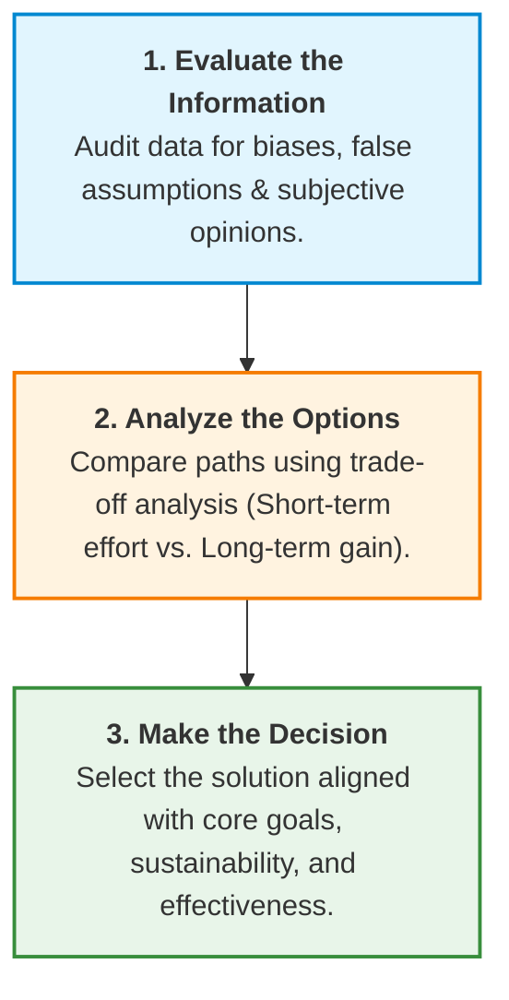

# Step 4: Evaluate Solutions Critically

## Overview

After generating a high volume of creative ideas during the divergent thinking phase, the team transitions into **Convergent Critical Thinking**. Ralph guides Mia through a structured **3-Step Decision-Making Process** to filter, compare, and select the most effective and sustainable path forward.

---

## Ralph’s 3-Step Critical Thinking Framework

---

## Detailed Breakdown of the 3 Steps

### 1. Evaluate the Information (Bias & Fact Check)

- **Objective Audit:** Distinguish objective performance metrics from personal assumptions or team opinions.
- **Identify Blind Spots:** Check for over-reliance on past successes or unverified assumptions about team capacity.
- **Key Question:** _"Are we evaluating this situation with hard evidence, or are personal opinions and cognitive biases clouding our view?"_

---

### 2. Analyze the Options (Trade-Off Evaluation)

Systematically compare candidate strategies by weighing **immediate effort** against **long-term strategic ROI**:

| Option Category              | Primary Focus                                  | Short-Term Effort                                      | Long-Term Gain                                                 | Key Considerations                                                    |
| ---------------------------- | ---------------------------------------------- | ------------------------------------------------------ | -------------------------------------------------------------- | --------------------------------------------------------------------- |
| **A. Hire New Staff**        | Bring in fresh skills & external capacity.     | **High** (Recruiting, onboarding cost, ramp-up time).  | **High** (Expands total team bandwidth permanently).           | May not solve immediate tight deadlines due to onboarding delay.      |
| **B. Train Current Talent**  | Upskill existing team members.                 | **Medium** (Temporary drop in output during training). | **High** (Boosts efficiency, morale, and internal capability). | Sustainable long-term, but requires up-front bandwidth buffer.        |
| **C. Enhance Communication** | Streamline collaboration & remove bottlenecks. | **Low** (Process adjustment & alignment meetings).     | **Medium-High** (Reduces rework and friction immediately).     | Essential baseline step; highly cost-effective with immediate impact. |

---

### 3. Make the Decision (Goal-Aligned Selection)

- **Alignment Filter:** Select options that directly advance long-term strategic goals rather than quick patches.
- **Criteria for Final Choice:**
- **Effectiveness:** Solves the root cause (over-aggressive scheduling/capacity mismatch).
- **Sustainability:** Avoids repeating burnout cycles in future iterations.
- **Practicality:** Works within existing constraints and budget realities.

- **Key Principle:** _"Don't just choose what is easiest or most popular—choose what is most effective and sustainable."_
