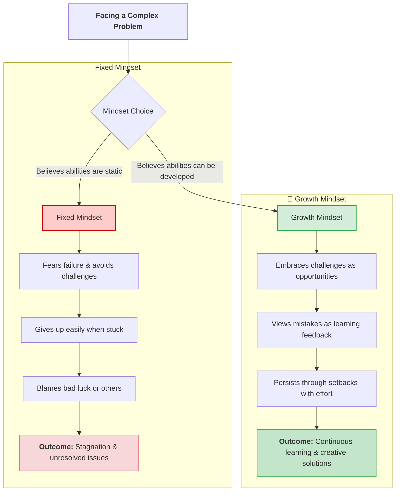

# Mindset in Problem-Solving: Fixed vs. Growth Mindset

## Scenario Context

**Step 3 of Problem-Solving: Brainstorming Possible Solutions**

While struggling to generate solutions for a critical project bottleneck, **Mia** feels overwhelmed and stuck ("hitting a wall"). Her manager, **Ralph**, observes that her frustration stems from a **fixed mindset**—treating the problem as unsolvable and looking for blame.

Ralph advises her that shifting to a **growth mindset** is essential to reframe obstacles as opportunities, unlock creative solutions, and learn from setbacks.

---

## Comparing Fixed Mindset vs. Growth Mindset

---

## Detailed Breakdown

| Aspect                        | Fixed Mindset                                                      | Growth Mindset                                                             |
| ----------------------------- | ------------------------------------------------------------------ | -------------------------------------------------------------------------- |
| **Core Belief**               | Talent, intelligence, and skills are static and unchangeable.      | Abilities can be developed through dedication, practice, and learning.     |
| **View of Challenges**        | Threats that risk exposing weakness or failure.                    | Opportunities to learn, improve skills, and grow.                          |
| **Response to Setbacks**      | Feels defeated, gives up quickly, or blames external factors/luck. | Stays motivated, bounces back, and tries alternative approaches.           |
| **View of Failure**           | Proof of incapacity or lack of talent.                             | Valuable feedback and an essential step in the learning process.           |
| **Impact on Problem Solving** | Restricts thinking; creates mental roadblocks and frustration.     | Expands options; encourages open brainstorming and creative breakthroughs. |

---

## Key Takeaways for Mia & Problem-Solving Teams

1. **Reframe Obstacles:** An issue isn't "unsolvable"—it simply hasn't been solved _yet_.
2. **Normalize Mistakes:** Early failures in brainstorming or pilot solutions provide data on what needs adjustment.
3. **Focus on Effort & Strategy:** Shifting focus from "Am I good enough?" to "What strategy can we test next?" unlocks progress during brainstorming.
