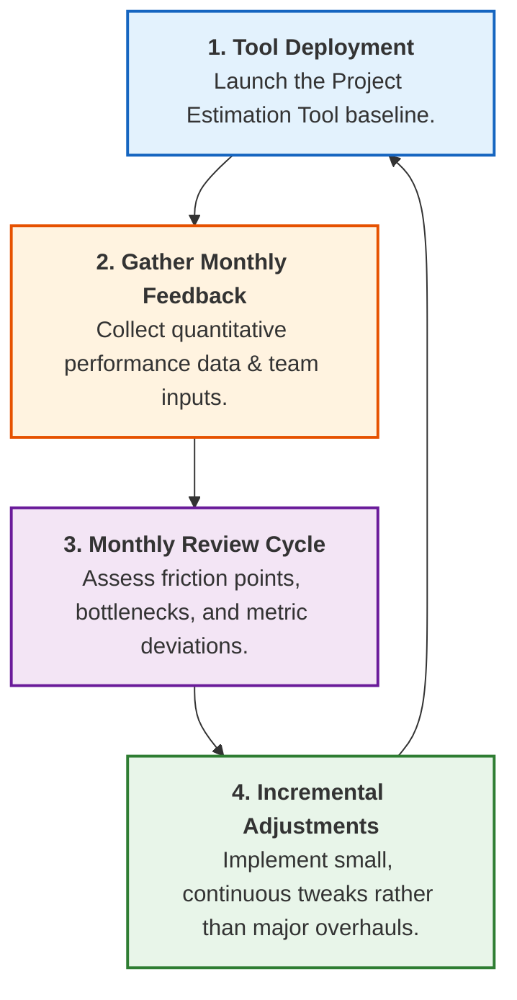
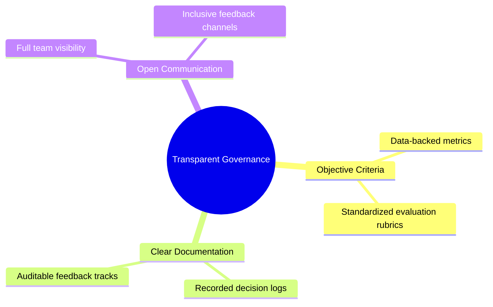

# Step 5: Implementation & Continuous Improvement (Kaizen)

## Overview

Having critically evaluated the options in Step 4, Mia selects the **Project Estimation Tool** as the most practical and scalable solution. To ensure long-term success, Mia and Alex integrate **Kaizen (Continuous Improvement)** alongside transparent governance protocols to maintain objectivity and prevent decision bias or collusion.

---

## The Kaizen Implementation Framework

---

## Kaizen Core Concepts & Application

| Dimension      | Traditional Overhaul                              | Kaizen Approach (Mia & Alex)                                    |
| -------------- | ------------------------------------------------- | --------------------------------------------------------------- |
| **Philosophy** | Rare, massive organizational shifts ("Big Bang"). | Small, regular, incremental enhancements over time.             |
| **Execution**  | Top-down mandate; rigid timeline.                 | Collaborative feedback loops; tool evolves _with_ the team.     |
| **Risk Level** | High operational disruption if the tool fails.    | Low risk; ongoing small adjustments prevent systematic failure. |
| **Focus**      | One-time feature delivery.                        | Workflow optimization, waste reduction, and adaptability.       |

---

## Governance: Ensuring Fairness & Preventing Collusion

Alex highlights a critical concern regarding subjective decision-making during tool iterations. Mia establishes two structural safeguards:

### 1. Transparent Documentation

- **Decision Audit Trail:** Every configuration change or feature priority update is logged with explicit reasoning and supporting data.
- **Objective Baseline:** Adjustments are made based on measurable estimation accuracy metrics rather than personal preference.

### 2. Inclusive Communication & Bias Mitigation

- **Equal Input Channels:** Feedback is systematically solicited across all roles (developers, leads, coordinators) to avoid single-perspective bias.
- **Open Review Forums:** Monthly Kaizen reviews are conducted openly to maintain psychological safety and prevent collusion or side-agreements.
