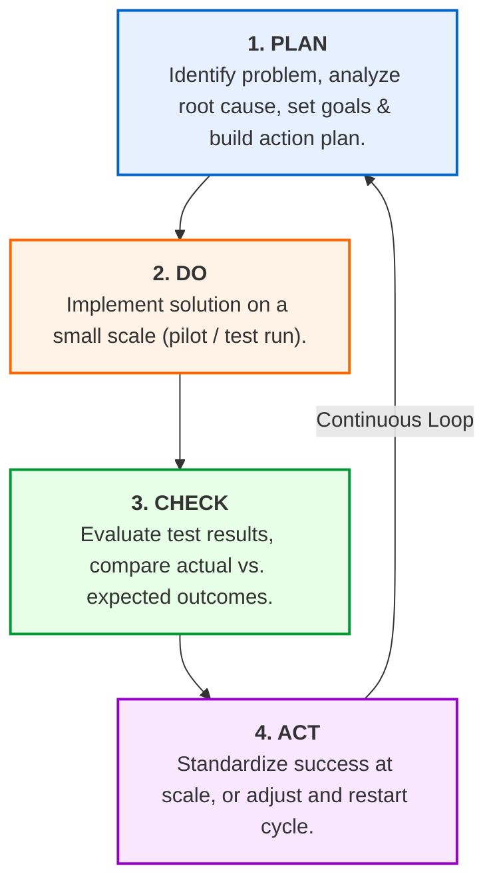
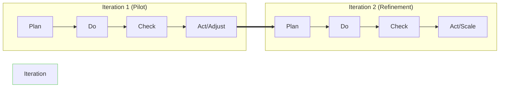

# The PDCA Cycle (Plan-Do-Check-Act)

## Overview

The **PDCA Cycle** (Plan-Do-Check-Act), also known as the **Deming Cycle** or **Shewhart Cycle**, is an iterative four-step management method used for continuous improvement of processes, products, or services.

Rather than committing to massive, irreversible changes all at once, PDCA emphasizes testing solutions on a small scale, learning from measurable results, and making data-backed refinements in a continuous loop.

---

## The PDCA Continuous Improvement Loop

---

## Detailed Breakdown of the 4 Stages

| Stage       | Core Focus                 | Key Activities                          | Output / Goal |
| ----------- | -------------------------- | --------------------------------------- | ------------- |
| **1. PLAN** | **Preparation & Analysis** | • Define the problem & gather data.  |

 • Identify root causes (using 5 Whys / Fishbone). 

 • Draft actionable solution, timeline, roles, & KPIs. | Clear target and risk-mitigated execution plan. |
| **2. DO** | **Small-Scale Test Run** | • Implement the plan in a controlled setting/pilot. 

 • Follow process strictly. 

 • Collect observational data and note friction points. | Empirical data from a controlled pilot environment. |
| **3. CHECK** | **Evaluation & Review** | • Compare actual performance against target KPIs. 

 • Analyze what worked, what failed, and unexpected bugs. | Verified results and list of necessary adjustments. |
| **4. ACT** | **Standardization or Refinement** | • **If successful:** Adopt, standardize, and scale globally. 

 • **If unsuccessful:** Tweak parameters and restart at **Plan**. | Process standard baseline or refined strategy for next turn. |

---

## Iterative Process Execution Workflow

---

## Key Takeaways

- **Low-Risk Innovation:** Testing on a small scale during the **DO** stage limits the blast radius of potential failures.
- **Driven by Data:** The **CHECK** stage ensures decisions rely on actual measured results rather than assumptions.
- **Kaizen Philosophy:** The cycle never truly stops—achieving a new baseline in **ACT** immediately becomes the starting point for the next **PLAN** phase.
