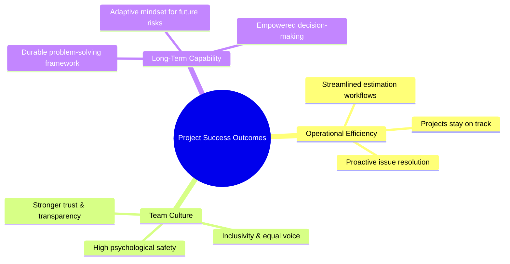
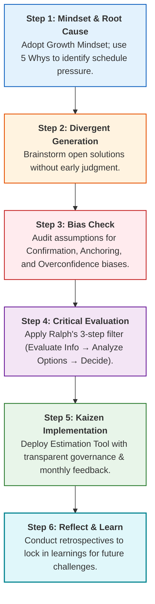

# Step 6: Reflect and Learn (Post-Mortem & Retrospective)

## Overview

A month after deploying the new Project Estimation Tool and establishing monthly Kaizen feedback loops, Mia and Alex pause to conduct a formal **Reflect and Learn** retrospective. This final step completes the problem-solving cycle by synthesizing key insights, measuring impact, and embedding continuous learning into the team's culture.

---

## Key Outcomes & Realized Business Impact

- **Workflow Efficiency:** The estimation tool resolved root-cause schedule pressures and kept project milestones on track.
- **Culture of Inclusivity:** Regular Kaizen touchpoints ensured every team member had a voice before workflows degraded or broke.
- **Organizational Trust:** Transparent documentation and clear decision logs eliminated misunderstandings and fostered a sense of fairness.

---

## The Complete 6-Step Problem-Solving Cycle

Mia’s end-to-end journey demonstrates how combining analytical critical thinking with Kaizen incremental improvement yields lasting organizational transformation:

---

## Core Principles for Long-Term Growth

| Principle                 | Strategic Focus                     | Team Action                                                                               |
| ------------------------- | ----------------------------------- | ----------------------------------------------------------------------------------------- |
| **Root-Cause Focus**      | Fix systemic drivers, not symptoms. | Diagnose underlying schedule aggressive assumptions rather than pushing forced overtime.  |
| **Incremental Progress**  | Embrace Kaizen over radical shifts. | Make small, steady monthly refinements to tools and processes based on actual usage data. |
| **Transparent Alignment** | Prevent collusion and bias.         | Maintain open communication channels and publicly documented decision-making logs.        |
| **Continuous Reflection** | Conduct formal post-mortems.        | Regularly evaluate _"What worked? What didn't?"_ to maintain adaptability.                |
