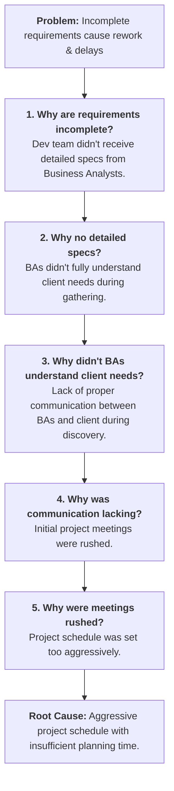
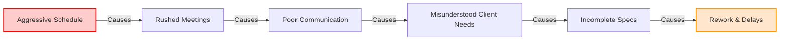

# Root Cause Analysis: The 5 Whys Method

## Context & Scenario

**Participants:**

- **Mia** (Project Manager / Lead)
- **Lily** (Assistant)
- **Alex** (Developer)

**Initial Problem:**
The team noticed that work was not getting completed on time, leading to testing delays, confusion over responsibilities, and significant rework. Initial guesses pointed to surface symptoms like task assignment overlaps or communication gaps.

To avoid quick, superficial fixes, Mia applied the **5 Whys Technique** to peel back the layers and uncover the root cause.

---

## What is the 5 Whys Technique?

The **5 Whys** is an iterative interrogative technique used to explore the cause-and-effect relationships underlying a particular problem.

- **Primary Goal:** To determine the root cause of a defect or problem by repeating the question _"Why?"_.
- **Core Benefit:** Prevents team members from jumping to conclusions or addressing surface-level symptoms, guiding them toward long-term systemic solutions.

---

## The 5 Whys Breakdown

### Detailed Breakdown

1. **Why are the requirements incomplete?**

- _Answer:_ The development team didn't receive detailed specifications from the business analysts (BAs).

2. **Why didn't the business analysts provide detailed specifications?**

- _Answer:_ They didn't fully understand the client's needs during the initial requirements gathering.

3. **Why didn't they understand the client's needs?**

- _Answer:_ There was a lack of proper communication between the business analysts and the client during the discovery phase.

4. **Why was communication lacking during such a critical phase?**

- _Answer:_ The initial project meetings were rushed, with insufficient time allocated for detailed discussions and clarification.

5. **Why were those meetings rushed?**

- _Answer:_ The **project schedule was set too aggressively**, causing the team to jump straight into execution without buffering enough time for thorough analysis.

---

## Causal Chain & Key Insight

- **Surface Symptom:** Delays in development and testing.
- **Initial Assumption:** Task misassignment or individual performance issues.
- **True Root Cause:** Systemic planning failure (setting an overly aggressive schedule that sacrificed discovery and requirements gathering).
