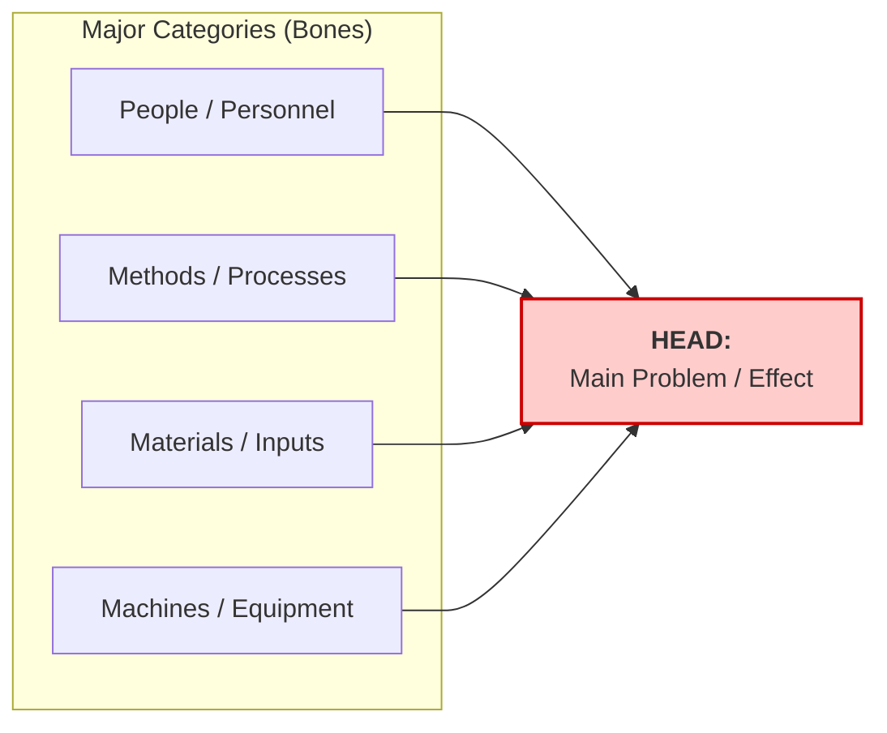
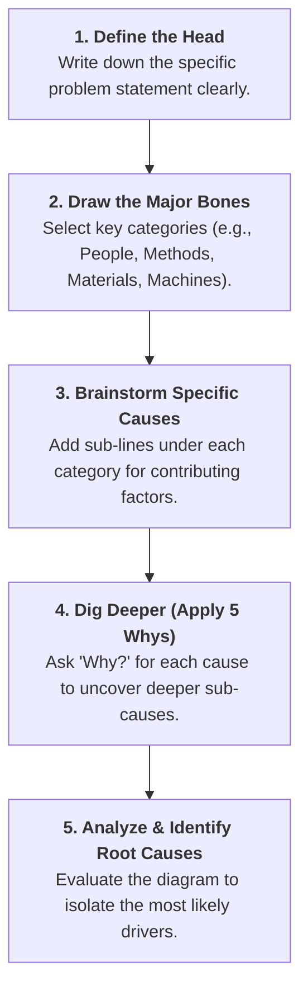

# The Fishbone Diagram (Ishikawa / Cause-and-Effect Diagram)

## Overview

The **Fishbone Diagram**, also known as the **Cause-and-Effect Diagram** or **Ishikawa Diagram** (named after its creator, Kaoru Ishikawa), is a visual problem-solving tool used to systematically map out all possible causes contributing to a specific issue or effect.

By categorizing potential drivers of a problem, it helps teams move beyond superficial symptoms to uncover root causes in a structured, visual format.

---

## Structural Components

- **The Head (The Effect):** The primary problem statement clearly defined at the far right.
- **The Spine:** A central horizontal line connecting causes directly to the problem statement.
- **Major Bones (Categories):** Broad areas where causes originate (e.g., _People, Methods, Materials, Machines_).
- **Sub-Bones (Specific Causes):** Granular factors branching off each category, answering _why_ that specific area contributes to the problem.

---

## Common Category Frameworks

Depending on your industry, standard categories (the major "bones") are used to structure brainstorming sessions:

| Framework                        | Best Used For                            | Typical Categories                                                                                       |
| -------------------------------- | ---------------------------------------- | -------------------------------------------------------------------------------------------------------- |
| **4 Ms** _(Manufacturing)_       | Physical production, hardware, machinery | **M**achines, **M**ethods, **M**aterials, **M**anpower (People)                                          |
| **6 Ms** _(Expanded Production)_ | Complex operational systems              | **M**achines, **M**ethods, **M**aterials, **M**anpower, **M**easurement, **M**other Nature (Environment) |
| **4 Ps** _(Services / Business)_ | Office environments, services, software  | **P**eople, **P**rocesses, **P**olicies, **P**lace (Environment/Tools)                                   |

---

## Step-by-Step Implementation Workflow

### Detailed Steps

1. **State the Main Problem (The Head):** Write a concise statement describing the gap, delay, or failure. Place it at the right side of your board/page.
2. **Identify Major Categories (The Major Bones):** Draw diagonal branches off the central spine for 4 to 6 overarching operational areas.
3. **Brainstorm Specific Causes (Sub-Bones):** For each category, ask _"What specific factors within this area contribute to the problem?"_ and attach sub-branches.
4. **Dig Deeper with Sub-Causes:** Attach smaller nested lines to existing causes to expose hidden dependencies and assumptions.
5. **Analyze the Final Diagram:** Review the completed visual map with the team to prioritize areas requiring corrective action.

---

## Key Benefits

- **Visual & Structured:** Replaces chaotic brainstorming with an organized visual taxonomy.
- **Prevents Tunnel Vision:** Forces teams to consider non-obvious areas (e.g., checking _Equipment_ or _Environment_ when they initially assumed it was a _People_ issue).
- **Pairs Multi-Tool Frameworks:** Serves as an ideal foundation to run a **5 Whys** analysis on specific high-impact sub-bones.

<ElicitationsGroup message="How would you like to build on these root-cause tools?">
  <Elicitation label="Create a master markdown cheat sheet covering all 4 techniques" query="Create a comprehensive, single-page master cheat sheet combining 5 Whys, Pareto Principle, 6 Thinking Hats, and Fishbone Diagram with diagrams."/>
  <Elicitation label="See a full end-to-end project scenario applying all 4 methods" query="Show me a realistic end-to-end case study of a software delivery team applying 5 Whys, Pareto, 6 Hats, and Fishbone Diagram sequentially to fix recurring delays."/>
</ElicitationsGroup>
