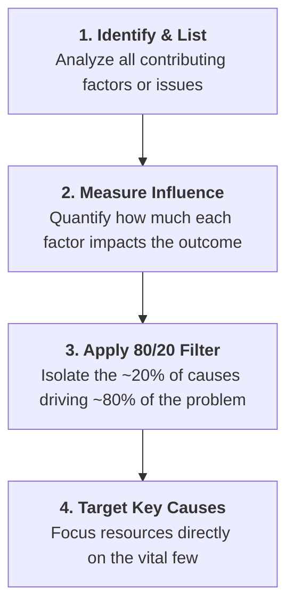
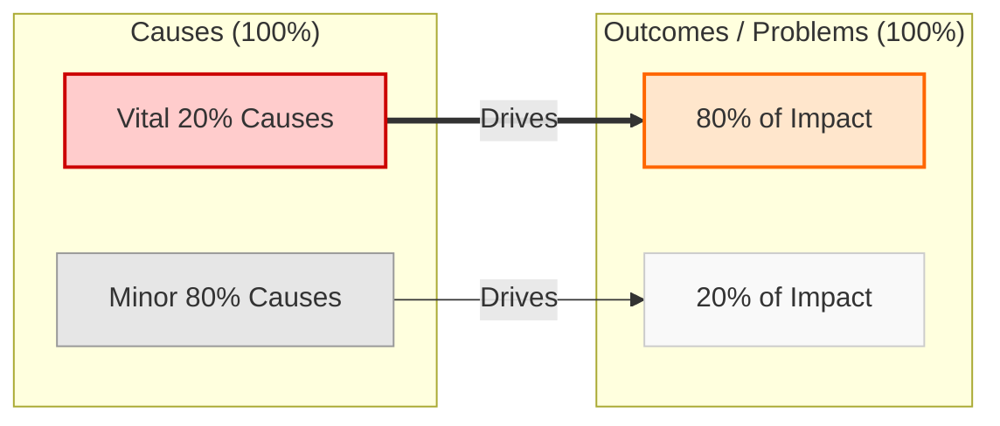

# The Pareto Principle (80/20 Rule)

## Overview

The **Pareto Principle** (also known as the **80/20 Rule**) states that roughly **80% of effects come from 20% of causes**. In problem-solving and management, it serves as a prioritization framework to identify and tackle the "vital few" root causes that yield the highest impact.

---

## Key Concepts

- **The 80/20 Ratio:** A small minority of factors (~20%) drives the vast majority of outcomes or problems (~80%).
- **Targeted Focus:** Helps teams avoid spreading resources too thin across minor, low-impact issues.
- **Resource Optimization:** Maximizes ROI on effort and time by fixing high-leverage issues first.

---

## Step-by-Step Implementation

### Detailed Steps

1. **Identify & List Factors**

- Gather data on all problems, bugs, or bottlenecks affecting project performance.

2. **Analyze Influence**

- Measure the frequency, severity, or cost associated with each contributing cause.

3. **Isolate the Vital 20%**

- Rank causes by impact to pinpoint the small subset responsible for most of the trouble.

4. **Target High-Impact Solutions**

- Allocate effort toward resolving those vital causes rather than spreading bandwidth across trivial ones.

---

## Impact Distribution

---

## Summary Table

| Category                | Vital Few (~20%)                 | Trivial Many (~80%)            |
| ----------------------- | -------------------------------- | ------------------------------ |
| **Share of Causes**     | ~20% of issues                   | ~80% of issues                 |
| **Share of Impact**     | ~80% of friction/results         | ~20% of friction/results       |
| **Action Required**     | High priority — fix immediately  | Low priority — defer or ignore |
| **Resource Allocation** | Majority of team effort & budget | Minimal effort                 |
